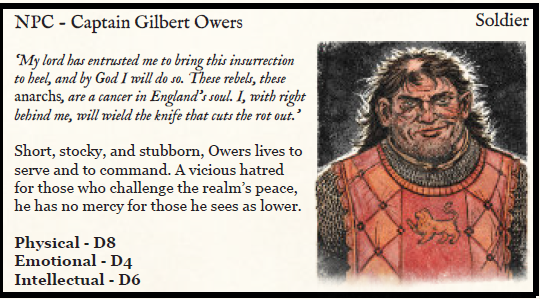
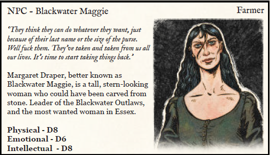
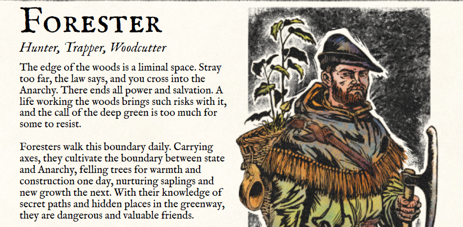
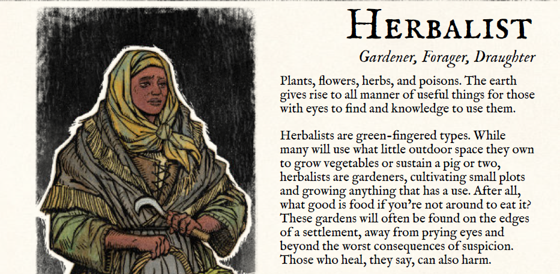
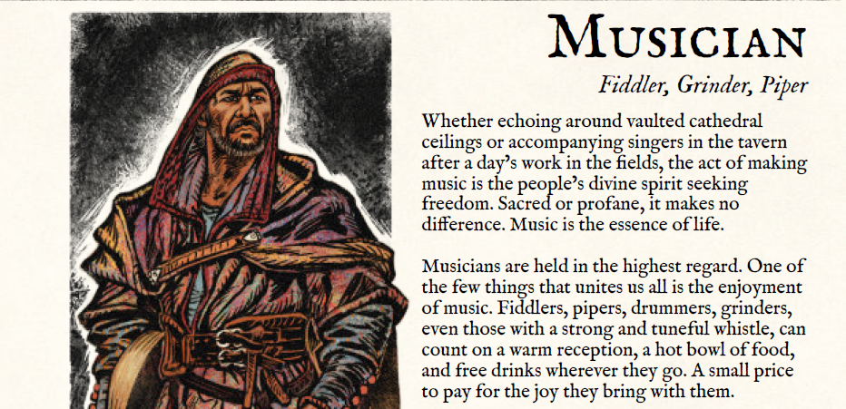
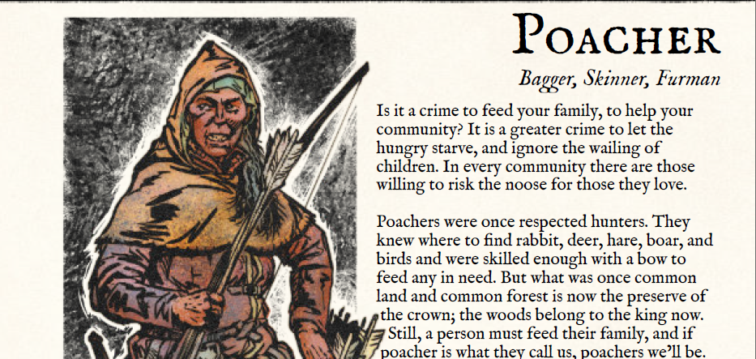
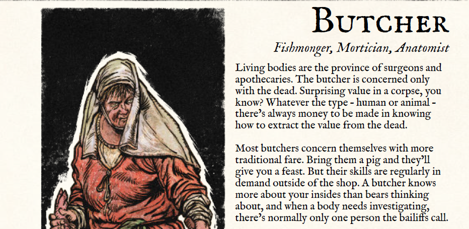
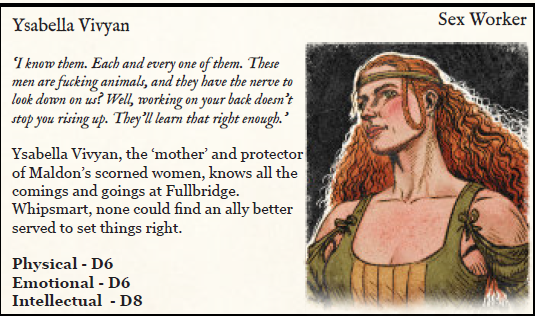
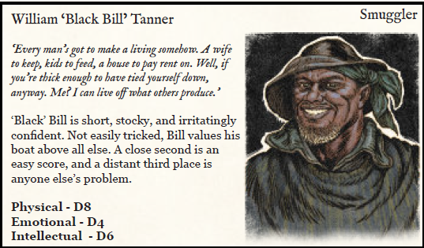
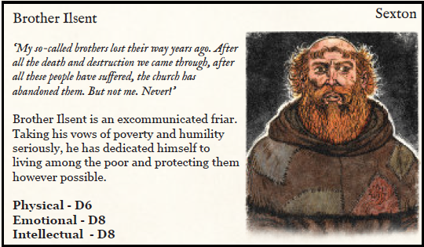

---
tags:
  - rpg/gming
  - rpg/gallows-corner
relates-to:
played-on: Ancient Robots
title: "Gallows Corner: A peasant revolt RPG - One shot"
description: What follows is an attempt to capture what the experience of running/playing Gallow's Corner "A Spark Takes Hold" scenario as a one shot
pubDate: 2026-04-10
heroImage: ./gallows-corner.png
---
What follows is an attempt to capture what the experience of running/playing [Gallows Corner](https://www.threesailsstudios.com/gallows-corner) for a one shot in [Ancient Robots](https://www.ancientrobotgames.co.uk/). The scenario I run is [A spark takes hold](https://www.drivethrurpg.com/en/product/555624/gallows-corner-a-peasants-revolt-rpg-quickstart-guide) which is meant to be an introduction to the system and help you learn the mechanics of the game as you go.
## Starting situation

_MIDSUMMER DAY, 1376, Town of [Witham](https://en.wikipedia.org/wiki/Witham), Essex_

A blow to the head from a spearbutt fells one of you while hands seize the rest. You
see Maggie draw a blade, her stance daring any of the militia to touch her.

'Margaret Draper,' the Captain states. 'You are charged with raising the Commons,
the burning of documents, and Treason against the King and his subjects. In your
absence, his honour Robert Fitz-William, High Sheriff of Essex, has found you
guilty and sentenced you to hang. I, Captain Gilbert Owers, will convey you to the
county gaol at Colchester, where you will await your death.'

'You're filth, Owers. You and all your kind,' Maggie spits. 'You have no authority,
here or anywhere.'

Dashing forth, the militia spring on her and beat her senseless, though more than
once you see an arm drawn back, blooded by Maggie's blade.
Some minutes later, hands and legs bound with coarse rope, you are each dragged
through the evening gloom to the militia's camp. Thrown to the floor, the firelight
gives you a glimpse at Maggie, unconscious, heavily bruised and bleeding.
It seems she was right. They caught you, and caught you helping her. If hanging is
to be her fate, it's likely you'll be next...

---

The party have been captured by the local militia, led by Captain
Gilbert Owers. They don't know where they are, how far away they/ ve
been taken from the town of Witham, where they were captured, nor
what their ultimate fates will be.

All they know is that they are battered and bruised, and that
Blackwater Maggie, a woman they agreed to help escape the militia, is
there with them, unconscious and struggling to breathe.

---
## Summary

We start by taking a step back to know how our group got involved with Maggie and captured. John Green, the woodcutter of this freshly baked group of outlaws was approached by Maggie and asked to help her escape when the militia interrupted the festive summer solstice celebrations. Always carrying his axe and ready for action, he cuts one of the ropes holding one of the tents stood for the celebration, causing commotion and attracting the guards, aiming to give Maggie an opportunity to escape.

Everybody knows each other in this town and young Eve the herbalist, observing that her friend John Green is in trouble with the militia tries to move and throw some ale barrels to distract the guards. However she does not expect them to be so heavy and she is barely able to move them, but she definitely gets the attention of a few soldiers who walk towards her for causing trouble.

Her old plump drummer friend, Boule, does not miss what is going on and picks up her instruments beating hard and rhythmically, calling out a few soldiers, momentarily distracting them from the growing chaos.

Blind Harry the poacher observes from the distance, he retreats as soon as he sees the militia getting closer, his old levy nose tuned to the smell of soldiers, from being one and from avoiding getting caught when trespassing noble lands. He readies his bow and starts shooting arrows in the direction of the soldiers, causing more chaos. A loud thud on the back and then everything goes black.

Barry The Pig does not need any other cue, the militia interfering again in the town business. They've taken enough, the life of his childhood friend. Chaos is the chance to get some revenge. He jumps from behind his meat stall, butcher's knife in hand, and charges towards a few soldiers. So driven by rage he does not notice one of them putting their feet in his way and he goes face first in the mud, soldiers binding him as he resists.

One by one all of them are apprehended and taken into the custody of Captain
Gilbert Owers, like it or not, they are now rebels and enemies of The Crown.

Now in the cold night they are, far from the fire, guarded by two of Owers' men. Moonlight lights the night and the silver shining of a knife comes from the boot of one of the distracted guards. John Green spots it and gestures to the other bound prisoners and they stealthily try to get close enough. But moving such a group is noisy, and the guard turn to face John Green before he can act. With a smile in his face he stabs the woodcutter reaching hand.

The militiamen is about to laugh when something gets stuck in his throat. Blood splatters all over Green's face and the bloody tip of an arrow protrudes just as the other guard falls flat.

Two hooded figures emerge from the shadows, one heading to the laboured breathing body of Maggie and the other one addressing the prisoners, helping them cut their restraints and gesturing for them to leave before the rest of the militia notices they are free.

On the way back their saviours, Artful William and Charles both let them know that they are part of the Blackwater Outlaws, also known as the Blackwater Gang, a name attributed by the militia and the crown powers.

They walk during the whole night until they arrive to Osea Island. There lies an improvised camp with a few tents housing the group of outlaws. Maggie, recovered from the beating and and having had an early breakfast, addresses the party and requests the help of the party for her next bold move. All the outlaws here have lost their lives and, in some cases, other people's lives and have been unfairly punished by Owers' hand. It is only a matter of time before they are found and killed. They need a better defensible position and set their eyes in the town of Maldon, where they have some contacts they hope will help them to seize the town. But being outlaws and well known in the area they can't make contact and organise the revolt without being noticed by the stationed guards. 

'This is where you come in, you are outlaws like it or not and our best chance of survival is bringing this town into the Anarchy!' Maggie asks putting both of her hands on the makeshift table, bruises all over her face from the beating last night.

It is decided, the recently baked group of rebels agree to set the spark of revolution in the town, and they are given details about the people that can help them achieve their goals.

When they arrive to town they divide and conquer.

Eve and Boule focus on finding Ysabella and on their way to the brothel they manage to help one of the prostitutes, Tilda, who was being abused by a drunken guard on the street. The old Boule beats the guard with a stick trying to shame him and she is in turn hit and beaten, thrown to the floor and kicked hard, being left lying on the street with a soar body.

This action manages to catch the attention of Ysabella, who they are led to by Tilda. She is in for taking control of the town and take down some of the guards. They will meet at night and she will provide when is the best time to assault the garrison and get the weapons.

Blind Harry decides to look for Black Bill at the Hythe. After some asking he finds him and with skilful negotiation skills he manages to enlist him under the promise of free rein on a free Maldon, where he could build his fleet of barges. He agrees to move the Blackwater Outlaws from Osea Island and getting them into town without being seen.

John Green and Barry the Pig both head to the All Saints Church where they listen to Brother Ilsent's speech. They then take part in helping distribute whatever scraps of food the religious man has managed to get to distribute among the poor. They talk with him and try to convince him to lend some of his congregation to take the town. But the man fears the death toll might be too high. He is willing to sacrifice himself and a few others, but he won't put in danger all of his followers.

( ⬆️ I missed that he was excommunicated, oops)

They all convene together at the brothel that night with Brother Ilsent (a strange sight) and Ysabella. And then a plan is forged.

- Eve and Boule will stay with Ysabella and poison the drinks of the guards that frequent the establishment. Then they will head to the garrison to help taking it
- John Green will take Brother Ilsent and some of his followers to create bonfires in the outskirts of the town so they can draw guards outside and create a distraction
- Barry The Pig and Blind Harry will set fire to the stables close to the garrison and set the couple of horses that stay there free. Hopefully that should lure some guards outside and should make taking the weapons easier
- They hope Black Bill will keep his word and bring reinforcements at some point

No plan survives contact with reality but this one starts really well. Eve disguises the poison on the drinks perfectly and Boule enhances the mood in the brothel with candles and good music. The guards are in high spirits, even a little bit less grumpy than usual, and as they drink and walk to their rooms one by one drop to the floor.

At the outskirts of Maldon John Green manages to start some fires, but it turns more difficult than expected and a small detachment of guards on duty catches them before they can fully finish. But not all hope is lost, he can at least save the day and skilfully he guides the group _Beyond Surveillance_ (a handy skill to have!). As they get back they block the town gates and walk towards the garrison.

Things on the stables don't go well. Starting the fire becomes a bit difficult, the horses are unruly and one stomps Barry before running away. The chaos and the noise is also matched with the return of a familiar face. Captain Owers and five of his men are in town. The unusual movement on Maldon got to him and his nose for trouble guided him to town. He sees the outlaws and orders their men to charge.

Meanwhile outside the barracks the rest of the group reassembles. Ysabella has a sneaky way in and they are able to slit some throats and take the building without casualties or major problems as a silent barge docks in the Hythe unloading revolutionaries.

The battle at the stables is cruel and bloody. Blind Harry shoots an arrow that pierces Owers arm while the rest of his men charge. Chaos follows, Barry using his cleave, slippery as a pig and fierce as a lion, bloody as a butcher. Harry fends for himself against three guards, valiantly revolting and fighting for his life, until a spear pierces his heart, a crushing shout piercing dawn. Just at that moment his precious friend John Green arrives from the nearby garrison just to contemplate the last bloody breath of his comrade that fought with him in the war with the French. A little later the Blackwater Outlaws arrive, helping the heroes to secure the town.

In the chaos of the revolt Owers manages to disappear and skip town. A new dawn and a new era are born for the people of Maldon and Essex. How long it will last or how far it will get nobody knows, but one thing is true, the heroes of Maldon will be known as the ones who tried to stand for the commons.
## System thoughts

A few things that I noticed about the system:
- Character creation was a breeze although I changed the order. Rather than starting with Name and description I felt it was more useful to Choose trade and job first along with the dice, then Skills and last the name and description. After all the motto of the game is you are what you do and I find easier to get inspired for a name and a description if I already know what my character's job is. I think this helped the players
- Mechanics are very simple and straightforward, they were very easy to explain
- I got a bit confused with trade and job. We ended up using more job than trade because it was easier to argue for that extra die. I need to go back to see if I missed some understanding of it. What made a bit more difficult to make compelling arguments for a trade die is that they are fairly abstract (which is good and bad at the same time)
- I didn't get to use opportunities but using a collective influence pool and putting tokens in the middle of the table was good. Also awarding influence for successes was quite cool although in a one shot there aren't that many opportunities to see the long term effects on a character
- I am super excited to try out the retinues mechanics but it is something that is probably a bit out of scope for a one shot and would be better for a campaign (wondering if for a west marches campaign a shared pool of retinues would work best and people could just take characters from that pool)
- When the rules talked about the lethality of the game I wasn't very convinced but seeing it in action combat is dangerous, deadly and high stakes (just how I like it so combat is not an easy first choice)

## Scenario thoughts

- The first part of the adventure to introduce how tests work can be done in a quick scene that helps introducing the characters and putting them in a retrospective situation about how they got captured (and reward with influence successful actions)
- I find there are too many important characters for a one shot. I found hard picturing/remembering all of them well. I wonder if having only Maggie, 1 contact and the main antagonist would be enough and then having some inspiration/outlines for other characters. At the same time I liked that having so many options forced the players to discard trying to find the thief, but maybe those kind of choices can be introduced without the need of NPCs?
- For next time I think making a town map would be useful
## GMing thoughts

- Asking _How did you get captured for trying to help Maggie escape?_, give a few prompts to the first player and ask the next one to continue  was a good choice. This helped establishing links between them was a very good way to get people geared up, be clear on the tone/goal and skip the boring part where everybody needs to greet each other and find motivation for their characters
- Splitting the party and managing the spotlight is always difficult as a GM. I think it didn't go too bad but I feel I could have done a little bit more to ensure everybody have equal chances to shine in the game
- I bring too much paper and tools to the game and then struggle to find the relevant information. I need to keep working in having a good summary page. Or just learn to take my time and be a little less worried because players might get bored if I take too long finding the right page.
- I am bad with names, I need to take a little bit of extra time to take notes while I GM, or just cut the number of NPCs/things to remember (not having enough hours of sleep didn't help either!)