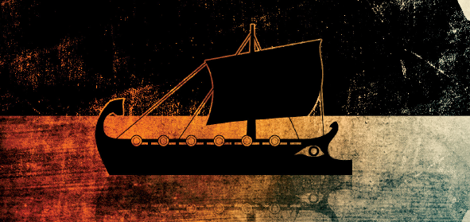
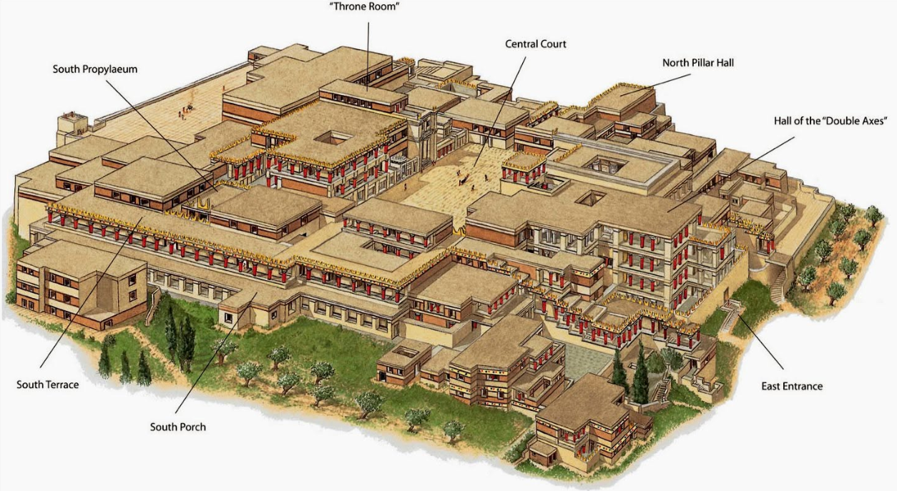
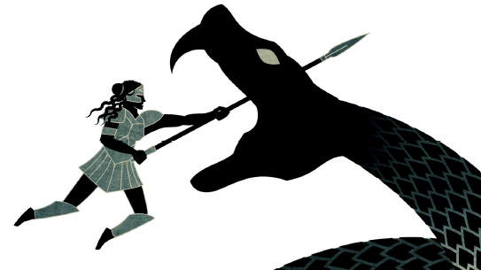
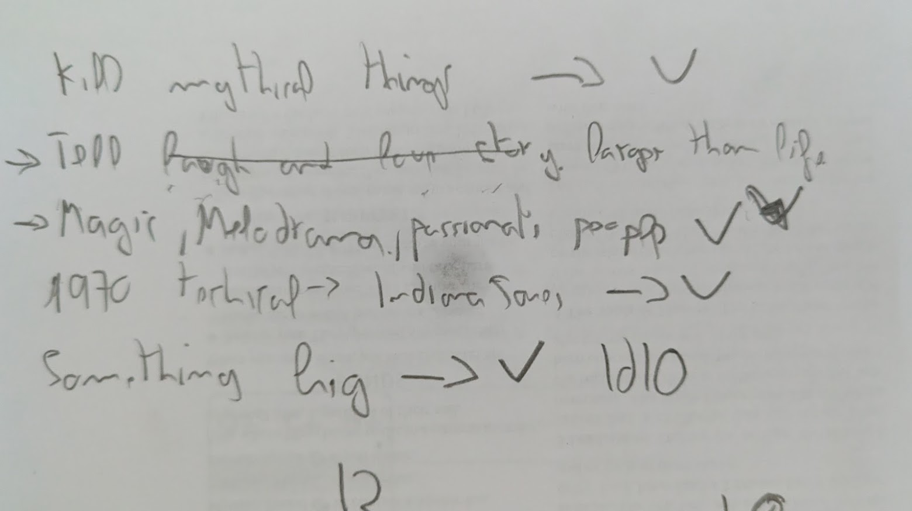
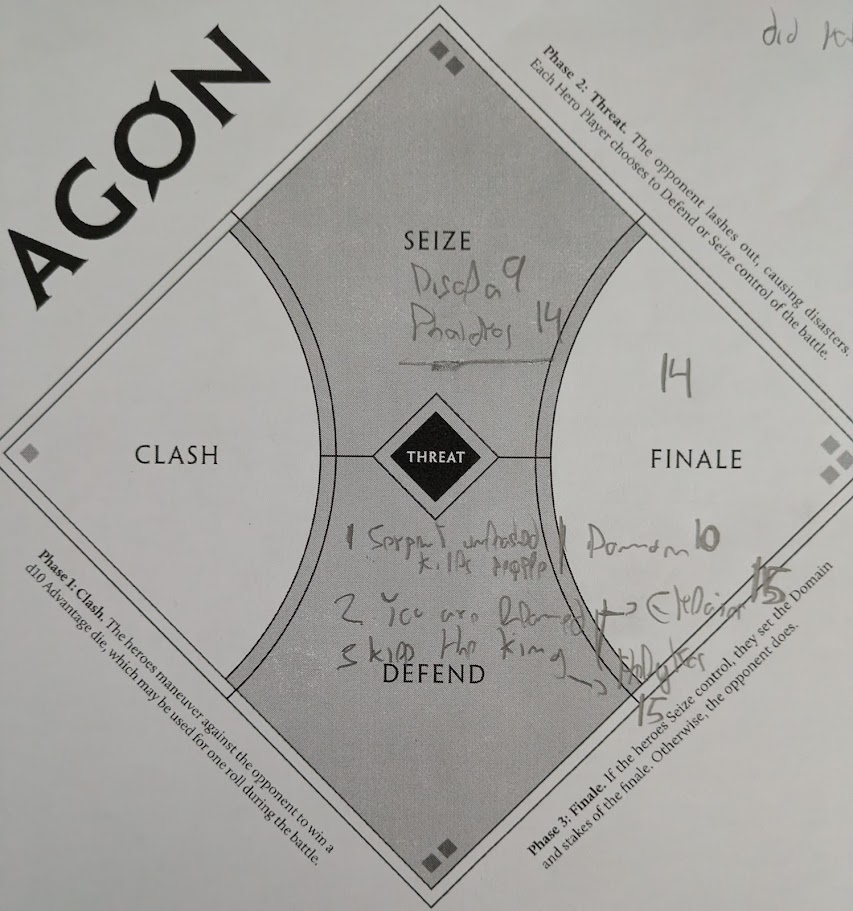

---
tags:
  - rpg
  - rpg/gming
  - rpg/agon
played-on: Ancient Robots
title: Agon One Shot - The Island of Nimos
description: What follows is a summary and thoughts of my first time running Agon in Ancient Robots. Domon, Helykos, Phaidros, Eklaios and Disala fight the perils of the island of Nimos and the chthonic entities that lie underneath.
pubDate: 2026-06-27
heroImage: ./agon-python.png
---
What follows is a summary and thoughts of my first time running [Agon](https://evilhat.com/product/agon/) in [Ancient Robots](https://www.ancientrobotgames.co.uk/). Domon, Helykos, Phaidros, Eklaios and Disala fight the perils of the island of Nimos and the chthonic entities that lie underneath.

[Background music I used for prep](https://open.spotify.com/playlist/6ehPawQ7gBPJ6hqSzPJ6GZ?si=3cfe00275acb4244)
## Summary

> _The heroes_:
> 	- _Loud Roaring Domon, scion of Kythia who honours Demeter_
> 	- _Ashened Faced Helykos, scion of the Cursed King [Lycaon](https://en.wikipedia.org/wiki/Lycaon_(king_of_Arcadia)) who honours Artemis_
> 	- _Phaidros, scion of Hermes_
> 	- _Eklaios who honours Dionysus_
> 	- _Silver Tongued Disala who honours Hades_

The five heroes navigate through the mist in a treacherous sea littered by sharp rocks. Domon successfully leads the crew and as the mists clear to leave a bright day, two gods show their signs. Apollo and his blazing torch, a snake curling around it and chains. Artemis, the bow, the arrow, a snake and a knife, decapitating the serpent. Domon ponders on that as their [penteconter](https://en.wikipedia.org/wiki/Penteconter) sails towards the port of Nimos.

The heroes dock and are received by the guards, their ship recognised for its exploits in the war they come back from. They are also bathed by the hot breeze with many perfumes and smells: rosemary, thyme and other scents are in the air. Under that layer their noses pick up something dark and unsettling wrapped up and kept at bay by the perfumes.

Presiding over the outskirts of the city there is a hill with a massive palace overlooking its domains. Black flags wave mournfully, darkening the vivid oceanic colours of the palace's walls and pillars.

_Imagine the Knossos Palace but with blue pillars_

### The funeral

The prince of Nimos is dead and the heroes travel to the palace to present their respects to King Telmarios and Queen Naia.

Once they arrive they immediately perceive something is not right. The king is sunken in his throne, the queen is faring better and keeping her composure but looks tense. Behind the throne a tall bald figure covered in tattoos whispers to the king's and queen's ears. It is Harkon the priest of Apollo. 

When the heroes try to pay their respects to the dead prince the priest stops them and tries to prevent them from getting close. Helykos son of Lycaon and prince of Arcadia shares his grief with the white bearded King Telmarios, moving him and infusing light into his eyes. Is this the beginning of a new friendship?

Domon, Disala and Eklaios confront the priest and the reinvigorated King overrules the priest and takes them to see the body. In the meantime Phaidros sneaks into the palace looking for clues of what might be going on but he is caught by the queen's guards, not before spotting ancient markings in the shape of a serpent in some of the halls of the palace.

As they examine the body of the prince the heroes notice a small drool of green liquid coming out of the prince's mouth. With the help of Artemis' precision Helykos takes a sample of the substance.

> Players, if you are reading this in a campaign you might have been able to distil this to bring somebody back from the dead!

At that moment the guards bring Phaidros dropping him on the floor in front of the queen.

'We found this undesirable skulking around taking advantage of your hospitality my queen,' says one of the guards.

The heroes rally around Phaidros as he argues that Hermes himself has entrusted him to warn about the serpent.  The crew was plagued with visions on the way to Nimos and he has now found the symbol of the serpent in the walls of the palace. Silver Tongued Disala lashes out in support making the earth tremble with her voice and calling the name of Hades. King and Queen stare at the priest when the serpent is mentioned and like a cornered animal he starts to run...towards the wall.

A chase ensues, Domon picking up a guard's spear and throwing it menacingly to the priest, Phaidros trying to block the entries, Eklaios trying to encourage the guards and Helykos jumping and trying to tackle the fugitive. And they all fail as Harkon presses a mechanism on the wall, a door opens and leaves everyone in the room gasping.

### The battle

The ground trembles again and the walls of the palace shake. The heroes find a way to open the secret door that reveals cavernous corridors to Gaia's womb. Domon, Phaidros and Disala head into the depths while Eklaios and Helykos remain guarding king, queen and a court in shock.

Down in the depths the three heroes finally face the source of the tremors. Chanting awakens the mythic and thought dead chthonic entity, [Python](https://en.wikipedia.org/wiki/Python_(mythology)), which instead of killed has been enslaved by Apollo himself. Its _Scintillating Scales_ take the heroes by surprise as it camouflages with the humid rocky passages. The serpent shakes the heroes with its tail and moves through the tunnels following faint light until it is in the open. Phaidros, Disala and Domon fight their way out through cultists. But only Phaidros is able to catch up with Python before it heads for the city. He uses one of his swords to climb up to the creature. The scales are hard as rock but Phaidros is strong and a bronze sword holds...for now.

Back in the throne room of the palace the courtesans have fled and only guards, Queen Naia and King Telmarios remain. From the tunnels, like a stream of black blood, cultists stream forth. Eklaios' voice steps in, firm and strong. He orders the guards to fall back to where the prince is resting and they form a shield wall, cultists' bodies piling up on the floor. However a couple of them manage to get through and a knife points directly to the king's heart. Helykos' quick reflexes stop the hand with the dagger and redirect it to the aggressor's neck. An unpleasant gurgling follows.

Once the situation is under control they notice the rumbling and the shaking, the chaos and the voices coming from the city.

All the heroes meet again close to the docks where Python crushes small buildings and the people looking for shelter in them. Riding the beast, trying to stay on top of it and holding on to the sword, Phaidros keeps trying to direct it to where it can cause less damage to the city.

An epic and bloody battle ensues. Eklaios tries to command the remaining guards but they break loose, so he is left with his sling aiming at the serpent's eyes. Helykos tries to command his bond with the animals using Artemis' blessing but they are weak as (surprise!) it turns out experimenting with elixirs has an impact on wildlife. Phaidros, exhausted from fighting and managing the beast during what only can be described as a wild ride, finally falls off, one of his swords breaking.

In the heat of the battle Python is driven away from the city towards one of the cliffs, where the beast finally has to face Domon's spear, which draws blood as the beast opens its mouth to bite. The massive head moves to the side in rage, picking up Disala's body as it crunches, snapping like a twig with a cry of pain. But she is a hero, tough as nails, and starts stabbing it in the eyes. Blinded the beast moves towards the cliff and she pleads in an agonising cry to push her with the snake and finish the hideous creature. Domon takes the initiative, helped by the other heroes. Using his spear as a harpoon he embeds it into the side of Python and pushes and pushes, taking the spear back just as it is about to fall.

As Disala and Python fall she opens cuts on the neck of the beast. The wound is big enough that when they hit the sharp rock at the bottom the head of the serpent detaches from the rest of its body, leaving a great green/red stain in the sea as it slowly gets washed by the waves.

### The aftermath

Back in the city the heroes cry and mourn Disala as she takes a place of honour alongside the Prince of Nimos. They are welcome to stay as honoured guests in the palace until they are ready to sail home.

## Game thoughts

### What went well

On a system level:
- The dice mechanic was really fun, I like how Agon cleverly uses one big dice roll and then asks everybody to narrate one thing. It is a great technique to share the spotlight between players

As a GM:
- Less big papers and relying more on index cards was a good improvement compared with other games
  
- Pacing was timely for a 3h session, I was either lucky or I am getting better at it!
- It feels all of the background research I did around mythology and history paid off in painting the island
	- There were lots of materials and options that didn't get used but I enjoyed telling the players after the game all the other things that were there to explore/uncover. It made the game feel more alive
  - Going round the table and asking one thing players would like to see helped me frame the game to try and make sure these things happen. I stole that from [Stonetop](https://plusoneexp.com/collections/stonetop) and I'm definitely using it in other games I GM
  
- Having a nap and some rest before the game made a big difference and I felt in a much better position to run the game

### What was challenging

- The part I found challenging was the _Threat_ stage when you have players to seize and defend. It took a bit of back and forth because there were multiple options and I couldn't make up my mind if it made sense fictionally for all heroes to be able to defend (some people were staying in the palace and others going down the passages). We ended up with
	- Disala and Phaidros going down and trying to seize the initiative for the finale
	- Domon going down but aiming to prevent the serpent from killing people across the city
	- Eklaios trying to prevent the heroes being blamed for the chaos caused and staying in the palace
	- Helykos staying to protect King Telmarios
- Scenes, contests and the battle were a bit fluid/abstract in my mind. I think this comes from doing the roll before anticipating what happens. If I was looking for a more grounded experience that gave me a clear picture of what was happening I don't think I would pick Agon as the game to GM (or at least after having GMed it I don't think I would find it easy). At the same time having that change where you make up the scene after rolling feels very Greek oracle interpreting signs, and it takes tons of load off the GM!

_The threat phase was challenging to picture in my head_