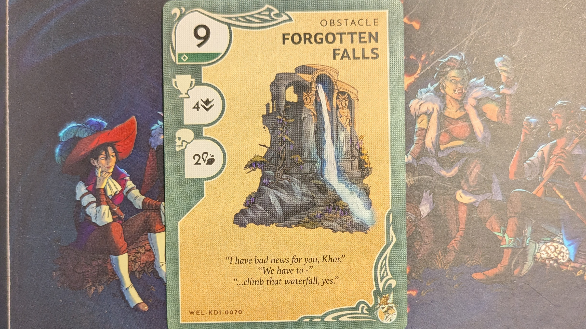
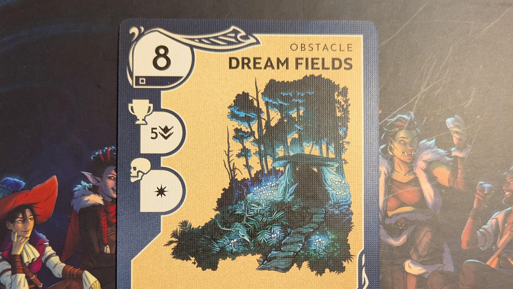
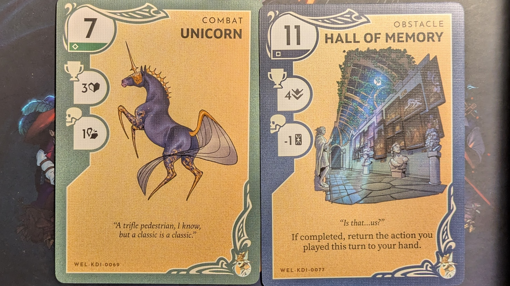

---
tags:
  - rpg/cairn
  - rpg/solo
relates-to:
  - "[[cairn-shadows-in-the-glistening-pine]]"
played-on: notebook
title: Cairn 2e - Shadows in the Glistening Pine - Solo game
description: What follows is an attempt to capture what the experience of running/playing Cairn 2e solo for the first time has been. I have recently started GMing in open table and I find to try and appease my inner critic and get more confident with the rules and the setting of a game, running a solo scenario to test drive the system is a tool that does the trick for me.  Plus I love to get a kick in the ass to actually write something as it ends up making me feel good with myself!
pubDate: 2025-09-22
heroImage: ./cairn-2e-hero-image.png
---

What follows is an attempt to capture what the experience of running/playing Cairn 2e solo for the first time has been. I have recently started GMing in open table and I find to try and appease my inner critic and get more confident with the rules and the setting of a game, running a solo scenario to test drive the system helps me to build some confidence.  Plus I love to get a kick in the ass to actually write something as it ends up making me feel good with myself!

Spoiler alert on the open table thing, it went surprisingly well. A big shoutout to [Ancient Robots](https://www.ancientrobotgames.co.uk/) and the nice players I had on my table. I ran the [Trouble in Twin Lakes](https://yochaigal.itch.io/trouble-in-twin-lakes) scenario as a one shot and was afraid and then pleasantly surprised about how having multiple parallel plots worked out.

In addition to using the Cairn 2e materials I have used a few other tools/materials to help me with inspiration. These are all the tools/materials I have used:
- [Cairn 2e Player's Guide](https://cairnrpg.com/second-edition/players-guide/)
- [Cairn 2e Warden's Guide](https://cairnrpg.com/second-edition/wardens-guide/)
- [Barrow Delver](https://manadawnttg.itch.io/barrow-delver) - A lightweight two pager solo ruleset for Cairn
- [Ironsworn Lodestar Expanded](https://tomkinpress.com/collections/products-for-ironsworn/products/ironsworn-lodestar-expanded-reference-guide) - as extra support as oracles are more fleshed out than the ones in Barrow Delver
- [Kinfire Delve Cards](https://kinfirechronicles.com/pages/delve) - I have used them to draw inspiration trying to put into practice what I was talking in [this previous post](https://alrevolutum.com/blog/kinfire-delve-use-in-ttrpg/)

Without further ado let's get started with the game!

## Creating the character

| Name           | Age | Background                                                                  |
| -------------- | --- | --------------------------------------------------------------------------- |
| Seed (she/her) | 42  | [Fieldwarden](https://cairnrpg.com/second-edition/backgrounds/fieldwarden/) |

 **Traits**:
- _Athletic, webbed skin, curly hair, sharp face, precise speech, rancid clothing_
- _Virtue: serene_
- _Vice: vengeful_

| STR | DEX | WILL | HP  | ARMOUR | Gold |
| --- | --- | ---- | --- | ------ | ---- |
| 15  | 7   | 7    | 2   | 1      | 12   |

**[Bonds](https://cairnrpg.com/second-edition/players-guide/character-creation/#bonds)**:
- You promised a  childhood friend that you would bring them back a rare gift, something unique in all the world. Take a _Bracelet_ woven from twine and wildflowers
- The Dawn Brigade did your family a service, giving you a dried _Blood-Red Flower_ as proof. When it flower turns white it means the favour is owed

**[Omens](https://cairnrpg.com/second-edition/players-guide/character-creation/#omens)**:
- The local fauna is behaving oddly, displaying heightened aggression or fleeing the area entirely. Hunters talk of a shadowy figure that roams the Wood, calling to the animals.

| Inventory slot | Item                                   |
| -------------- | -------------------------------------- |
| 1              | Rations x3                             |
| 2              | Torch x3                               |
| 3, 4           | Brigandine                             |
| 5              | Sling (d6)                             |
| 6              | Hand axe (d8)                          |
| 7              | Repellent x3                           |
| 8              | Greenwhistle (flute that calms plants) |

**Petty items**
- Bracelet (wild flowers) - from a friend
- Blood red flower (from the Dawn Brigade)

---

Character creation was quick and fun. There was a lot of rolling in tables and what I found most useful is that by the end of all that rolling I had a few well defined strokes on my character, getting a good visual of what my character looks like and their traits and personality. I find it generic enough, with good prompts to grab onto to tailor what you would enjoy more as a player.

This is something that I also saw it helped my players when I run Trouble in Twin Lakes, which I suspect it is baked in all the games based on Into the Odd (although this has been my first Into the Odd game so at this point it is just a feeling).
## Starting situation

Once I have some understanding of the character I am playing I decide to write a starting prompt trying to draw inspiration from my character profession:

> You have followed strange marks from the town you are a guardian of. A few young people have disappeared over the last week and nothing has been heard from them. You were just back from a trip to a nearby town where you had your axe repaired and gathered some tools. As you started to investigate you found strange tracks in the outskirts of town that might point to where those people might be.

Cairn 2e rules for dungeon/forest crawl are really good to prep but they assume you roll the whole dungeon or forest before you actually play. I wanted to be surprised by the narrative of the game so I did some tweaks to progressively roll my forest so I didn't have to know everything in advance and I could experience the game as a player and a GM.

This means during the sessions I'm about to narrate I generated the forest on the fly, filling in the details as I needed them using the excellent tables from
[Cairn's Warden's Guide](https://cairnrpg.com/second-edition/wardens-guide/forest-seeds/#creating-a-forest). All my game was written on a notebook before deciding to move all my notes to digital. It was pretty useful for me to have a page on the notebook where I could keep adding point crawls to the forest when I was discovering them.

To get started I only rolled on a couple of tables to add some detail to my forest. The forest is _primeval_ and _flooded_ and it is called the _Glistening Pine Forest_. That was me all sorted and ready to go!

## The adventure

Seed has been following the tracks from the outskirts of town. She is certain this must be related to the recent disappearances and people are starting to get antsy. A week is definitely too long for somebody to go on a drinking spree, leaving home due to an argument or go on an adventure. Not that anybody that disappeared left with any of the provisions or scarce possessions you would expect from somebody going on a trip.

Following the tracks she reaches the edge of the _Glistening Pine Forest_. It smells of wet pine and dark clouds gather above the trees, menacing. She looks up, sighs and walks in.

---

```

Roll forest die drop table: 5, Hazard
Roll in hazard table: Bone orchard, bleeding trees

```

([Forest die drop table](https://cairnrpg.com/second-edition/wardens-guide/forest-seeds/#forest-die-drop-table), [Hazards table](https://cairnrpg.com/second-edition/wardens-guide/forest-seeds/#hazard))

---

As soon as she enters the forest rains pours like a waterfall, her boots squelching in the moss, water fighting to get inside her brigandine. After a while pine trees become more scarce and give way to strange twisted white trees and bushes without leaves.

Seed examines them closer and her eyebrows tense with concern. Branches look like bones and they have reddish brown fruits, their texture between a gel and a sap. She observes one dropping and it being slowly swallowed by the mud below.

Feeling the distress of the forest she takes out _Greenwhistle_, her trusted flute that has helped her before to get through dark and dense forests.

---

```

How does the orchard react?

1-2 agresive, spit attack
3-4 ground starts to sink
5-6 The orchard responds, blood slows down, 
the forest glints in the distance

Roll: 1

Dex save to avoid the attack

Roll: 5 over 7 DEX
Result: success

```

---

One of the bone trees twists and spits the reddish/brown liquid. Seed makes a narrow dodge, pockets the flute and continues walking into the forest until she leaves the bone orchard behind.

---

_After this encounter I decide it is time to roll where I'm heading in the forest and take the chance to [roll the forest vice and virtue](https://cairnrpg.com/second-edition/wardens-guide/forest-seeds/#traits)._
- _Virtue: sensible_
- _Vice: aggressive (corrupted?)_

```

Old logging rd   ----------------
---------------> | BONE ORCHARD |
                 ----------------
                         |
                         | Pilgrim path
                         | (stone markers, stillness)
                         v
                 --------------------
                 | MONSTER SKELETON |
                 --------------------

```

```

Roll forest die drop table: 1, Monster
Skeleton - Recuperating
Next to a bone tree, covered in the Sap

```

([Monster table](https://cairnrpg.com/second-edition/wardens-guide/forest-seeds/#monster))

---

Seed walks deeper into the forest following an old pilgrim road, its religion lost to time, its ancient stones overgrown by moss and decay. There is silence, and the occasional bone tree.

At the distance she spots a faint movement. Yellow bones covered in the reddish sap. A human skeleton with some decaying skin. It moves its head slowly, like in a slumber.

Seed ponders, but decides to go around the path instead of getting closer to investigate. This does not seem any of the villagers disappeared people and whatever happened here it is beyond help. "Best to not awake any beasts or make the forest angry or aware of my presence", Seed mumbles before moving away from the path.

---

```

------------ Animal Path (bent trees)  ------------------
| SKELETON | ------------------------> | SLEEPING GIANT |
------------                           ------------------
      |
      | Pilgrim path
      |
      ?

```

```

Roll forest die drop table: 5, Hazard
Mossy Giant, snoring, difficult breathe, grunting

```

---

As Seed walks the muddy path she starts to notice how it widens, big footprints on the wet soil and moss. The footprints are erratic and there are bent trees on the sides. Ahead lies a big figure, moss growing on their back and underneath hardened skin that looks like bark. The difficult breathing and the mumbling is audible from the distance. This creature seems  to be in some sort of nightmare or comatose state.

---

```md

Core: Focus oracle from Ironsworn
pg 53 Ironsworn Lodestar Expanded

Result: 49, Hole

```

---

Seed carefully gets closer and notices small perforations around the creature's neck, brownish red dripping slowly before it gets washed out by the rain.

---

_Question: Is the rain the spirit of the forest trying to defend itself and clean?_

_Question: Is this the mark of a Blood Elf? Use [Frost Elf stats](https://cairnrpg.com/resources/monsters/frost-elf/), maybe something turned this elf and has now corrupted the forest. -> somebody from the town stole something?_

---

Behind the giant there is an almost unnoticeable path heading north. It is heavily covered in vegetation and moss, the occasional bone tree popping.

Seed considers helping the creature but she is unsure she has anything that could help. She has never seen one of these, looks like a troll or a giant, but kind of morphed with the forest. It is completely unpredictable what would happen if the creature wakes up, they might decide she is a good meal after all. In the end she steps out of the path blocked by the giant, putting a little bit of distance and getting into the dense forest.

---

_This is dangerous. The giant could be awakened and one does not know what dangers lie beyond the faint path._

```

Roll dex save: 14 - Failed
Result: 1d4 strength damage - 4, strength now on 11

```

---

Seed manages to get around the giant but the terrain is not easy to traverse. It is dark, covered in vegetation and the constant rain does not do things easy. There are rocks, sinkholes, spines and nettles everywhere. She is thankful for having her trustworthy brigandine which covers most of the stinging, but face, neck and knees get the worst of it. Her body itches but she pushes through in tiring effort.

Back on the trail she notices a set of humanoid steps that sink into the ground. There are two lighter ones that head in Seed direction that stop abruptly. "They must be recent or otherwise they would be completely erased by the rain", she mumbles. She wonders if they are the same person. Both sets of tracks are definitely humanoid. There is only one way to find out, to keep going. 

She gets to a clear in the forest where there is a humble and almost derelict hut. There is smoke coming out of it.

---

_Does Seed notice any danger?_

```

Roll: 1d6
Result 5, yes, and Seed catches that in time

```

---

Seed notices the faint glint of some thin threads that cover the area around the hut, drops of rain helping recognise them for the trained eye. They tie to some trees and close to those there are wooden chimes and small rusted green copper bells. She advances with care not to pull or trip over any threads, staying alert as she gets closer to the hut. Her eyes are wide open, hood down and rain trickling like a waterfall picking up momentum over the edge of a black ridge.

There is a green patch full of colourful mushrooms very close to the smoky attempt of a building, a couple of bone trees growing at the edges, and Seed's eyes pick up a corpse as she presses on. It is decaying and seems to be growing some sort of roots in the ground. The shape looks familiar but in order to know more she needs to get closer to the hut and the body.

---

```

DEX save for stealth
Result: 1, critical success

```

---

Like a shadow, she advances. There are no more threads here but a couple of tricky unnoticeable boggy holes. She is used to the paths and her full attention is on the task. She takes a close look at the corpse. Even if it is decomposing she can see the resemblance, Wilmot, one of the village's teenagers is there. Strange roots growing out of his torso, his lower part covered by the soil.

---

_Does the hut have a window? (Using Barrow Delver to determine that)._

```

Result: 2 (+6 over what I had to roll under, 10). Yes and

You can see who is inside.

I decided to roll in a Barrow Delver table 
to get inspired: Favor madness
 
```

---

Inside the hut there is a slim figure with pointy ears. There is also a small bony human in the corner, Hazel, another of the teenagers that went missing. Seed and the prisoner lock eyes, fear cutting through the air like cold steel. The captor is busy humming, sorting through some scrolls and does not notice this, yet.

---

```md

Seed is going to attack with the sling. 
Will get a free attack since the enemy is unaware.

Combat: Seed vs Blood Elf

Round 1: 
- Stone crashes through the window dealing 
- 6 damage (8/14 HP Blood Elf)

Round 2: 
- Seed runs into the hut axe in hand and attacks
- 6 damage (2/14 HP Blood Elf)
- The Blood Elf casts a sleep spell 
- Seed WILL save is a 3, she has 7 WILL, resists
  
Round 3:
- Seed attacks again
- 7 damage (0 HP, STR 8 - 5 = 3)
- Blood elf STR save. 8, against current STR 3, fails. 
  Blood elf unconscious

```

([Blood Elf Stats taken from Frost Elf](https://cairnrpg.com/resources/monsters/frost-elf/))

---

Seed shoots her sling through the window hitting the elf in the head. She runs to the door and charges with her axe in hand trying to slash the still surprised enemy, that mumbles some words in an ancient tongue. Seed fights sudden sleepiness taking hold of her body and instead slashes the Blood's Elf chest open, leaving him to collapse and bleed on the ground.

She rushes to Hazel. He is chained to the metal stove, shaky and silent, looking between his silently agonizing captor and the fieldwarden.

"We need to get out of here. Where is the key for the manacles?" Seed demands, adrenaline still rushing through her veins, eager to get out of this place as soon as possible. Hazel just points to the elf.

She searches the bleeding body and finds a key. As she moves it, she notices a wooden necklace with carved symbols that she doesn't understand. She takes that hoping to get some answers later when she comes back to the village.

As she frees Hazel she asks the confused and terrified teenager if there are other people here alive. It takes a bit for him to answer and the Seed only gets a faint and slow shake of the head.

There is something deeply wrong with this forest and she is not sure she is equipped to get to the bottom of it and protect a confused teenager who is barely able to talk due to the shock. She offers her hand to Hazel and says: "Let's get you out of here, we can talk once we are outside the forest and heading back home".

Seed tries to cut through the forest, trying to get back to the bone orchard without having to go through the giant or the skeleton.

---

```md

Wilderness event, 1d6 roll

Result: 6 - Discovery 
To help getting inspired I draw a random card from 
my Kinfire Delve collection, getting a Forgotten Falls card.

```

([Wilderness event](https://cairnrpg.com/second-edition/players-guide/procedures/#wilderness-events), [Kinfire Delve use in TTRPGs](https://alrevolutum.com/blog/kinfire-delve-use-in-ttrpg))

_Interpretation:  Uncorrupted bit of the forest. Potable water pond?_



---

Seed and Hazel stop for a moment to gather forces next to a spring that sprouts clean water into a pond. The rain seems to stop for a moment, or maybe the treetops are sheltering this bit of forest, clean of red goo and bone trees. As a fieldwarden there is a feeling, an instinct, that you learn to pay attention to. It is not a defined thought, but an undefined certainty, clear and physical, that is acquired from so much time spent in the wilderness, looking for lost cattle, people or hunting beasts. Seed knows well enough when to trust that instinct. Both are exhausted and the fieldwarden decides if they don't stop they might regret it later. She drinks the refreshing water, shares her rations with the shaky teenager.

After some time eating in silence she ventures to ask another question, hoping the food has given him enough energy to be a bit more chatty.

"How did you get there, do you remember?" asks Seed.

---

_Looking for some inspiration on the response I decide to use another Kinfire Delve card and I draw Dream Fields_



---

They talk in whispers as if to not upset the tranquillity and temporary peace of the forest and continue eating. Seed does not get many answers but Hazel is a bit more talkative. He was in the outskirts of _Barktown_ (_at this point the town has come up a few times so I decide to name it_) drinking with _Emma_ and _Narcissus_. It was a home made brew. Then he must have fallen asleep. He dreamt of the forest, and wine, then he felt sick and woke up inside the hut. There he spent some time, a few nights at least, being fed by the elf with some brown/reddish undetermined substance. Its taste was horrible and made him feel sick, but without water or any other food he ended up eating this up. He doesn't know about the fate of the other teenager and for now Seed decides to keep that to herself.

---

_Question: Is he ok? what consequences did eating what looks to be the same thing Seed have seen dropping from creatures and the forest if any will have on Hazel?_

_Now it is time to roll for another wilderness event as they get ready to walk again_

```

1d6 roll

Result 6 - Discovery - back to the forest entry

```

---

The rest seems to clear Seed's mind and she is able to get back to the bone orchard, rain drenching them again as they leave the refuge of the spring and the gentle treetops. She sighs in relief, not long to get outside the forest.

---

_Here I find a good place to ask some questions to the oracle. It feels if there were to be any more obstacles in the forest this would be the last chance for them to appear._

_What is waiting in the bone orchard? Will the forest allow me to go? (roll in Barrow Delver outcome table)_

```md

Result: 20, 6+ more than X 
No, and (extreme no with consequences)

```

_To get myself inspired with the extreme no I draw a couple of Kinfire Delve cards:_
- _Unicorn, Hall of Memory - Maybe it is the mount of the Blood Elf_

_I take the unicorn stats from the Warden's Manual:_
- _6 HP 14 STR 12 DEX 14 WILL, horn d10 ignores armour ([Unicorn](https://cairnrpg.com/resources/monsters/unicorn/))_

_Question: Maybe these were the tracks that Seed was following at the beginning of the adventure_




---

A massive horned horse, all bone no skin, only bright eyes on the sides, is blocking the way out of the forest. The creature sees Seed and instantly charges without hesitation. Unicorn horn aiming to hit.

"Run!" Seed shouts to Hazel.

---

```

DEX save to act in combat first

Result: 10 over 7 DEX, fail

The Bone Unicorn attacks

Damage: 1d10 (9), Seed goes to 0HP and 11 - 7 STR, 4 STR left

Seed STR save to remain conscious 1d20 (6) over STR 4, 
she goes down

I roll a 1d4 to see what location in the body 
(1 leg, 2,3 torso, 4 arms) - 2

```

---

Before she can react the Bone Unicorn goes for the chest, sharp pain spreading like a bolt through Seed. Then everything goes black.

## Thoughts about the adventure

- It has been fairly fragmented to play, although I have gotten better at doing it in small chunks and not forcing myself to write well or with a perfect narrative. I have been able to focus more on enjoying towards the end
- [Putting into practice this](https://alrevolutum.com/blog/kinfire-delve-use-in-ttrpg/) has been interesting. The Bone Unicorn wouldn't have come up without using the cards from _Vainglory's Grotto_.
- Seed being impaled and taken out of combat in one hit without even a chance to react was completely surprising. But I kind of like the idea that a future character might encounter her
- Rather than building the dungeon beforehand I built it on the fly. It didn't feel 100% polished, I think there must be ways to have a more natural process. Or maybe I just need some more practice
- The prompt to follow the trail that kicked off the adventure was kind of lost in favour of exploration. I wonder if it would make sense that trail was just some torn clothes from the teenagers and the strange marks were the bony hoofs of the unicorn as the Blood Elf took the bodies to the hut. I could have gone and tidied that up to make it fit with the story more by adding details to the adventure. But leaving it as is feels like a good reminder that I won't get a super polished story on the first go. It makes for a great outline and got me going without getting stuck into details. In the end good stories and texts are always built incrementally. Going back and making edits is what it is expected
