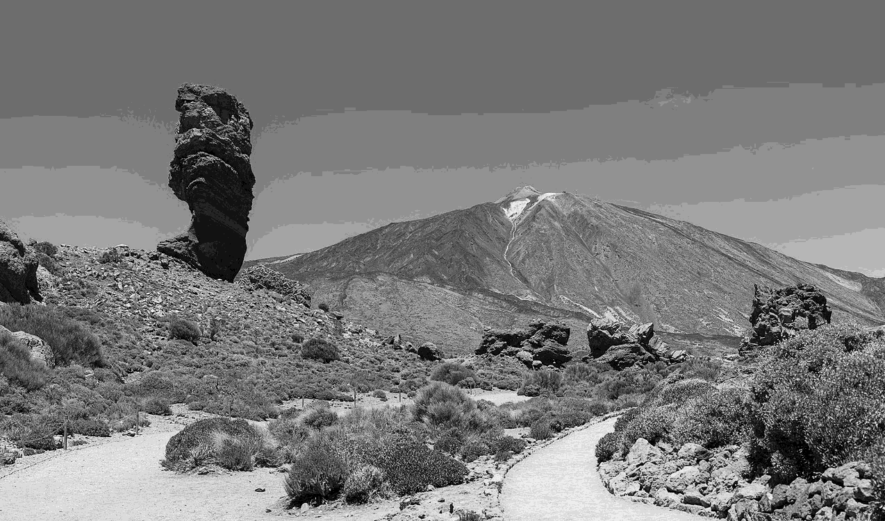
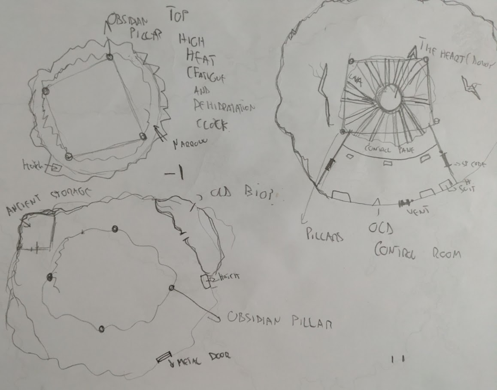

---
tags:
  - rpg/cairn
  - rpg/gming
relates-to:
played-on: Ancient Robots
title: Cairn 2e - Volcano's Soul - One shot
description: What follows is an attempt to capture what the experience of running/playing Cairn 2e for a one shot in Ancient Robot Games
pubDate: 2026-02-13
heroImage: ./volcanos-soul-001.png
---
What follows is an attempt to capture what the experience of running/playing [Cairn 2e](https://cairnrpg.com/second-edition/) for a one shot in [Ancient Robots](https://www.ancientrobotgames.co.uk/).

## Starting situation

The ground trembles again in your little island surrounded by nothing but the endless sea. It has been a decade since the last time. The last expedition travelled to the peak of the Fire Mountain to appease the sprit's anger bringing sacrifices and offerings from the settlements all across the island. None of them ever came back, but the trembling stopped and everybody was able to move on with their lives.

This time the trembling is worse and the omens are bad according to [Vulcana](https://static.wikia.nocookie.net/hades_gamepedia_en/images/a/aa/Hestia.png/revision/latest/scale-to-width-down/268?cb=20251011161929), the leader of the _Caretakers of the Fire Mountain_. She's sent word to all the settlements and you and your companions have volunteered/being chosen by your village to bring tribute to the angry spirit.

Prepare your sandals and climbing gear, we are going on a volcano island crawl!

## Summary

Grit [the Mountainwise](https://cairnrpg.com/second-edition/backgrounds/greenwise/), Anxious Andy the [Rill Runner](https://cairnrpg.com/second-edition/backgrounds/rill-runner/), Socks [The Foundling](https://cairnrpg.com/second-edition/backgrounds/foundling/) and Fergus [The Kettlewright](https://cairnrpg.com/second-edition/backgrounds/kettlewright/) all put themselves forward to be the expeditioners to the Fire Mountain, appease Guayota and save the island. Representing _Sandy Coals_ they are all branded and marked with hot iron in their arms. Feasting an sleeping follows. The next morning they depart on foot towards the Mountain of Fire, tremors within the earth getting worse by the day.

The new offering of _Sandy Coals_ is reminiscent of the past. Instead of a mysterious helmet brought to the shores of the village (and then lost or brought to Guayota to appease the god/spirit) they inscribe the same carvings in a small anchor forged by Fergus using the best metals _Sandy Coals_ has access to.

The group travels up north sorting up clouds of smoke brought with speed for miles. They cover their faces with Fergus forge cloths. This makes the trick for everybody except Grit, which refuses the cloth dismisses the smoke as a bad smell, although his ashen nose and tongue think otherwise. Their first day of travel ends in a river, quiet, with a little bit of fishing. The water is warm and the fish scarce but Anxious Andy and Socks are skilled fishermen, or maybe they just got lucky with dazed lethargic fish.

Next day they go to the lake from where the stream comes from, finding bubbling water and dead fish. They make their way around the lake and find a family of refugees from the north. The lake there has also become unhospitable. The group distrusts the family and the woman leading them, and feeling the awkwardness, quickly part ways wishing good travels. Their day ends camping in the Flamingo Jungle, surrounded by rotting vegetation. Patches from the jungle seem to be falling apart.

During the night quick steps and rustling alert Socks when he is on watch duty and the light from Grit _wisp lamp_ shinning brightly wakes him up. A close up look reveals a goat stampede. Usually quiet 50-year-old Socks has a bout of adventurousness, or maybe is just the hunger, and skilfully pulls one of the goats away from the rest. Intense stabbing from both Grit and Socks follow. A bit of salt and more rations for the following day are secured.

The next few days follow, more ominous signs of the wrath of the Guayota, tremors, heat, death and absence of wild life. But finally they get to the Caretakers Temple. Ruins from an ancient past, big columns with inscriptions, everything more majestic than any of the buildings in the City. Inside they are received by Vulcana who offers food and drink and thanks them for their sacrifice. This is where Grit secretly learns of his amulet relationship with the volcano, or at least the symbol appears on some of the writings in the ceiling of the temple's library and a caretaker confirms that all humans come from the mountain and those with lasting legacies still hold on to some of the relics from there. Fergus also talks with Vulcana about his [twig](https://cairnrpg.com/second-edition/backgrounds/rill-runner/#what-songs-are-you-best-known-for-roll-1d6), that came in a dream delivered by a white raven. Vulcana thoroughly examines that and talks about a prophecy about a chosen one marked by the gods to apease the Mountain. The twig seems to be some sort of relic that comes from the Mountain, although she is at a loss of what its purpose is.

Next morning they leave, almost the last expedition to depart (there is one from each main village). They face a group of [fire ants](https://cairnrpg.com/resources/monsters/driver-ant/) ahead when climbing the mountain range that surrounds the volcano. A lot of intimidating noise from the expedition follows, only succeeding in bringing 10 more ants which does not seem scared at all and feel more than ready to dismantle some invaders that got too close to their nest. In a stroke of genius Anxious Andy uses his [Reed Whistle](https://cairnrpg.com/second-edition/backgrounds/rill-runner/#what-songs-are-you-best-known-for-roll-1d6) rendering the ants peaceful for a short period of time, good enough to make a escape and find another route.

The climb to the top of the mountain is hard and exhausting, except for Grit, who is in his element and enjoys the challenge and the exercise. Although at the top are all sweating, the glow from the lava reflecting on their shinny faces.

Inside the volcano they find a different kind of mysticism to what they might have expected. Even if Socks has a map nothing prepared them for strange humming obelisks, metal trapdoors, and strange panels that glow lightly. But everything feels predestined, the half medallion from Grit opens the trapdoor and saves them from the scorching heat. On the floor below the heat is more manageable, thrumming of obsidian obelisks audible over the sounds of the mountain, rocks and melting lava. In this floor is Fergus strange twig that becomes useful, opening a double door made from bulky metals. Fergus takes so seriously taking the twig close to the panel that he smashes it against it and hammers it with his weapon, opening the door permanently but breaking the key in the process.

The expedition goes down one level, to reveal a massive mechanical heart beating arrhythmically and erratic, dozens of pipes protruding from it. Also, an [Iron Construct](https://cairnrpg.com/resources/monsters/iron-construct/) moves towards them and it is met with violence, a moment that Anxious Andy takes to use his whistle again, rendering most of his allies useless. With two massive hands the construct grabs Grit and Fergus and takes them to a room with red flashing panels. He talks to them reassuringly and injects them with something. They go limp and a few seconds later feel a higher command that now controls their bodies. Then they are commanded to wear some clothes and they obey.

Socks takes the chance and sneaks in through one smaller door with a human hand shape. It opens and he goes in, heat draining his force, burning his life. But he pursues the path, a ramp down until getting to a valve at the end of a corridor. Hands burning and melting he turns it, steam hissing out of it. He goes back and meets Grit in a yellow suit that has momentarily regained control of his body. They try to get out.

In the meantime Anxious Andy tries to make conversation with the Iron Construct revealing that it is an avatar of Guayota. He panics and in a desperate move he runs against the beating heart, which is recovering its rhythm a few moments after the valve has been moved. He throws the anchor, hitting the heart, making a dent, a small burst of vapour coming out of it. The anchor goes down and melts. 

Grit and Socks run and try to pull Fergus, who remains loyal to Guayota. They do not linger for long, and run up the volcano along with Anxious Andy, hoping to make it out and be the first expedition to survive.

## Open ended questions

- What happened with the other expeditioners? Maybe they died clearing the path? Or they decompressed other parts of the system and died trying
- Does the heat penetrate to the core now that the double metal doors are open? If so Fergus won't survive for long and the volcano might blow up in a few weeks. If the hatch gets closed the facility might be able to survive for longer

---

## GMing experience thoughts

### What worked

- Using timers for heat on the phone when they were on the volcano
- Including items from bonds/story into the main plot
- Having some vague points on the map
- Having some roughly sketched Volcano dungeon map
- Having a small intro with why each player is here and going around the table
- Asking the players to name the village and the jungle so it feels world where the players and GM can contribute to

### What didn't work

- A bit too long of a journey. I had to rush and skip some of the watches so we could get to the volcano in time.

## To think more thoroughly

- Character generation was fairly smooth but:
	- I ended up skipping traits (and I think that is probably fine)
	- Relied on other players filling gaps and working in parallel (If I had less engaged players this might have taken longer)
	- Bonds and character backgrounds tables are definitely the most engaging parts
- Did I have too many pages printed? I think I managed ok but I had lots of reference material and custom tables which was a bit overwhelming in the end

