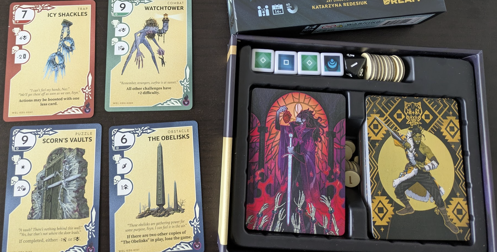

---
tags:
  - rpg
  - boardgames
played-on: notebook
title: Can I use Kinfire Delve cards as oracles for TTRPGs?
description: I recently bought a couple of Kinfire Delve boxes and I am curious about repurposing the cards to use them as TTRPG solo and GM oracles.
pubDate: 2025-09-09
heroImage: ./kinfire-delve-hero-001.png
---

I recently bought a couple of boxes for [Kinfire Delve](https://kinfirechronicles.com/pages/delve) and had a blast playing them solo and with my wife. The art is amazing and evocative, the rules are simple and straightforward, they come in a small boxes and they don't cost a fortune (it was £20 in my local shop). Also they are modular and you can reuse characters between the 3 boxes.

Yes, as you might have figured out I have a soft spot for simple, modular games. Extra points if they are carefully crafted and look nice. I can picture the world and the characters and playing with well made cards and components feels great!

After playing a couple of games I realised the dungeon crawl experience had the cards categorised in 4 types of challenges: combat, puzzle, obstacle and traps. And recently I have been struggling on a solo [Cairn 2e](https://cairnrpg.com/second-edition/) game when I had to create point crawl events on the fly. And then I thought: "Well, once I know I'm going to be facing a dangerous problem in my forest crawl or roll something tricky on an event why don't I use these cards as oracles to help me get inspired".

And then my mind started racing. If I can do this solo, can I bring cards when I am GMing and use them as some help to run games with 0 prep? Yes, I am also obsessed with this because I get anxious when I'm about to GM and I want things to be perfect. This leads to  constant fear that repeats all the time in my head "If you don't prep you will run a shitty game because you won't know how to improvise". Funny thing the brain. In parallel my body freezes and I can't actually concentrate because of the anxiety so I end up not having a good time prepping (at first it is fine and enjoyable but starts to get bad the closer I get to running the game, and then back to being fine once I'm running it, in most cases).

The solution: procedural generation (and asking questions to players when in doubt!). If I can find a good toolset to generate stuff on the fly I can progressively start hammering into my psyche that I don't need to prep to run a good game (even better if I am able to hammer into myself that it is just a game).

So I'm going to give it a try in solo and who knows, I might even start to introduce this in any games I run!