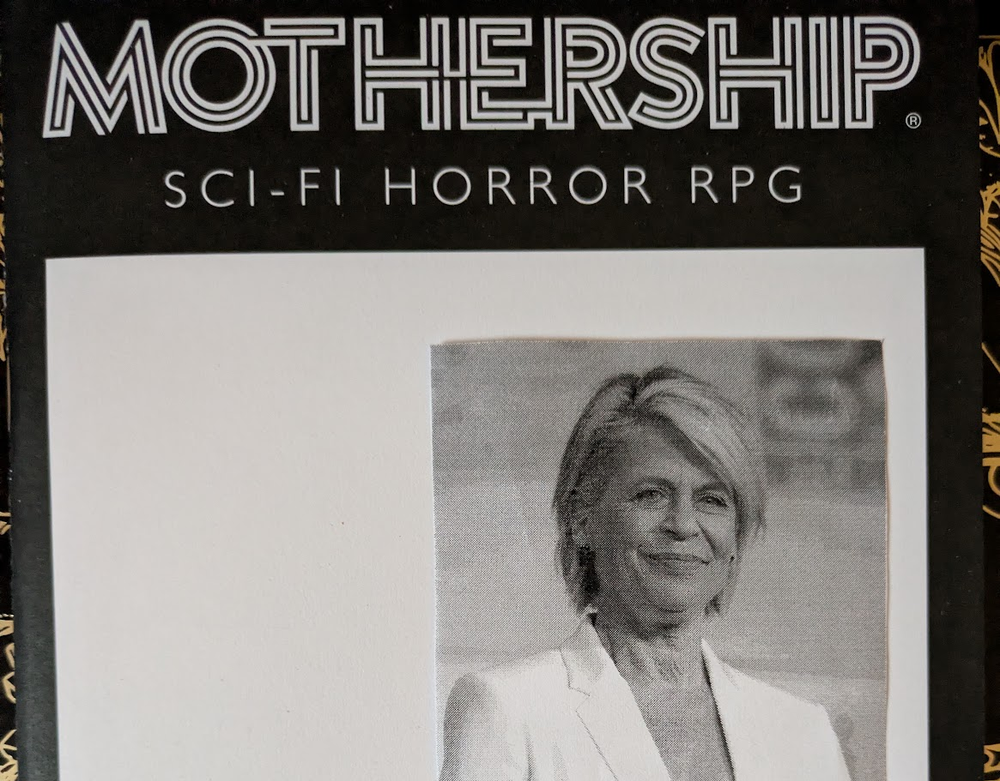
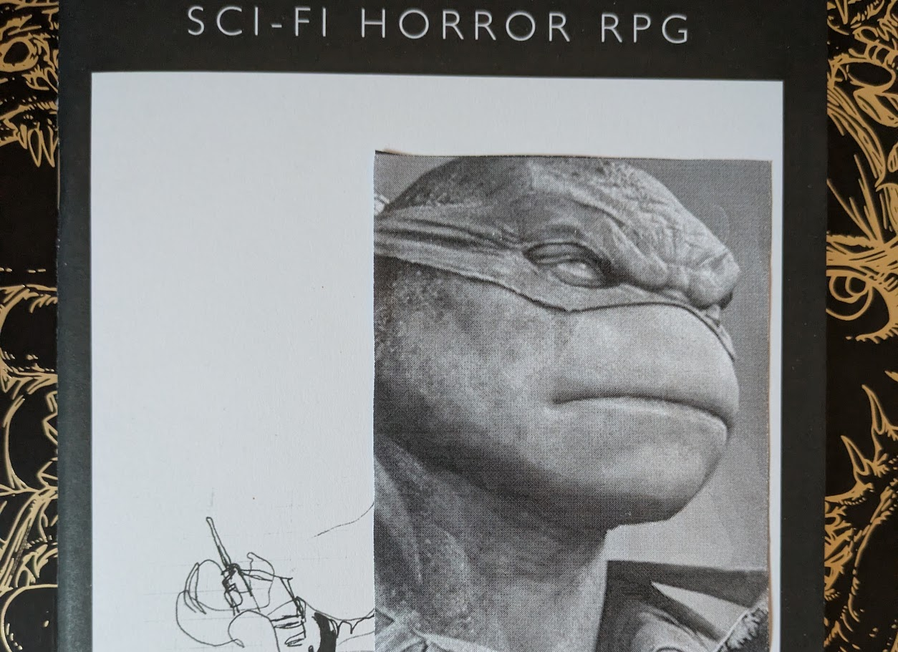
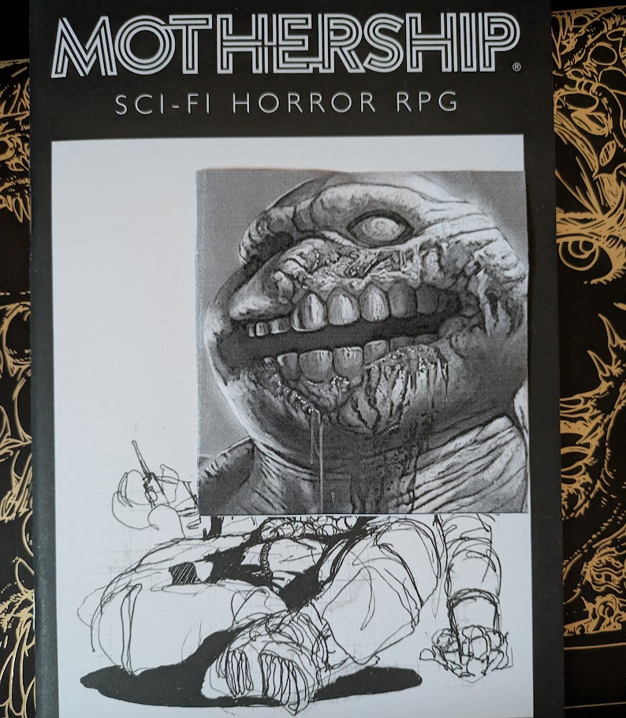
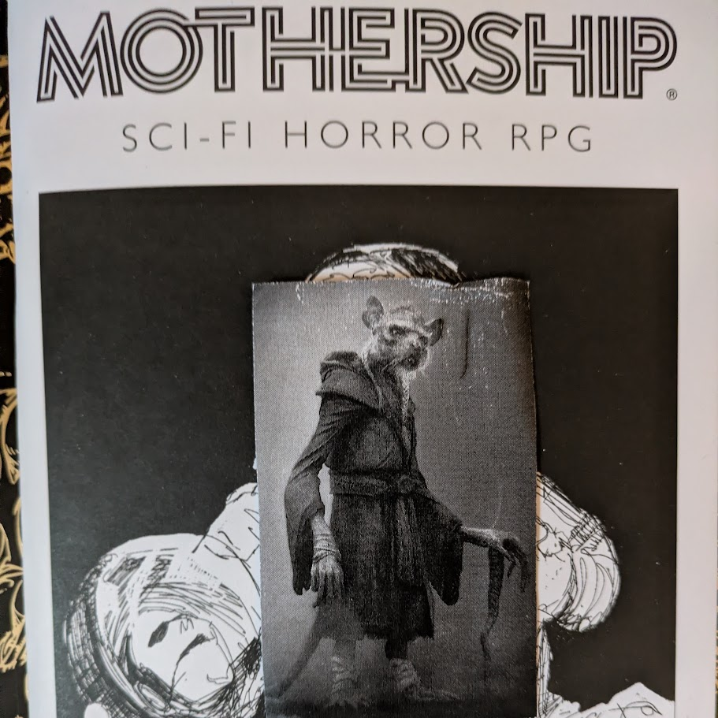
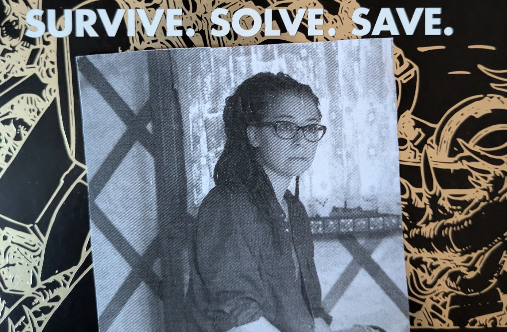

---
tags:
  - rpg
  - rpg/gming
  - rpg/mothership
  - rpg/one-shot
played-on: Ancient Robots
title: Mothership Galactica - Journey to Paradise - One Shot
description: A summary of my first time GMing Mothership for 6 players in Ancient Robots and using a custom setting.
pubDate: 2026-08-17
heroImage: ./mothership-galactica-one-shot-banner.png
---
A summary of my first time GMing [Mothership](https://www.tuesdayknightgames.com/pages/mothership-rpg) for 6 players in [Ancient Robots](https://www.ancientrobotgames.co.uk/) and using a custom setting.

> The starting point varies a bit to standard Mothership in two aspects:
>  - Players start without a loadout
>  - Androids are now Chroniclers, academics with unsettling and obscure knowledge tasked with keeping history alive.

I have embellished some bits, omitted and summarised other parts of what happened, but what follows should capture the spirit of what we played.
## Summary

### Sleepyheads get a rude awakening

They are in, finally. They signed up for a journey through the cold space to move away from the worries of The Company and life in space. They have been promised a paradisiac world, a good job and all their needs covered. Some are in for the ride of discovery, like Marco Xanthus, The Chronicler and expert in linguistics. The paper about the candidate world talked about strange signals and how this could indicate the last echoes of a lost civilisation. That is all he needed to sign up, and he won the lottery to get in!

Others like Dr Penny Sinclair The Herpetologist had less pristine motives, and an opportunity to escape from all her debts wasn't one to pass up. She rang her best friend Sam "Big Guns", who pulled some strings with her old marine contacts to get them in.

Dr Robertson The Planetologist wanted to be the most renowned expert in the universe. With that attitude and credentials of course he got a VIP ticket.

Gary The Teamster is a simple man, he just wanted a good job, a good nap and zero worries. He joined the lottery, and bet his own ticket to get a second one for Borg Rang. The Chef would surely be up for a trip after Gary saved his life. A fresh start and no blowing up kitchens this time, nothing like this to recover from a career bump.

And on they go, they get put to sleep in some medical facility and then wait for a few thousand years until they get to the planet with all the prefabs already set up for them.

A faint beeping, a loud hissing and their minds all foggy. They awaken in a dimly lit room and look at each other confused. What the hell is happening?

### Leg it

Gary's instinct kicks in immediately and he checks the panels of the cryopods. It looks like some unusual readings on the oxygen supply and faults in the system have triggered this awakening. So no welcoming committee, no paradise yet, just the cold black space and this metal colossus.

The rest of the group also awakens in confusion, walking at first aimlessly through the room. They find drops of dried blood on the floor, which Dr Penny savours and determines is definitely human blood, chilling more than one spine.

There are about 50 pods, all of them crammed on one side of the room, about half of them with people still sleeping, the other ones empty. They are not the first ones to get out and wander. At the end of the room there is a reinforced metal door. Sam does not think, she is a marine after all, that door is coming down.

Some banging on the door. Meanwhile Gary works on the panel, and the door hisses open giving way to a different room that shows some recent use.

There are coffee mugs and after such a fuzzy wakeup Marco sniffs the closest cold coffee, goes to the coffee machine and prepares a double espresso. Sam, Robertson and Penny search the room, find and then skim through a data pad that mentions some crew moving people out of the cryopods. The name Aurora appears multiple times along with commands, so they assume she must be in charge of the key crew. They also find a bed with restraints and some used syringes.

Gary looks at the multiple exits and picks a door. As he gets closer he can hear a faint noise, is that an alarm? He opens the door and the sound enters the room, some red flashing of lights along the corridor. He walks until there is a right turn, and there a camera looks straight at him. He waves his hand casually and continues walking.

Attracted by the noise and fearing people are wandering away alone, Borg runs after them, holding his "#1 Chef" hat (which somehow he was allowed to keep inside the cryopod). Marco just follows after while drinking his cup of coffee, these people don't know how important the tradition of coffee is for a good wakeup experience.

As Gary and Marco walk to the end of the corridor painted with red light, a heavy metal door opens, revealing three individuals pointing their pulse rifles at them.

'Hands up and to the floor, what the fuck are you doing here?' a hoarse and unfriendly voice commands.

A confused exchange of words follows, mostly Borg inquiring what the hell is happening. But seeing there is no convincing to be done and a way out on a side corridor he just shouts: 'Run!' Gary follows and Marco keeps his hands up, rifle shots follow.

The chaos ripples through the corridor reaching Penny, Sam and Robertson. They look at the door in the opposite direction and run away from the conflict, Robertson leading the runaway sprint. This one is unlocked with the hit of a button, the door hisses before they head in.
### Chaos ensues

Back in the corridor Gary and Borg run pursued by one of the guards, alarms blaring and getting stronger and stronger as their steps echo the metallic passage. They have been shot but the adrenalin keeps the runaways energised until they reach the end of the corridor and locked double doors open. Two more guards receive Gary and Borg and they charge at them without thinking. Borg feels the pang of another shot and the bone of his lower rib breaking while Gary tackles the guard in front of him. Then he smashes the panel behind on the other side of the room, trying to close the doors but only succeeding in getting zapped and leaving them open permanently. Defeated and with no other option but to surrender or die they are handcuffed and led back through the corridor. Before leaving they see bumps in the metal doors and hear loud banging, followed by worried looks on their captors' faces.

While all this happens Marco is taken by the two remaining guards inside the room. There are bunk beds, another coffee machine, some lockers and a couple of tables with some games. They get through the room and traverse another door. Inside there is the sound of beeping computers and screens, some seats occupied by white coated individuals. Standing there is who seems to be the boss.

_Aurora (yep, I am a fan of bringing some pictures to the game so players and myself don't forget the important ones)_.

'Well, look who we have here, one of our dear sleepyheads. Aren't you lucky I might just have the best use for you?' she says with the overconfidence of somebody who is used to having it her way unopposed.

Dr Penny, Dr Robertson and Sam rummage through the well stocked room trying to find somewhere to hide from the chaos before it gets to them.

A panicked Dr Robertson finds a ventilation shaft and a shovel in one of the lockers. He is no action man but fear can be, under the right circumstances, a powerful drive. He repeatedly hits the vents using the shovel, bending and deforming it.

Under the clanking noise Sam uses a dislodged metal bar she found in the cryopod room to open a closed locker, finding an ID card inside. Dr Penny finds some syringes and a Tranq Gun in another locker.

The vent shaft, or what remains of it, falls. Robertson is sweating from the effort. They all go in, Sam "Big Guns" first.

### Convergence

The group crawl through the vents in a single line and after some time they manage to see through to another room. A bald man with a rounded belly sits at the room's computer, reclining from time to time and casting brief nervous looks at the reinforced door on the opposite side of the room.

Sam acts decisively and kicks the vents, lands on the floor and gets close to the man waving the metal bar.

'Do not move, do not shout. Who are you?' and before the man can react "Big Guns" requisitions the pulse rifle and aims.

Sweaty and shaky, he complies, spilling the beans very quickly in exchange for his life.

Back in the control room Marco is having an enlightening conversation with Aurora, who tells him he's got the opportunity to be promoted from experiment to guard as some new vacancies have opened recently. As he is about to ask about the experiments he observes two big humanoid creatures with turtlelike faces and strong and thick skin come through the door.

_These experiments are none other than a rip off the Mutant Ninja Turtles_.

He swallows, raises his hands, keeping hold of his empty cup of coffee, and accepts the offer.

'Of course you are still on probation and that means I need to take some precautions' indicates Aurora, and she goes and fetches a collar that she puts around Marco's neck. It is not very different from what is put on prisoners or slaves to remind them of their place in case they get ideas.

Gary and Borg are now in the crew quarters being moved towards the control room. Borg's questions are ignored or scowled at while Gary maintains a prudent silence. At the other end of the crew quarters a door opens, revealing "Big Guns" pointing the weapon at the guard, poor Barry. Both doctors are behind her, Penny holding the Tranq Gun, doing what she can to hide the trembling of her hands.

Gary takes the new appearance as an opportunity and uses his manacles to grab one of the guards by the neck, followed by Borg, who manages to make one of the guards drop their weapon.

At that moment the doors to the control room open revealing Aurora with her two mutant guards, who have remained eerily silent until now, although Marco could swear from their facial expressions that they were communicating some other way.

'Well, children, playtime is over. Drop your weapons if you want to survive.' Aurora says with a condescending smile.

The smile does not last and turns into a painful cry echoed by a deafening one caused by the mutants. She is on the floor, half her shin bloodied and crushed like mashed potato. The angry experiments advance towards Borg, who is on the floor, finger on the trigger, with a smug smile, proud of being able to pull that shot.

Marco slams a big red button on the door panel and the control room remains sealed from the carnage at the crew quarters. Outside though the situation is dire. Borg keeps firing at the monsters, which bleed but advance. Banging on the door coming from the corridor follows, Gary eyes the mechanism that opens it, and before he opens fire he is shot in the chest by one of the guards. He holds, fires and then drops to the floor. A few panting breaths and Gary is dead. Rabid mutants covered in blood enter the room.

_They look like they had fun in the lab_.

Trapped between them The Chef takes off his hat and his "#1 Chef" pin and runs towards the new enemies, followed by Aurora's lackeys. He blinds one of the feral mutants before being brutally dismembered by the two forces that clash in fury in the crossfire.

Dr Robertson runs again while Dr Penny tries to carry Sam, who has been shot while protecting the group.

'Save yourself, Penny, I am finished.' She stands up in pain, takes the rifle and shoots a barrage at the experiments and guards, buying them valuable time. Barry, uninterested in dying and panting in panic, runs too.

### A helping hand

Before walking to the vents Robertson heads to the lab behind the unopened door and smashes all the computers keeping the experiments alive, then runs to join the group.

As they are about to climb to the vents they see another mutant, ratlike, offering a thin, long hand.

'Come with me I will take you to safety'

_Splinter had to make an appearance!_

They hesitate, hear the carnage behind, and hop up. Surely their fate in the vents can't be worse than here.

Marco hears the muffled butchering of his fellow travellers from the safety of the control room. One of the scientists stands up, looks at Aurora, agonising on the floor, and then at Marco.

'We need to get out of here. Leave the bitch here, we'll climb to the vents' she says pointing to the vents and helping herself with some tools.

_Yep, it is exactly who you think it is from [Orphan Black](https://en.wikipedia.org/wiki/Orphan_Black)_.

Marco has so many questions in his head, but it looks like those will have to wait if he wants to survive. He stands up from kneeling down beside Aurora, shrugs numbed by the situation, and follows Blackstone The Scientist.

## Game thoughts

Wow, more than 2k words and I am still cutting on situations that we experienced during the game. Running the game for six people was challenging but at the same time very fun. There are a few things I would like to highlight:

- Mothership is super simple and intuitive to run. Even with that I forgot to run some more panic checks and I think I could have given a quick explanation about the rules before jumping into the game.
- I ran combat without rolling (Mothership allows a lot of flexibility) and this felt the best choice for large number of players. There is already enough spotlight management going on without a GM combat turn.
- Splitting the party was challenging but the right thing to do. It made more sense in the fiction than trying to manage 6 people + NPCs on the same room.
- Delegating tasks to the players helped me a lot. I want to experiment more with giving players different roles during the game in addition to roleplaying their character. Shoutout to one of my players for volunteering to take notes. It has made the write up so much easier! (not disclosing names here in case they want to keep their online anonymity).
- About prepping:
	- Index cards were great, keeping that for next open table games
	- Bringing paper to draw a map helped me manage the chaos of combat and where everybody was. The map diverged a bit from what I had envisioned but those omissions made the decisions easier for a game with 6 players.
	- Limiting prep to rooms and characters and not what happens worked well. I did daydream about possibilities and the game played out completely different to the options I was thinking about. It is hard to relinquish that kind of control to the table, but at the same time it is freeing and ends up being more fun to GM as I am playing to find out too!