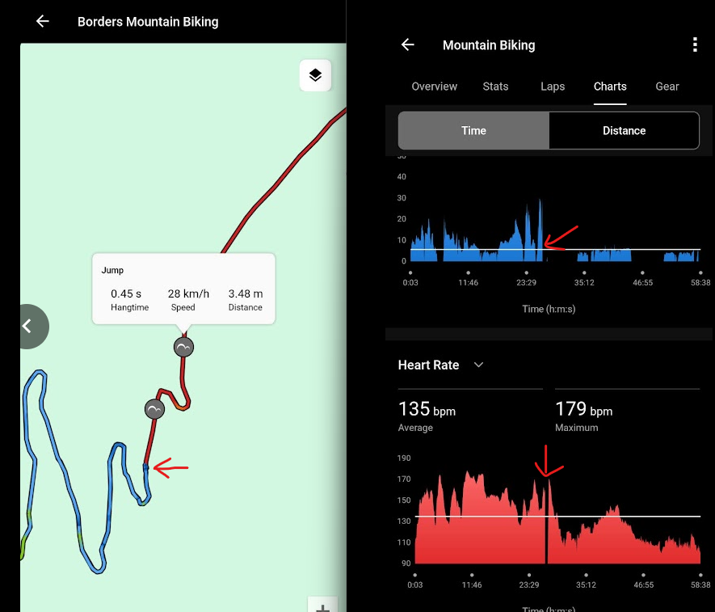
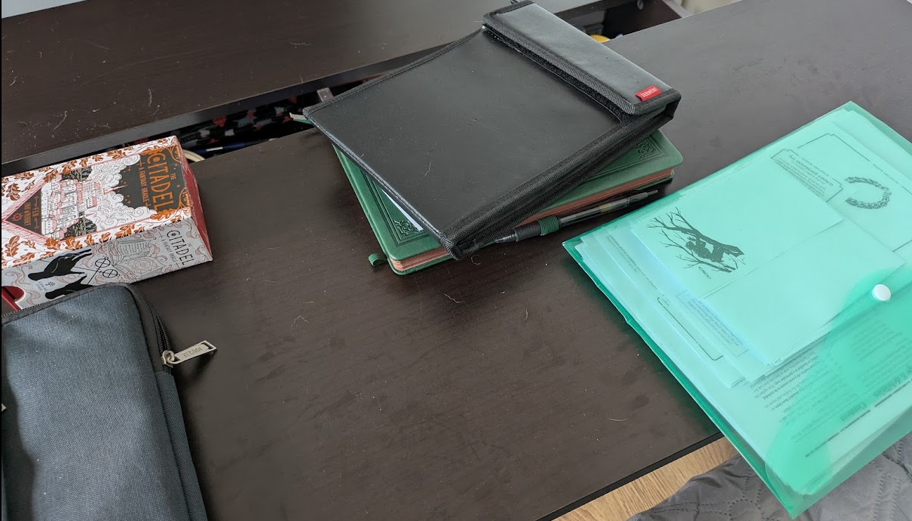

---
tags:
  - sports/mountain-biking
  - health
  - reflections
title: A Concussion Story
description: This is a little experiment and compilation of thoughts of how I felt after my concussion while mountain biking at Glentress, some reflections, learnings and the process to recover my memories.
pubDate: 2026-08-12
heroImage: ./a-concussion-story-banner.png
---

This is a little experiment and compilation of thoughts of how I felt after my concussion while mountain biking at [Glentress](https://forestryandland.gov.scot/visit/destinations/glentress/bike), some reflections, learnings and the process to recover my memories.
## _2026-08-01 in the hospital_ 

I have lost consciousness at Glentress while mountain biking. I feel fuzzy. I try to remember things but when I do it feels like I am in a dream. And then there are things I don't remember. What did I do this week at work? No idea, gone. I wonder if I need to rest or whether these memories have been damaged in some way. It is weird.

## _2026-08-02 at home_

Things feel much better now but I still find myself trying to remember details or evaluating myself. That dreamlike state is still there, although its hold is weaker. My brain feels like a tangled ball of threads, probably trying to make sense of things after the shock and regain some sort of normality.

I remember more things about yesterday and I think what happened is that my brain lost its connection to the present. I remember asking my wife if I was still in my current job or if my Stonetop books had arrived, or thinking how long it had been since my birthday. There were lots of questions with this common theme.

One of the things I noticed in the hospital and after is that my humour has been ok and I have been joking and laughing a lot. I wonder if it is my way of coping with it.

I still don't remember anything about how I fell or walking back to the car park. I have only got some data from my Garmin and what the person that was riding with me has told me.

Putting the bike in the shed after coming home from the hospital, noticing the handlebars skewed to the left and thinking that might have been the cause of me falling. All these feel like things that I know I said or thought but it is almost as if it wasn't me doing the thinking or speaking. That is what I mean when I say dreamlike.

I now feel like a detective or an investigative journalist trying to retrace my own steps and figure out what happened. And interestingly enough I am not afraid, just curious (I would definitely be afraid in any other situation and as I write this I can feel a familiar sensation in my gut). I think some of my normal inhibitions are also in a recovery process.

I also feel the urge to write here because this is a unique experience and set of feelings that I hope I won't have to go through again. I want to capture the thoughts and feelings and then re-read them when I am ok.

## _2026-08-02 at home but later_

I still feel a bit weird, tired, and my brain is trying to catch up with things. Also, with any reading or writing, I get tired pretty quickly.

The biggest impact at the moment seems to be in my short term memory. I still need a lot of reassurance around facts that are recent and I suppose that writing this is a way to deal with that. But also, it is for science! I really want to go back to this and be able to understand how I was feeling at this moment. That is why I have that urgency to write now before things get a little bit better.

The facts that are recent now keep coming back to me, unordered, and sometimes I know where they go, sometimes I don't.

Two things that still remain are:
- My inhibitions seem to be looser than before the crash. And I think this is because my mental bandwidth has been reduced and I don't have that many things going on in parallel (which might even be a good thing I can learn from!).
- I still surprise myself observing memories of things that I know have happened, but I am not able to tap into the feelings inside, they feel almost like implanted memories.

## _2026-08-03 at home_

Day 3, I think. I am trying not to look at the previous days' logs just yet, so I can capture a more natural stream of thoughts and reflections. It looks like my memories of last week at work are now fully recovered. I can feel how some of the inhibitions are coming back, things like anxiety or worry. It has been great being mostly free of them for a few days and I am hoping that this experience allows me to look at them from a different angle.

Things like concentrating to write or reading still feel a bit sluggish, I need to stop often and I don't have the same capacity to concentrate. But I know that will come back with time, after all apparently I had a _significant concussion_ according to the doctor who saw me. And I also find it interesting that I think this is the first time I write it.

My memories of the crash are still gone, and also what happened after. Apparently I was apologising a lot and being very curious about how I was feeling. That checks out, after all when I had my appendix removal surgery I asked if I could see it. And I am writing here about this because I think this is interesting and I might be able to dissect my thoughts in the future, and maybe find something useful. At the worst I will probably find an interesting story to tell/read.

This is the longest entry I have written, which is probably a good sign. The headaches have started to recede, although I still feel my head wobbly when I cough, and now that I have been doing some concentration effort I can feel a light sensation in my temples, probably a cue to rest and do something else that does not require concentration.

## _2026-08-04 at home_

It looks like I underestimated things on day 3. I had to take a few naps and I am still feeling fairly tired. Good news is memories are mostly back although I still get the occasional moment where memories feel like a dream.

I still have headaches and struggle to concentrate for long. One interesting thing is that some of the pain/discomfort comes from the side of the head that didn't receive the hit. I am guessing this was caused by the shock of the impact.

I am glad I didn't decide to rush back to work, even being alone at home tomorrow and looking after our dog feels like a big step.

## _2026-08-04 at home in the evening_

I am starting to see some progress. I feel tired but can do a bit more. I have finished doing some minor tasks for the Mothership game I am running, and also walked Moki for the longer evening walk.

It looks like I am progressing towards [stage 2 of this](https://www.nhsinform.scot/illnesses-and-conditions/injuries/head-and-neck-injuries/concussion/). Tomorrow will be my first day alone at home with Moki and without my wife and if that goes well maybe on Thursday I will be able to go back to work.

## _2026-08-05 at home_

I feel better. Still tired and with some headaches, and some of it seems to have expanded to the neck right side area, just below the ears and where the bone of the cranium ends.

I think about limiting my screen time. So I have sat in the living room and brought the laptop to write this (yes I know I have just said I was going to limit screens but this is important, and it is for science!), along with some printed goodies from my Stonetop campaign, drawing utensils and a notebook.

My mind stops at the thought of memories. I have assumed that the crash and a span of time surrounding it are lost. Other parts, like the hospital or segments of the mountain bike ride, are likely to remain fuzzy. Instead of repeating myself in every entry to state "I don't remember" I am going to change my approach and just highlight any extra memory recovery if it comes back before I decide to close this journaling experiment.

## _2026-08-07 at home_

My recovery continues. Yesterday was my first day back at work. I definitely felt more tired but managed to get through the day just fine. Today has been more of the same although I had to finish up early around 14:00 because I could not think anymore.

It is a bit frustrating but having flexibility at work makes things a bit easier. Headaches are still coming and going, memory remains with the same gaps that I think will stay there regardless of how much time I wait. 

## _2026-08-09 at home and the week of 2026-08-11_

Just a small entry. I think I have now entered the frustration stage where being tired is not novel enough to capture my curiosity, but it is painful enough to cripple almost every single routine or activity. I anticipate that is going to take some time and patience.

On 2026-08-10, I ended up exhausted and I am recalibrating during the rest of the week to try and not push myself too hard. It is an art and it involves constant fighting against self imposed and systemic expectations. Wouldn't it be great to have a [Hyperbolic Time Chamber](https://dragonball.fandom.com/wiki/Hyperbolic_Time_Chamber)? Although if I am honest I am not sure it would take away the frustration (maybe some of the expectations?).

## _A final reflection_

My memory has recovered all it can. Which means there is a part that will never come back as I anticipated in some of the timed entries.

Re-reading these entries, one thing I remember about the whole experience is how it has been free of fear for myself. I have been mostly curious. I am still very surprised as I tend to overthink and worry all the time. And it has been freeing. My only worry after the concussion was "ruining" the ride for my buddy. When I saw my wife it was that she was ok and not concerned about me. And then saying very loudly "Mokiiii" to comfort my dog.

Those things make me feel proud and a bit relieved, mostly because my self-esteem problems always make me paranoid about me not being kind enough or worthy (a concept that remains well in the abstract so I can never achieve that 🙃).

I am not afraid of picking up the bike to do more mountain biking either. I am looking forward to finishing the 6 month cooldown period recommended by the doctor so I can go back to Glentress or ride at the Pentlands. But I am happy enough waiting as a second concussion during this period comes with a greater chance of brain damage. Not being afraid does not mean I have to be reckless.

### Some lessons

The crash has also taught me a couple of lessons. If I am doing a relatively challenging circuit I should go with a buddy. I remember going a bit crazy in the Pentlands before, riding alone in heavy rain and just using my phone which drained battery unexpectedly fast. I was lucky the concussion happened when I was riding with a buddy instead of that time. That does not mean I need a buddy always (scheduling is difficult!) and for moderately challenging routes I can always use Garmin's [live track](https://support.garmin.com/en-IN/?faq=oPPijumqU23KHBCZk2wlc9) and [incident detection](https://support.garmin.com/en-GB/?faq=RfaXahBWkH8Q7pVFLsuUmA) (I've got a Garmin Edge and a watch which both have a good amount of battery).

The other thing to consider is being a little bit gentler with myself and not pushing my limits so hard. Before the crash I had done the [Blue Route](https://forestryandland.gov.scot/visit/destinations/glentress/bike), then went for lunch and straight into _Harry's Blue_. My stamina was very low at that point. Even though I don't remember the crash, it is very possible that the low energy might have influenced my ability to manage the fall more gracefully.

### Some learnings from the recovery

Another thing this experience has forced me to do is take things easy. I normally feel guilty if I am not doing things. Yep, thanks, capitalism, for imposing on me the drive to be productive. Even if I know you caused it, I cannot escape suffering from it.

But in this case I was forced to stop. Look at the screen for more than 20 mins...too tired, try and read something...too tired. I ended up sleeping, daydreaming and even doodling without any expectations. And that was freeing.

When I came back to work a few days after being forced to take things slowly, going a bit easier with myself helped. Taking my due training time to learn and continue a small project to improve how we run our applications locally, not having the urgency to immediately start with the next task and being a little bit less stressed about it. This allowed me to have more space to think (even at a reduced capacity as I am still recovering) and do better quality code reviews.

This battle against perceived productivity is going to be a bit more difficult to fight than the one at the personal level, mainly because the systemic pressure and expectations are stronger and more difficult to counter at the workplace. 

The funny thing is I know those things benefit the work I do (and my mental health!). But systemic pressures are quite hard for individuals to stand against no matter how conscious of them they are. And you get to play on hard mode if you are an anxious person like myself. In any case being conscious while waiting for that collective systemic change helps! And I do well reminding myself of that.

I can already feel the pressure building up in the back of my mind, that is why I am adding this little encouragement at the end of this write up, so I can come back and find comfort and strength and my future self can use this as a tool to live a fuller life.