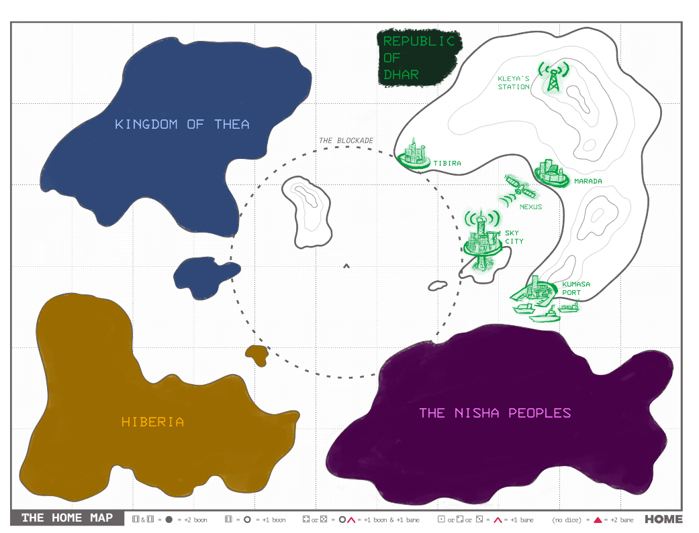
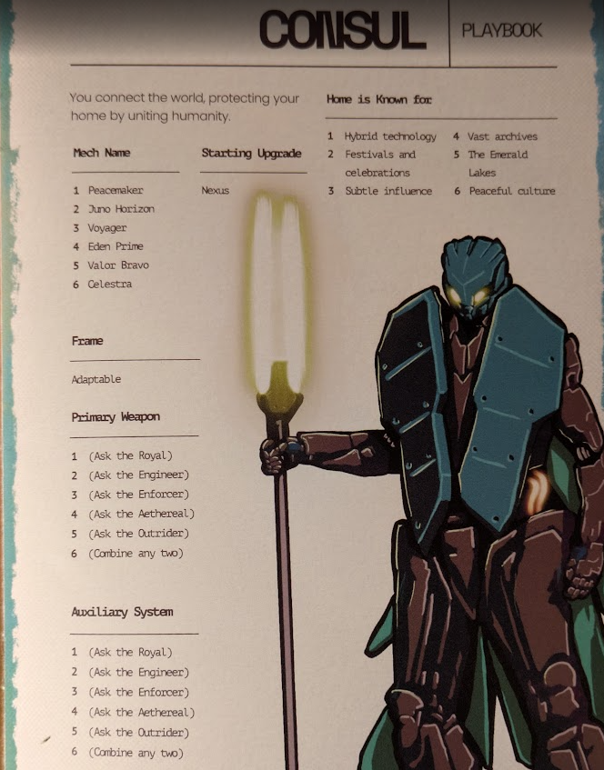
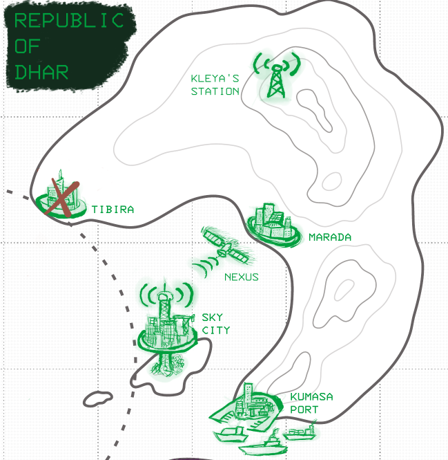
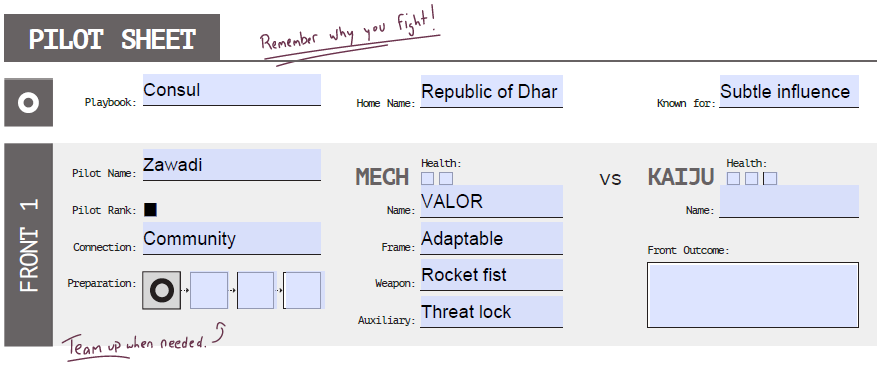

---
tags:
  - rpg
  - rpg/solo
  - rpg/home
played-on: notebook
title: Republic of Dhar - Solo game - 001
description: Playing Home Mech x Kaiju, a mech solo/coop RPG
pubDate: 2025-07-04
heroImage: ./home-rpg.png
---

## Why am I writing this?

I have always loved TTRPGs and writing. While I find the experience of playing with others unbeatable, specially when your table aligns on the tone and type of game they want to play, playing solo is an excellent tool to try different mechanics at your own pace, have shorter sessions and for me also having the opportunity to write something without having to worry too much about it being perfect or flawless.

What follows is a game of [Home](https://www.deepdark.games/home), a solo/coop RPG from 1 to 4 players where you embody a mech pilot trying to save their home. Over the course of the game you discover the culture and the nations that populate the world by coming up with ideas, rolling on tables and following a simple set of mechanics (see the video for a very quick overview from the creator).

<iframe width="560" height="315" src="https://www.youtube.com/embed/N0L73qd-l-k?si=MjDad4aT4OXW0JEI" title="YouTube video player" frameborder="0" allow="accelerometer; autoplay; clipboard-write; encrypted-media; gyroscope; picture-in-picture; web-share" referrerpolicy="strict-origin-when-cross-origin" allowfullscreen></iframe>

I initially wrote my game by hand on a notebook to prevent myself from editing too much what I was doing and having some time off screen. But I enjoyed so much the experience that I thought this would be a great opportunity to re-live the story, make some small tweaks along the way, reflect on the mechanics, and enjoy one of my other hobbies, writing.

Without further ado this is the story of my game:

> One year ago...
>
> _The Rift_ opened and the _Kaiju_ attacked. It tore our cities apart, rampaging for days until we finally dropped the bomb. We killed the beast but lost so much in the process.
>
> We knew this was only the beginning so we built the Mechs: giant war machines, the pinacle of human engineering and our only hope for survival.
>
> _The Rift_ is reopening. More _Kaiju_ are coming, but this time will be different.
>
> Your Home depends on you. Are you ready, Pilot?

### The world

I decided to separate the world in 4 different areas: _The Kingdom of Thea_, _Hiberia_, _The Nisha Peoples_ and the _Republic of Dhar_, where we will play and our mech pilot will be based on. Once I gave some names to the factions I decided that it could be interesting having the world in two different blocks, one representing the old powers and the status quo and a nascent one represented by _Dhar_ and _The Nisha Peoples_ who challenges the elites .

## Setup

### Our home

The first step on the game is to define our home and we do that by picking up a playbook from a total of 6. I pick the **Consul** and this will also be used later to define some of the mech traits.

I have already decided that the home for my pilot will be the _Republic of Dhar_ and then roll for what my home is known for, **subtle influence**. Then I need to draw 5 locations and select one of them to be destroyed by the first _Kaiju_, an unknown creature of unspeakable power.

---

From the ashes of the _Dhar Imperium_ rose the _Republic of Dhar_. A young republic with less than 20 years of history, incubated in the mountains of _Kleya's Station_ where the revolutionary leader organised the rebellion and the fall of the old regime (of course nothing to do with [this Kleya](https://www.starwars.com/databank/kleya-marki) and not inspired at all by _Andor_).

Skilled workers, hard working hands and agitators are at the core of _The Republic_. Only their sense of community and their planet wide roots within hostile kingdoms have prevented them from going back to the old regime.

Things started to change over the last few years when _The Nisha Peoples_ gathered forces to topple the old powers of _Hiberia_ and gained freedom, shifting the balance of power and _Dhar's_ isolation.

Then the _Kaiju_ came, reducing the bright city of _Tibira_ to ashes.

---

### The pilot and the mech

Now it is time to create the pilot and the mech. I decide the name, **Zawadi**, and a connection, **Community**, which I will then flesh out in my notebook (and in this case a little bit below).

Then I flesh out the mech using the prompts from my playbook. **Valor** is:
- **Adaptable**: manoeuvrable, can shift to different environments in combat and their frame is the result of the melting pot of different cultures, making it very flexible.
- Has a **rocket fist**: the fists can be controlled remotely and are also able to launch a barrage of missiles
- Uses a **threat lock** as an auxiliary system: it is a flexible defense mechanism that offers protection against biological threats, software attacks and sensor jamming.

---

_Zawadi's_ connection is the refugees community in _Sky City_. Their parents are refugees that had to relocate during the war of independence between _Hiberia_ and _The Nisha Peoples_. He is an active member of the community of exiles, displaced and refugees there, who are almost 50% of the population in the city. Instead of casting them as an enemy, the government of _Dhar_ put their best native and foreign minds to work together building a city that raises to the sky and was able to accommodate all the migrants. With all that labour and minds dedicated to the task it soon became a prosperous city and a powerful loudspeaker for _The Republic's_ influence.

_Sky City_ has two faces. One is the face of pain that shows the scars and cuts from running away, from leaving people behind, from the ones that could not make it to the safety of the city. The other one is brighter and looks into the future to a place where you can stop running and find a home. Every migrant knows this and _Sky City_ is full of them. Many of them organise between themselves and support each other despite coming from different places. Others remain silent and sombre, grieving their scars and cuts.

That's why the day _The Rift_ opened and the _Kaiju_ attacked old and new scars opened. _Zawadi's_ parents were on their first vacation out of the city since they had arrived to the _Republic of Dhar_. A week visiting _Tibira_, their museums, their history and their public thermal baths. It had taken a lot of convincing from _Zawadi_ but they finally agreed to take some time off. And then the Kaiju attacked and the city was destroyed.

_Zawadi_ was devastated but he has always been a fighter so he quickly volunteered to go and look for survivors in the ruins, half hoping maybe their parents would be alive. Many other volunteers, a lot of them from the refugees and migrant communities, organised a committee and helped with the rescue efforts.

_Zawadi's_ parents, who escaped from a previous civil war, couldn't outrun death this time. Instead of sinking in pain _Zawadi_ jumped into action and made sure the few survivors found had a roof and a purpose and he offered his house as temporary accommodation until permanent homes were assigned to them. Then he cried, shouted, and stayed in bed for a whole week. Sarah, the leader of the refugees committee, and other friends brought him food and waited patiently for him to recover.

The things he saw in _Tibira_ and the guilt and anger for loosing his parents left _Zawadi_ with permanent scarring deep in his soul. The repeating nightmares about the fate of _Sky City_ if another _Kaiju_ was to appear from _The Rift_ is what gave him the resolution to offer his life for the protection of his city and the refugees. Fighting was his way to heal those scars and a way to repay the kindness of his comunity. Not long after he volunteered to serve as a test pilot for the experimental mech _The Republic of Dhar_ was building as a response to this new menace and the possibility of _The Rift_ opening again. Great efforts and hopes where put in the mech, known as _Project Valor_. The best scientists and technicians of _The Republic_ didn't hesitate to savage anything that the _Rift_ spat out and use that knowledge to their advantage. There wasn't time for caution and the _Rift_ could open again anytime.

There were many test pilots and other half built prototypes but for reasons still unknown to him, _Zawadi_ was a natural and seemed to have a unique connection with the first fully functional mech of its class, _Valor_. While others struggled to move the colossal machine he was graceful and didn't have to think when using the neural connections and panels, he used the mech as another limb of his body. It was as if _Valor_ had chosen their pilot. They still trained secondary pilots for redundancy but their level of synchronisation was far below what _Zawadi_ could achieve.

---

