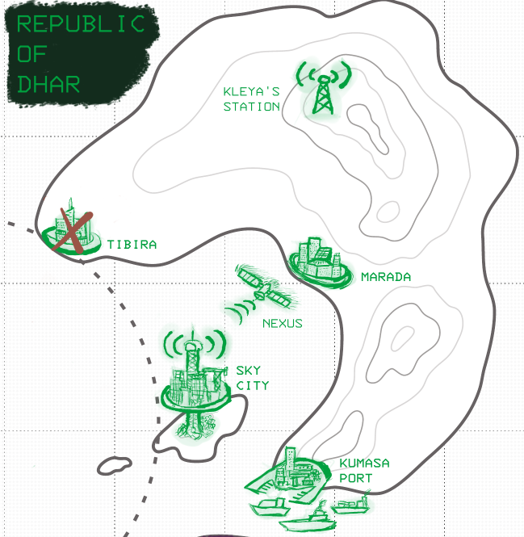

---
tags:
  - rpg
  - rpg/solo
  - rpg/home
played-on: notebook
title: Republic of Dhar - Solo game - 002
description: Playing Home Mech x Kaiju, a mech solo/coop RPG
pubDate: 2025-07-13
heroImage: ./home-rpg.png
---

After our preparation in [the first part](/blog/republic-of-dhar-solo-game-session-001) we move into the first front where we define our preparations made to deal with the _Kaiju_ and the final showdown with the creature when the _Rift_ opens.
## Front 1 - The Blockade

> The past year has been hard. Engineers barely slept as they built the Mechs. Pilots spent countless hours in training, scientists studied the _Rift_ with every possible sensor. We prepared the _Blockade_, the emergency shelters and the warning systems. We've pushed as if every day was our last, because it very well could have been.
>
> The wailing sirens mean the day has come, and the _Rift_ is open again. We have no idea when they will arrive, but it's inevitable now. The _Kaiju_ are coming.
>
> We need to keep them within the _Blockade_ and away from the cities. We need to stop them before they reach our homes.
>
> It's time to show what your Mech can do, Pilot. Good luck.

We start by drawing out our starting upgrade from the playbook. As you could see from the pictures in the previous post, the one for the _Consul_ playbook is the _Nexus_.



The _Nexus_ help us when we make preparation moves to _Unite the Nations_. I envision the _Republic of Dhar_ building a satellite to monitor, stream and transmit information from orbit. I picture how this satellite has broken frontiers and has shared information across borders and publicly with the population when possible, _Kleya's Station_ effectiveness is still recent in the memories of the people of _Dhar_. That kind of intelligence sharing gives the world a better chance to fight the _Kaiju_ when the _Rift_ opens.

Then we answer a few defining questions that will help us flesh out a bit more how things might play out when preparing for our fight:

**Who is your Home's closest ally or sworn enemy?** _The Nisha Peoples_ are very close to _The Republic_ and their ties have grown stronger since the _Kaiju_ attacked.

**How did your home helped create the Blockade?**: They created _The Net_, a sensor threat alarm with mines that can be remotely activated.

**What is the entrance to the Rift?**: A shimmering Aetheric portal


### Preparation moves

#### Unite the nations

```roll
Boon dice: 6, 4 (+1 die per Nexus)
Result: boon die gained
```

There is a summit between the four nations to work together in the blockade. Permission to expand _The Net_ over the maritime area of the _Kingdom of Thea_ and _Hiberia_ is granted after negotiations and the agreement to share intel.

**Where is the summit?** Maybe this is held on the _Kingdom of Thea_ as a neutral territory. Maybe this is an opportunity to portray the differences between the four nations.

**How does the Nexus help with the negotiations?** The Nexus is a powerful tool, maybe having the _Kingdom of Thea_ and _Hiberia_ as partners helps to keep the dissent down while also being able to get their eyes into some intelligence. Maybe they censor some of the information that is streamed from the Nexus so it is not that useful as an influence tool for _Dhar_.

---

The doors of _Thelon_, the capital of the _Kingdom of Thea_, open to the visitors. _Isha_ looks with her eyes wide open from the hover limousine as she enters the city. Tall walls built from old renovated white marble, decorated with bronze and silver figures and inscriptions, and no doubt kept spotless for the occasion. This would be seen as a complete waste in _The Republic_ and part of her feels uneasy in contempt and disgust when thinking how many people had to work in this when they wouldn't be able to repair their leaky roofs or be able to afford rent. The other part of her was impressed and satisfied they had put all this effort for the occasion. She had the opportunity to have some leisurely aesthetic views before what was going to be a fun few days of negotiations with rooms full of people who hated her and what she represented. She didn't have many moments of that over the last year, it was all a blur, and even if she would not change _Thelon_ for _Marada_ it was good to have a break.

They went into the palace and there she met with her team and other representatives. A bunch of well dressed servers passed drinks and food. She didn't take any of the drinks but the food was exquisite, although a bit pretentious. All that fanciness could not beat the fried spicy squid stall down the corner just after leaving her flat in _Marada_. In the reception she clocked the faces, the gentle but hardened _Nisha_ group, a bit displaced and perplexed, maybe also a little bit disgusted by the ostentatious display but they hid it well, she could only notice because she had been in their shoes before. She eyed the _Hiberia_ reps, altive, wearing expensive suits, polite but looking down on the _Nisha_. They were going to be a pain to deal with, but the real demands would be coming from _Thea_. The Kings chief councillor, a tall bald man with no facial hair nodded and smiled faintly at her. Those were the dangerous ones.

After the reception and eating the hard work began. They were received on a room full of ebony furniture, no electronic devices were allowed and they were back to pen and paper. Vintage and retro, these guys were old school, but she already knew that, and that they didn't particularly like the _Republic's_ interest in new toys, specially the ones that take out all their dirty little secrets.

The negotiation was intense and took four days, but it was done now. It had involved calling back to _Central_ a couple of times to see how far they could go with the concessions. Of course _Thea_ wanted to get control of the _Nexus_ and in the end it was agreed every nation would have veto rights over what was streamed from the Nexus and to whom, but in the event of _Kaiju_ or activity in the _Rift_ space communications would not be jammed and they would feed information to the satellite. Once _Thea_ agreed, _Hiberia_ moved in line to not be left behind but they would certainly be the first ones to break the agreement at the first opportunity.

The other positive news was that they had gotten the green light to expand _The Net_ to the whole blockade. They would have to share their design for the mines and hand over complete control of the sections of the blockade to _Hiberia_ and _Thea_, which would piss off more than one in engineering and had also pissed off a few in _Central_ but in the end you do what you have to do, and in this case it was handing cash and a small advantage to them at the price of having less holes in the whole _Blockade_.

"All in all I would call it a success, but I am so very tired", thought _Isha_ just before falling asleep on her fancy _thelonese_ room.

---

<br>

#### Study the Kaiju

```roll
Boon dice: 5, 5
Result: boon/bane dice gained
```

The ruins of _Tibira_ have become a research lab and people buzz like a swarm of bees there since the _Rift_ opened again. Tents all around the ruins of the city are set up. There, samples are collected and sent back to _Marada_, where components for the prototype mechs are produced and shipped to _Sky City_. There the new pieces are tested and pilots are trained due to their proximity to the blockade and ability to deploy them faster.
#### Rally the people

```roll
Boon dice: 5, 5, 3
Bane dice: 3
Result: boon/bane dice gained
```

The people join and volunteer to help with the defenses of _Sky City_, mounting some guns on the beaches in case _The Net_ is broken. There is also another side of the coin. Ever since the _Rift_ opened, casting a foreboding shimmering light in the horizon, many people have started packing. Not even the big mech prototypes brought to the big warehouses are enough to give many people sleep and fear prevails over hope and courage in many. This also has an effect on outside immigration. The more normalised relationship between the nations and the menace of the Kaiju has almost stopped the flow of migrants looking for the mantel of protection of _Sky City_ and the _Republic_.


### The Final Showdown

#### Reveal the Kaiju

Now it is the time to reveal our major enemy for this front. If I was playing coop another player would be revealing their Kaiju and playing against me, having offered previous hints about their nature during the _preparation moves_. Given that I'm playing solo I create the Kaiju now on the fly so it can surprise me. To envision our enemy we make use of the tables provided in the game rolling 3d6 for _category_, _name_ and _trait_.


The Kaiju is an _Elemental_ of name _Moltenjaw_ and their trait is _trail of fire_. Its fire is so intense that it burns in the ocean like Greek fire.

---

Radars blare and _The Net_ reverberates, signals rippling across all the nodes and all monitoring detecting a big heat signature coming out of _The Rift_. The waters are choppy, unsettled and nervous and from the entry to _The Rift_ steam rises in the distance, so high that you can see from _Sky City_. From within the steamy salty clouds a creature emerges, tall like a massive volcano with titanium jaws and molten lava as saliva.

_Zawadi_ is already in the mech warehouse along with other pilots but his mech is the one finely tuned to be up for the task. He's lived there during the last few weeks waiting for the sirens to blare at any moment. Now it is his moment, the moment he has been preparing for. He jumps into Valor and accommodates in the seat, the neural connections plug in and the cabin hisses closing and leaving him in faint darkness adorned in the dim glow of electronic devices. Valor and him are now one.

Outside everybody moves frantically, helping with the defenses of the island, running into the shelters. Sirens blast the air in distress and _Valor_ flies with determination traversing _The Net_ and leaving it behind. _Moltenjaw_ grows closer and bigger, a colosal beast the size of an island with a massive roaring peak.

---

<br>

#### Showdown Move I

```roll

Boon dice: 6, 6, 5, 2
Bane dice: 5, 3
Dice cancellation: 5 (removes 1 bane/boon)
Result: 2 Damage to Kaiju (1/3)

```

_Zawadi_ shows neither doubt or mercy and skilfully rides _Valor_, the fading ring of the sirens in _Sky City_ a motivation fuelling his determination. The fists detach from the mech powered by powerful rockets mining and cracking the sides of _Moltenjaw_ with loud punches. The creature cries and spits liquid fire while _Valour_ taints from a safe distance. But even from that distance the temperature rises inside the mech, cooling systems for electronics working at maximum capacity and the mech energy draining quickly.

#### Showdown Move II

_Special move: Team up - The Nisha peoples respond_ (+1 die)

Just as the systems starts to overheat multiple incoming missiles appear in the radar. "Good thing that _The Nisha peoples_ stayed true to their words and decided not to just watch", _Zawadi_ thinks as _Moltenjaw_ gets closer to _Sky City_. The naval and aerial forces from the 4 nations contain _Moltenjaw's_ prole with the help of _The Net_, miniature versions of the creature crawling out of the water, some of them blowing up in pieces. The whole world expectantly watches what is streamed from _The Nexus_.

```roll

Boon dice: 5, 2, 1, 3
Bane die: 3
Special move: Improvise - reroll 1 to a 5, no change to outcome
Dice cancellation: 3 (removes 1 bane/boon)
Result: 1 damage to Kaiju (0/3), 1 damage to Mech (1/2)

```

The barrage of missiles peels layers of rocky and hot skin from the _Kaiju_ who shouts making earth and ocean tremble. Then with impressive speed they move towards _Sky City_, leaving behind a trail of vapour, fire and unquiet waters. _Zawadi_ recovers _Valor_ fists and uses its propulsion rockets to keep up with the speed of _Moltenjaw_ who gets closer to _The Net_, picking up some of its mines as if they were annoying ticks. But that is enough to let _Zawadi_  catch up. The mech ascends into the sky at the same time it cuts some distance between him and the beast and then falls in diagonal like a sharp arrow, letting gravity do its job and assist his descent.

The impact is brutal and _Valour_ fists drive the _Kaiju's_ face down to the ocean. The heat  is horrible, the ocean floor crumbles and _Zawadi_ screams in pain at the same time the mech arms start to melt. He is forced to eject the arms and there is shouting over the comms, overpowered by the dying _Moltenjaw_ groaning. _Zawadi_ feels like his arms are ripped apart and barely makes it out to the coast, losing consciousness.

A rescue team and a fire brigade helicopter arrive to the scene a few minutes later. They have to cool down the mech before taking him out and transporting him to the hospital. There he is treated and slowly recovers from severe burns on his arms as if it was his skin the one that was melting below the ocean. Surprisingly _Valor's_ command cabin remains intact despite the outside damage and the cause of the burns remains a mystery many prefer not to think about.

### The Aftermath

The _Kaiju_ was so big and hot that when they cool down a whole new island forms. The creature is now _Moltenjaw Island_, visible from _Sky City_, dark and distinct and a start reminder of both the _Kaiju_ menace and the power of people when they band together to survive.

Even if _Sky City_ has changed and many have left the symbol remains, a symbol of resistance about the _Kaiju_ but also the old ways of _Hiberia_ and the _Kingdom of Thea_, where the dissident and the dispossessed from both nations found refuge.

A big celebration is held on the city a few weeks later, the _Moltenjaw Island_ cooling off, _The Rift_ closed again. People gather together with representatives and visitors from _The Nisha Peoples_. On the west _Hiberia_ and the _Kingdom of Thea_ remained untouched. _The Net_ defenses with some aerial and maritime support from their armies held off the minor attacks from other creatures, and some over there start to question if it was worth the expense. Some others were also sour about having left the initiative to _The Republic of Dhar_, who so eagerly had encouraged others to resist and rebel against their "tyranny" for a few years later ask for military support.

But for now, the world can breathe...until _The Rift_ opens again.

