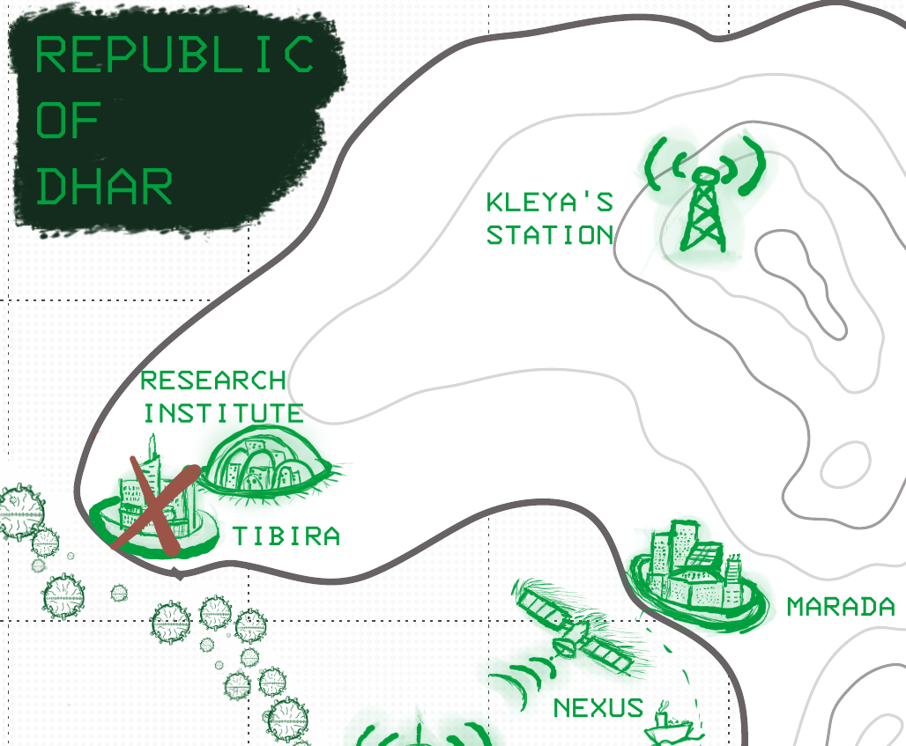
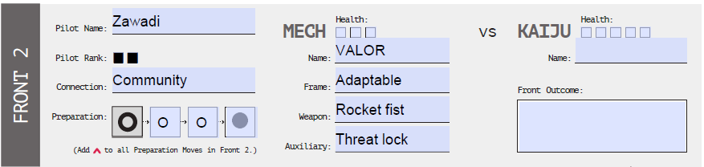
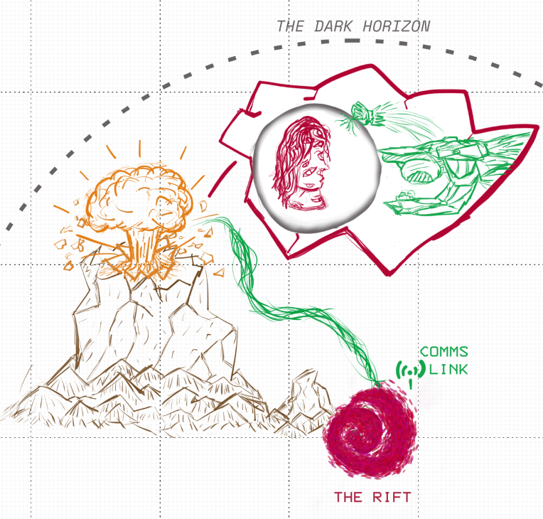
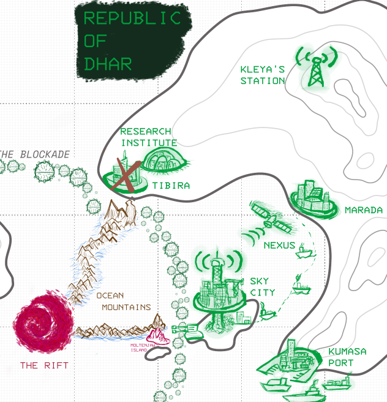

---
tags:
  - rpg
  - rpg/solo
  - rpg/home
played-on: notebook
title: Republic of Dhar - Solo game - 003
description: Playing Home Mech x Kaiju, a mech solo/coop RPG. After defeating Moltenjaw a period of peace and preparation follows before the Rift opens again.
pubDate: 2025-08-01
heroImage: ./home-rpg.png
---

After defeating _Moltenjaw_ on [the second part](/blog/republic-of-dhar-solo-game-session-002) a period of peace and preparation follows before the _Rift_ opens again.

## Front 2 - The Rift

Four years have passed  since the last _Kaiju_ invasion...

> Humanity is weary. The waiting, the anxiety, the dread of the Kaiju returning, it all weighs on you. What does in mean to live, when your priority is to just survive?
> 
> The plan remains the same. We must push into the _Rift_ and find the _Source_.
> 
> Sensors show the _Rift_ is open again. Our probes broadcast images of a truly alien world, a place of awe and terror. You are brave to venture in there, Pilot, braver than the rest of us.
> 
> It's time to bring the fight to them.

As Zawadi has survived the last Kaiju encounter with some minor burns, the first thing we need to do before answering some questions is to draw a new upgrade on our home. I decide to pick up the _Research Institute_ upgrade which will give me a bonus die when I decide to _Study the Kaiju_ during preparation moves.

---

**The upgrade**

Next to the ruins of _Tibira_ things have changed in the last 4 years. The packed tents around the city have been replaced by a big dome to the north. Clean and sleek buildings are organised inside the protective cocoon, where new samples are brought. Outside entire teams work in the ruins digging and making new discoveries with the freshly uncovered samples which interact in weird ways with an environment that is alien to them.

_Zawadi_ has visited a few times over the last few years, sometimes to have some blood samples taken, other times to be questioned and observed in the hopes of that being useful for some kind of scientific breakthrough. Many scientists and doctors are fascinated by what happened inside the mech and they are still trying to understand what made _Zawadi_ special and what triggered some sort of connection with _Valor_.



---

Then we try to answer some questions about the world and the current situation when the _Rift_ opens:

**What has become scarce in the world and where is the only place where you can find it in abundance?** Minerals to build and repair mechs have become more scarce. The improvements made to the new and existing tech have become more and more depending on rare metals and resources that come from the _Rift_ for their resistance and conduction properties. The place from where those can be extracted in big enough quantities is _Moltenjaw Island_, where the remains of the beast are now mined and studied in the _Research Institute_.

**How do children in your _Home_ learn about the _Kaiju_?** The children on the _Republic of Dhar_ now learn about the _Kaiju_ as part of the science classes and on the regular drills where people is led to the shelters. These have relaxed a little bit over the last year but the opening of the _Rift_ has put everybody on edge again.

**What does it look like in the _Rift_?** Rolled on the table provided and got impossibly tall mountains.

### Embrace your connection

Now it is time to dig into our _Pilot_ and their _Connection_ before we start with the preparation moves.

---

The alarms blare once again in _Sky City_ and people move towards their designated shelter areas. _Zawadi_ thinks at first this is one of his dreams, he has been having them since vanquishing _Moltenjaw_ and have become more recent in the last month or so.

_Sky City_ is smaller than it was. Some of the people that run away came back, but not enough to return the city to its previous population levels. The _Haven of Refugees_, as many people used to call it, is no longer an attractive destination now that it is close to the _Rift_. Everybody saw that it was the first target chosen by the previous _Kaiju_ and the city escaped tragedy by a few thousand meters.

Working in Sky City has become harder too. Jobs have been prioritised to the mech warehouses and to _Kaiju mining_, a dangerous task that consists on sending crews to _Moltenjaw Island_ to extract valuable materials that are now core to building new mechs and improving existing prototypes. This is the closest humanity has gotten to exploring a dangerous alien planet. Even if the beast is dead, their guts are still hot in some points and their internal crust is unstable and shifting constantly, ready to eat a few humans at a time, and having succeeded a few times over the last years.

_Sky City_ is hurt but not broken. Despite losing population, despite a dent in hope, it remains tall and enduring. Its citizens gear for the next _Kaiju_ menace, with the _Kaiju miners_ diving deeper and facing the dangers of the newly formed island, and the technicians preparing and assembling new mechs and fitting _Valor_ with new equipment. New test pilots join _Zawadi_ in their daily practices and manoeuvres increasing the roster. _Sky City_, with the refugees committee at their head, has its most decisive members at the front, people like _Zawadi_ and _Sarah_, who are tired of running, either from the old powers as _Hiberia_ or the _Kingdom of Thea_, or the more recent alien menace of the _Kaiju_.

_Zawadi_ and _Sarah_ are just returning from a training session when the sirens ring and they receive the news, the _Rift_ has opened again. Both carry fear and courage in their eyes as they are met by the technicians and engineers gathered in the mech warehouse. This time they are ready to fight back.

---

### Preparation moves

#### Unite the nations

```roll

Boon dice: 6, 5
Bane die: 1
Result: Success, boon dice gained

```

A _Conference_ between the nations organised, funding gets through and _Hiberia_ and _Thea_ reluctantly contribute despite lowering their levels of involvement.

---

_Isha_ eats avidly after the last of the _Conference_ sessions. It has been a few hard days, but at least at the end of the day she knew she could go back to her flat and pick up a box of fried squids from the corner stall on her way up. They have something warming, homely, and the fact that it was Mario serving them and offering a listening ear instead of the non stopping demands of the _Conference_ was a nice change at the end of the day. 

_The Nisha_ representatives were the only exception to all the moaning. They were always eager, always knowing what was at stake and quick to take real actions. But from _Thea_ and _Hiberia_ it was all complaints and demands. _Isha_ doubted they would be able to get any more contributions from them. 

_Isha_ rummages with forming thoughts in an internal monologue: "I can feel it on their language and their excuses. They are pulling back from fighting the _Kaiju_, but they are still not ready. So they have just given us some scraps of funding. They see the _Kaiju_ as an us problem even though they pad that with kind works and cosmetic praises."

---

<br>

#### Study the Kaiju

```roll

Boon dice: 6, 5, 5
Bane die: 1
Result: Success, boon die gained

```

The _Research Institute_ organises an expedition to collect samples from the other side of the _Rift_. The samples are collected via drones and they also manage to draw a map of the surrounding area of the _Rift_.

#### Build an outpost

```roll
Boon dice: 6, 6, 5
Bane die: 2
Result: Critical success, double boon dice gained
```

A team escorted by _Zawadi_ and _Valor_ is sent to the other side of the _Rift_ to establish a comms link so command can guide the pilot and information can get to the other side in real time. They hide it fairly well so it will be difficult to disrupt.

---

_Valor_ dives into the _Rift_ for the first time. Engineers have worked under the clock as well as scientists from the _Research Institute_. From the samples collected in drones they have discovered the atmosphere at the other side of the _Rift_ is weird and contaminated by _Aetheric_ particles. Electronic systems also behave in strange ways and devices require to be shielded with heavy electromagnetic protection, obtainable via heavy metals that hamper mobility or by very precious shielding and light ores found in the shifting guts of _Moltenjaw Island_. Only _Valor_ has those components and that was at the cost of one of the best _Kaiju mining crews_ being decimated in their effort to extract the valuable materials.

_Zawadi_ feels his head and guts spinning like water escaping through the drain as he enters the red shimmering light. He immediately appears on a dim, alien landscape. Very tall shadows of rock can be seen at a distance, but it is hard to distinguish more than the shapes, even with night vision mode. A group of choppers follow the mech and engineers with thick suits land and start unpacking heavy pieces with the help of some machinery. All of those pieces are shielded by pure tungsten and are extremely clunky and painful to handle.

He stays close to the team, vigilant, but the _Rift_ seems to be dormant and silent, almost dead, although _Zawadi_ can't shake the feeling that he is being watched and he has to resist the urge of going deeper into the darkness.

The engineers work quick despite their bulky suits and they manage to activate the comms link, drilling it into the landscape to camouflage it. The mission is a success and they are able to open comms with _Central Command_.

---




### The Final Showdown (Front 2)

#### Reveal the Kaiju

Our enemy _Kaiju_ is revealed. _Old Witch_ is a weird _aether touched_ creature with the ability to control minds and we are fighting them on their territory, where they are strongest.

---

After the comms link has been installed it takes a few days to prepare the expedition. _Zawadi_ takes the chance to go back to _Sky City_ to stay with _Sarah_ and other members of the committee, some of them now fellow pilots, part of the engineering teams, or miners. They are less than before, but more tightly knitted than ever.

Everybody leaves his flat after a night together and it is just _Sarah_ and him. She has been like a mother to him. She is 50 with all her hair greyed out, but that didn't stop her from becoming a mech pilot. Resolute, strong, and unapologetic, the _thelonese_ refugee shows a similar link to _Zawadi_ and has been an ocasional visitor to the _Research Institute_. Some of the scientists there have been theorising if sync percentages might be higher for those who volunteered in ground 0 after the destruction of _Tibira_.

"They shouldn't have sent you alone. What is the point of the other mech prototypes if they can't fit them for battle in the _Rift_?", complains _Sarah_.

"You know that every second it passes the _Kaiju_ can be heading here. We can't risk waiting more time. Besides, you and the others are the last line of defense if the _Kaiju_ gets through the _Rift_", answered _Zawadi_

She tries to argue, but she knows it is pointless, she just needs to vent, to show support. In the end she just embraces _Zawadi_ and both cry silently hoping they can see each other and he comes back victorious from the _Rift_.

At the warehouse all of their companions and friends wait in supportive silence while he steps up into _Valor_. A swarm of heavy tungsten drones takes off behind him and flies towards the _Rift_.

_Valor_ walks first into the _Rift_ and activates the _comms link_ switch. Drones follow, buzzing, operational support enhanced now that they can get a clean feed from the _comms link_. 

At the north west something from the distant top of one of the colossal rugged mountains seems to call him. _Zawadi_ does not see anything at first, and then panels start illuminating and flickering. His mind becomes fuzzy and dreamlike and he feels unable to describe any of that to command at the other side of the comms. A group of drones fly to the mountain trying to map the area and they promptly disappear from the radar, stirring disquiet voices over the comms warning the pilot to proceed with caution.

_Zawadi_ approaches. There is no fear, only the feeling of wanting to get there, without really being able to control it. As he and _Valor_ get close he sees them, a head of many eyes that are bright and emit light, levitating at the top of the  sharp mountain. A translucent black bubble regulates the light emitted and stands like a veil. 

"Old Witch is their name" says _Zawadi_ over the comes as a big massive mouth opens from the mountain and tries to engulf mech and pilot.

---

<br>

#### Showdown Move I

```roll

Boon dice: 3, 2, 2, 2
Improvise (x2, as I am now a more experienced pilot I can do this twice): 2, 2

Result: Failure, 2 damage to mech, Health 1/3

```

_Zawadi_, still dreamlike, reacts very slowly and the opening rocks crush the mech, pieces flying and scattering, screens screaming red, following by shouting over the comms. From below the mountains start to move and screech like steel worms taking over drones and getting closer to the _Rift_.

#### Showdown Move II

```roll 

Boon dice: 6, 5, 5 ,2

Old Witch uses their ultimate power
Bane dice: 6, 6, 3, 3

Result: lost 1 die (4), will die if I don't use special skills

```

_Valor_ seems to be sleeping, unresponsive and falls into their knees waiting for the next crush. _Zawadi_ makes a conscious effort to connect, wake up the mech and leave the debilitating state he is in. But it is so tempting to just stay as he is, leave things as they are and stop struggling. Memories slowly flow into his mind, _Sky City_, his parents and their effort to take their child to safety. Did they die for nothing? And what about Sarah, at the other side, waiting for him to go back, ready to fight. But he's got the best piece of equipment, the best chance to have a go at this thing. He can't let _Old Witch_ take control, this is not what he has been training for.

```roll

Special move: Remember why you fight - Special skill that grants me a re-roll

Boon dice: 6, 5, 4, 3

Result: 2 damage to the Kaiju, 3/5

```

_Valor_ comes back to life as if awaken by _Zawadi's_ memories. Screens flicker alive and they dodge  and punch with one hand, avoiding the next crushing move from the mountains. The other punch flies away powered by the rockets, repeatedly and furiously smashing the translucent shell that protects _Old Witch_, that holds but shows some cracks.

#### Showdown Move III

```roll

Boon dice: 5, 5, 3, 2 

Result: 1 damage to Kaiju (2/5), 1 damage to mech (0/3)

```

_Zawadi_ hears the voices over the comms, huge mountains advancing from the _Rift_, tearing apart any military resistance, mechs at home unable to cut through this menace. The shell does not break completely and the jaws of the mountain close off again ready to strike again.

_Sky City_ and the _Research Institute_ both brace for impact with an ETA of 5 minutes. There is only one option and _Zawadi_ knows what to do. He pushes forward towards the shell: "Take this you fucking Old Witch".

```roll

Special move: Detonate Core
Boon dice : 6, 3

Result: 2 damage to Kaiju (0/5)

```

As _Valor_ smashes against the shell with their head, cracking it open, _Zawadi_ presses the manual trigger to detonate the mech core. The Rift rumbles and there is a big crater at the top of _Old's Witch_ mountain, where everything explodes and melts.  The comms link with _Dhar_ is broken, the shimmering red light subdues and the portal closes once again.



At the other side of the _Rift_ the advancing mountains that approach _Sky City_ and the _Research Institute_ stop abruptly, still salty and wet from an agitated ocean all around them, but no longer moving, dead and still. 

Our Home is safe, but at a high cost.

