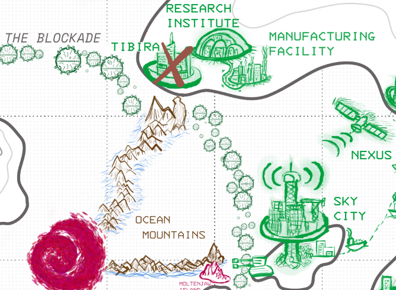

---
tags:
  - rpg
  - rpg/solo
  - rpg/home
played-on: notebook
title: Republic of Dhar - Solo game - 004
description: Playing Home Mech x Kaiju, a mech solo/coop RPG. In part 4 we dive into the third front and try to end up the Kaiju menace once and for all. Are you up for a final battle pilot?
pubDate: 2025-08-23
heroImage: ./home-rpg.png
---

After defeating _Old Witch_ at a high cost on [the third part](/blog/republic-of-dhar-solo-game-session-003) a few more years pass before the _Rift_ opens again.

## Front 3 - The Source

3 years since the third invasion...

> We found it. We launched a probe beyond the _Dark Horizon_ during the last Front and it just reestablished contact. It's still alive and found the _Source_ of the _Kaiju_.
> 
> We need to destroy the _Source_ and let humanity live again.
> 
> The probe showed something else though: the most powerful _Kaiju_ we have ever seen. It could annihilate an entire country in days. Do not let that _Kaiju_ through or there won't be a home to save.
> 
> The _Rift_ is opening, but let's make sure it is the last time, Pilot. One final push to save the world.

We lost pilot and mech during the last front so before we start drawing an upgrade and moving into the preparation moves we need to create our new pilot and mech and envision them. What I envision makes most sense is leaning into _Sarah_ as our next pilot. We already know a little bit of her and it provides us with an opportunity to discover how _Zawadi's_ death has shaped her over these three years.

---

**The new pilot and mech**

_Sarah_ took over _Zawadi_ after his sacrifice. She wasn't the youngest of the pilots, or the most skilful in the manoeuvres and regular drills, but when the techs and scientists started incorporating new pieces of mech using only _Ocean Mountains_ and _Moltenjaw Island_ materials her neural synchronisation levels went up to a 100%, taking everybody by surprise. No other pilot managed to get an increase on their sync levels with those new pieces added. It was almost as if one piece of _Zawadi_ travelled through the ocean mountains and wanted just her to be the one to take over his role.

Her piloting changed quickly after she lost _Zawadi_. She became more aggressive and reckless, something that wasn't taken very well by everybody but was allowed as something that might be caused by grief and eased with time. Over the three years all the new components built to re-assemble _Firewalker_, her mech, were geared towards this style. It was the first and only fully alien made mech, all of its pieces made of _Rift_ materials. _Valor_ fought at a distance but _Firewalker_ gets really close to their enemies with their fiery flaming sword, made from the core materials of _Moltenjaw Island_. Their auxiliary systems are geared to constrict and grapple targets, ripening them for fatal and devastating blows. She has used _Firewalker_ to cut slices of _Ocean Mountains_ with the ease of a butcher slicing meat. Instead of a subduing anger over time, _Sarah's_ wrath burns bright. She's stepped down as part of the executive of the refugee committee to fully focus on her training. She spends a few hours in the morning at the gym before her daily practice, then she goes for a swim in the wild sea. Her muscles are now hard and strong as the encasing of _Firewalker_. Her brown skin is now darker and even though her body looks as athletic as ever, her face shows an aging tiredness that makes her look over 60, long dry wrinkles navigating through her skin as waves in the sea. Her frame is now as _Imposing_ as _Firewalker's_ is. They are one and have one goal, vanquish the _Kaiju_ once and for all.


---

**The upgrade**

We now get to draw a new upgrade in our Home. I think what makes sense here in the context of the story and also to add some mechanic benefits is a _Manufacturing Facility_.


Next to the _Research Institute_ there is now a big _Manufacturing_ Facility where all the materials from the _Rift_ get directed. There is some permanent housing for the tens of thousands of workers and scientists from the _Research Institute_. Both can now prototype new ideas and get them produced in a very short interval of time, having assembled and tested all the new pieces for _Firewalker_.

---

After we are all set up with our pilot, mech and upgrade we have got some questions to go through to help us flesh out what has happened in the world and the _Republic of Dhar_ over the last 3 years.

**What everyday technology has changed because of the discoveries on _The Rift_?** The link between mech and pilot has established and verified there is some sort of connection between _Rift_ powered mechs and their pilots. After some more analysis and studies run on the materials extracted scientists have realised the minerals from _Moltenjaw Island_ and the _Ocean Mountains_ are not completely inorganic and they shift between periods of inactivity when they show inorganic and unanimated properties and others where they show some primitive biological behaviours. This seems to be related with the _Aetheric_ infusion of these elements. On the _Research Institute_ experimental computers and test androids have been developed alongside the new mech components. It is still early to know the impact of these advances. Some people are terrified of the consequences, other hopeful. Most people think there is no option but to push forward and hope this helps facing the next _Kaiju_.

**How have world politics have changed since the first invasion?** The _Republic of Dhar_ and _The Nisha Peoples_ are solid allies. The _Kaiju_ have been a test and collaboration has strengthened between both peoples. _The Nisha Peoples_ have seen an influx of migration from the _Republic_, many of those coming from _Sky City_. 

However this focus on the _Kaiju_ has stopped the previous revolutionary drive coming out of both nations and has given enough time to the elites of _Thea_ and _Hiberia_ to regroup and crush any resistance. Under the mantel of defending against the _Kaiju_ their military and police spending has been going up. Working conditions have deteriorated and today people work longer hours on these nations. However contributions to the defenses for the _Rift_ have been growing weaker as years passed and recently the rhetoric of _Thea_ leaders is moving towards reclaiming some of the islands beyond the blockade. On _Hiberia_ drums of war resonate again, but not against the _Kaiju_. They claim the west of _The Nisha Peoples_ island, arguing that when independence was declared there weren't free elections in that area and many people were exiled and barred from voting.

**What is the source?**: The _Source_ of the _Kaiju_ is an automated breeding program created by an unknown species.

### Preparation moves

#### Study the Kaiju


```roll

Boon dice: 4, 1
Bane dice: 2, 2

Result: Boon and Bane dice gained o/󠁞󠁞󠁞^

```

An expedition is sent to the program facilities. They manage to get some detail info on the facilities and interface with some terminals and send data over the comms link. But the whole expedition is lost via a sudden loss of contact.

---

Sarah moves her right leg up and down, up and down, trying to calm her nerves, her anxiety and her anger while she listens to the feed and looks at the screen in the room rises like hot steam. She and other pilots,  fully suited and ready to board their mechs, observe the progress of the team that has made it to the other side of the _Rift_. She is too unstable and _Firewalker_ too big for a stealth mission, that's the excuse. But they are willing to risk the whole team disappearing if the _Kaiju_ or whatever else is beyond _The Dark Horizon_ of the _Rift_ awakens. They have sent some smaller mechs, a waste of time. If they are discovered and the _Kaiju_ awakens, they are fucked, the pulsing Aetheric signatures show spikes in the atmosphere like a sleepy breathing, but it resonates with a strength never seen. She should have been there working as a distraction, drawing attention. The time for caution and training should be over.

As she mulls over her thoughts cheers inundate the room and the feed. The expedition approaches a big multi domed facility large as a city. One of the teams seems to be trying to interface with one of the alien terminals, sending the data to an isolated server on the _Research Institute_. Another team is walking via the perimeter and using tools to establish a rough mapping on how the interior might look like. Suddenly all the feeds stop at once. No cries, no static, no help. Just silence. "I fucking knew it" Sarah thinks while restraining herself the urge of punching the table.

---

The sacrifice of the expedition is not in vain. Soon after the data is received the _Research Institute_ scientists work without a break, sharing their findings with the wider scientific community and engaging in a frenzy of conversations. The facility seems to be an autonomous breeding facility. There is nothing indicating their builders are still around and the best guess is the Kaiju is all that is left from them, at least in the world of the _Rift_. It looks like the facilities are not fortified and fairly open to interface which makes many suspect that this was a controlled environment where dissension or hostilities where not expected. What was the ultimate purpose of the facility is still not clear, but what seems certain is that the Kaiju comes from here, by design or an experiment gone wrong.

#### Unite the Nations

```roll

Boon dice: 6, 5, 4
Bane dice: 5, 2, 1

Result: Boon dice gained

```

_Kleya's Station_ is transmitting via the _Nexus_ again. The opening of the _Rift_ has accelerated the withdrawal of support from _Thea_ and _Hiberia_ from the joint efforts to stop the _Kaiju_. There is no point in keeping the censorship on the _Nexus_ anymore and the _Republic of Dhar_ and the _Nisha Peoples_ promptly organise an international campaign to recruit volunteers to fight against the _Kaiju_.

It turns out people have not forgotten the _Kaiju_ and despite _Thea_ and _Hiberia_ government efforts to label the _Kaiju_ menace as a hoax and a distraction thousands of volunteers answer the call and flood _Sky City_, which bustles with activity once more. Most of the volunteers help with the defenses and shelters, expanding warehouses and repairing ships sent from the _Kumasa Port_ and _The Nisha Peoples_. The more specialised ones go to _Tibira_ and work in the nearby _Manufacturing Facility_. 

#### Gear up

```roll

Boon dice: 6, 6, 1, 1
Bane die: 3, 2, 2

Result: 2 boon die gained ⚫

```

Mechanics and scientists work overtime to get _Firewalker_ ready for the confrontation. Research on exploiting the core of one of the _Ocean Mountains_ progresses fast and makes the first _Aether powered_ weapon in the world, a massive shatter gun that can be used to blast entire surfaces. The weapon is tested by opening up a passage between the _Ocean Mountains_ with just one shot.


### The Final Showdown (Front 3)

#### Reveal the Kaiju

The decisive time has come. It is now time to reveal our most challenging adversary of the game, a _Kaiju_ like no other before. _Nighthunter_ is an _adapted_ creature with _hypersenses_. I imagine as humans had time to prepare so did the _Kaiju_, 3 years of time with whatever remains of _Valor_ and _Zawadi_, 3 years to adapt and learn before the _Rift_ opened again.

---

The moment has come. _Sarah_ looks back at _Sky City_ one last time and boards _Firewalker_. It is finally time for payback.

The plan is simple. _Sarah_ will lead and confront the _Kaiju_ hopefully taking the battle far enough from the _Breeding Program Facilities_, leaving the way open for an assault team to blow up the complex. _Central_ has decided to call the creature _Nighthunter_ because we haven't seen it since the probe detected their _aetheric_ signatures with the opening of the _Rift_. "I'll be lousy enough to make you come, I'm sure you wouldn't want to miss a good meal" thought _Sarah_ as she approached to the shimmering red portal that would take her inside the _Rift_.

_Sarah_ flies at all speed through the eternal nighttime of the alien world, only dim light coming from above as if they were dying fireflies at the ceiling of a big cavern. Then she sees it. The remains of the old mech assembled with rocks from the _Ocean Mountains_ and behind those layers a pair of red eyes. The creature's hand wears on their skin one of _Valor_ rocket fists. _Sarah_ flies without changing course in silence and after a few seconds she bursts in swearing and curses, shooting with _Firewalker's_ new shatter gun and then taking out the flaming sword.

---

#### Showdown Move I

```roll

Boon dice: 5, 4, 4, 3
Bane die: 1

Result: Both Kaiju and mech receive 1 damage. Kaiju 6/7, mech 3/4

```

The battle is fierce, _Firewalker_ cutting pieces of rocky/mech armour from _Nighthunt_. But _Sarah_ is too focused on the offensive and the remains of _Valor_ punch drives her to the south eastern mountain range causing a massive hole to open and ravaging pieces of _Firewalker's_ armour . The screens flicker and _Sarah/Firewalker_ scream in pain and rage, the reinforced armour holds for now.

#### Showdown Move II

```roll

Boon dice: 6, 5, 4, 1
Bane dice: 2

Result: 1 damage to the Kaiju, 5/7

```

_Firewalker_ stands their ground now, feeding on _Sarah's_ rage. She moves the mech without thinking and uses her mechanical grappling hook to stop _Nighthunter_ for long enough to provide a heavy blow in one of the legs of the creature. It cauterises and recovers quickly, but exposes a fleshy like tissue.

#### Showdown Move III

```roll

Boon dice: 6, 6, 4, 1
Bane dice: 1

Result: Critical, Kaiju takes 2 damage, 3/7. 1 bane dice and 1 boon dice are lost due to deterioration.


```

_Firewalker_ raises their arm fast like an inverted bolt emanating from a thunderstorm. _Valour's_ altered rocket fist detaches from the Kaiju and it is sliced, falling to the bottom of the mountain.

#### Showdown Move IV

```roll

Boon dice: 6, 4, 3, 1 (We had 5 dice before)

Ultimate power move from Kaiju that grants 4 bane dice
Bane dice: 6, 3, 1, 1

Result: mech and Kaiju get 1 damage. Kaiju 2/7, mech 2/4. 3 boon dice are lost (6, 3, 1)

```

Inside _Nighthunter_ _Sarah_ feels a familiar presence and through an opening wound in the chest she sees a pulsating burnt body. It opens its red eyes and the _Kaiju_ charges against the mech all the way through the _Rift_ and into the portal in just a few seconds. They crash through the surface and some mountains and pieces of _Firewalker_ and _Nighthunter_ remain stuck in the alien landscape before they appear at the other side of the _Rift_, where the volunteers forces wait on cruisers, helicopters and a couple of mechs, all readying their weapons. Smaller creatures emerge from the falling pieces of the _Kaiju_,  and a whole ship is sunk by a mech sized creature, its shape a bad attempt to mimic the bust of a human face.

#### Showdown move V

```roll

Boon dice: 5

Result: 1 damage to mech and Kaiju. Kaiju 1/7, mech 1/4

```

_Kaiju_ and pilot appear so quick that the defense forces almost haven't got time to react except for a barrage of missiles before they past through, leaving them to deal with _Nighthunter's_ prole. _Sarah_ tries to slow down her enemy but she is not able to get away from them so when the missiles hit the already battered systems of the mech they start to fall apart, one leg submerging into the ocean like the crystals of a broken bottle. She cries in pain but holds off as....blood?...starts to dye the waters and the mech armour. The _Kaiju_ is bleeding, and as a trapped beast they charge again pushing the mech with them.

```roll

Boon dice: 5

Result: 1 damage to mech and Kaiju. Kaiju 0/7, mech 0/4. Both are destroyed.

```

_Sarah_ realises the grappling hook is still functional. Looks at the face of the creature and the red eyes in the chest. There is agony in them, and familiarity. Is it _Zawadi_ looking to come back home? She fires the grappling hook and with _Firewalker_ tattered arms embraces the Kaiju diving into the water. The creature...or is it Zawadi? does not fight back, like feeling the embrace, and allows to be driven to the bottom of the sea. As they go down the already shattered mech starts to crumble like a stomped can of juice.

``` roll

Does my pilot survive? (4) Yes, but will not be a Pilot again 

```

Emergency systems kick and still embracing _Zawadi_ her cabin is ejected to the surface. Misiles follow to make sure nothing remains of mech or _Kaiju_.

The _Rift_ closes once again, a few still fight on the other side against malformed and embryonic _Kaiju_. The charges are ready and they detonate. Everybody retreats, but somebody has to check that the explosions have done the job and eliminate and hunt any stray half formed _Kaiju_. A few hundred stay back to never return home.

Victory is here. It is a happy day for many, bittersweet for others.  The _Kaiju_ is no more but the last few years won't be forgotten.


### The Aftermath

_5 years later_

The _Rift_ was gone. The _Kaiju_ was gone. The mechs were gone and all the materials were repurposed for experimentation with self conscious devices. 

Right after the war with the last Kaiju _Dhar_ couldn't justify the oversized military spending of maintaining a fleet of mechs when what was needed was to rebuild, repair and regrow after years of scraping all possible resources. Instead the _Research Institute_ and the _Manufacturing Facility_ used the scrapped materials to create autonomous androids that could help with the change.

This was the moment _Hiberia_ and _Thea_ had been preparing for. As soon as the last mech was decommissioned, they launched an attack on the _Nisha Peoples_, hoping the smaller military capacity from them and the inability of the _Republic of Dhar_ to offer support would mean a quick reclaim of old areas of influence.

Two years of difficult war followed and at the peak of the conflict half of _Nisha's_ territory was under occupation. Many were killed. _Refugees_ flooded _Sky City_, mostly families from _The Nisha Peoples_. But what _Thea_ and _Hiberia_ didn't expect was the appearance of two invisible armies behind their front lines. The volunteers from the _Kaiju Wars_ brought back with them contacts, connections and a different example of what their country could be. With Kleya's station and the Nexus humming again they started to organise. 

It wasn't a loud voice a first. Years of carefully crafted information had created support for the war among citizens in both _Hiberia_ and _Thea_. Their enemies were presented as leeches, sucking out the resources of the old nations to wage a war against an exaggerated enemy. The _Nisha_ stole their lands not so long ago and _Dhar_ sucked all those _Kaiju_ resources for their own benefit sharing nothing. It was time to get back their payment so that the citizens of the old nations could live in prosperity and stop maintaining the parasites. The people that made it back to their countries had to do it secretly and be ostracized, sometimes incarcerated or executed accused of working for the enemy.

But as time passed and war started to take a toll in the world population, the appetite for change started to grow. People started to listen to _Kleya's_ station thanks to the _Nexus_ range and clandestine repeaters across the islands. Garrisons had to be deployed, but most of the loyal and experienced troops were fighting in the front. _Thelon_ was the first city to fall, quickly followed by the rest of the kingdom. _Hiberia_ took a few months as the support there was spread more thin due to the natural isolation of the nation.

The _Research Institute_ in _Dhar_ fulfilled a different role during the war. Rather than focusing on military the experimentation with _Rift_ powered conscious biomachines had the purpose of repairing the destruction caused by the war. In the end this would be key by the end of the war and also opened up the debate of the rights of those androids, which would become an important player and object of debate in world politics.

_Sarah_ was active and came back to the refugee committee during the war, but the energy she used to have had been burnt by all the anger she liberated, and all the sadness from that last encounter with _Zawadi_. Once the war was over she decided to retire from the committee, moved to a gardened top flat in _Sky City_ and cultivated tomatoes and strawberries. She told stories of the old world and the _Kaiju_ to whom was willing to listen and frequently played boardgames with the younger members of the committee and other surviving old friends. 