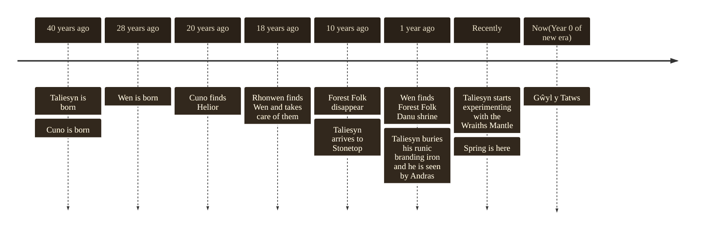
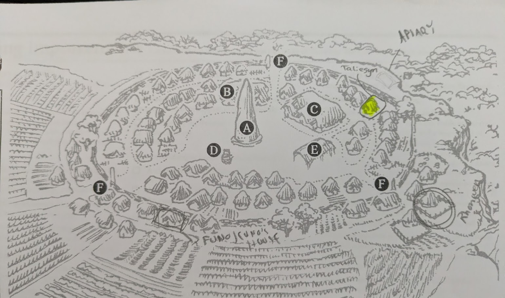

---
tags:
  - rpg
  - rpg/gming
  - rpg/stonetop
played-on: Home
title: Stonetop - Session 0 - Creating the village and characters
description: What follows is the initial session of Stonetop where we established the main characters and some relationships in the village.
heroImage: ./stonetop-banner.png
pubDate: 2026-06-29
---
What follows is the initial session of [Stonetop](https://plusoneexp.com/collections/stonetop) where we established the main characters and some relationships in the village.

The idea is that writing notes will help me spark some ideas for the game and will help as a refresher between sessions.

## Expectations

I have been hyped about the game since a certain someone shared [this video](https://www.youtube.com/watch?v=wH5-uQj4uOA&t=5242s) with me. I went from thinking 'Nah, this is not for me' to 'Shit, I really want to play this' really fast and ended up buying the physical edition.

And here we are with me running a tentative campaign now. This is a game significantly more prep heavy than anything that I have run lately, but what attracts me is that it is heavy on procedures (and that many of those procedures have some reusability across TTRPGs).

I don't know how long this tentative campaign will last or whether I will commit to having a published summary for every game. For previous games it has helped me reflect on GMing and this has the additional value of refreshing previous sessions and providing me with space to think about links between events and possible scenarios. Because I will likely be sharing this with my players I won't outline my thinking of future events or things that I want to keep in suspense (although I might do it after the fact).

Without further delay let's start with a summary of what we did in this first session.
## The heroes of Stonetop

### Wen (Blodwen) - The Blessed
#### Character info

- Savage looking creature of the woods. No concept of gender. Tall, strong, furs and leathers
- Hearty, strapping, soothing voice with beasts
- Odd, does not interact well with people
- Hunter Rhonwen took them in. They hunt together
- Caught glimpses of the Forest Folk (shared their worship of Danu)
- Age 28, First 10 years raised by wolves
- Sacred pouch. Nobody goes near it. Rhonwen got it blessed for Wen
- Two wolves, Brother and Sister. Instinct to bark. Rhonwen has a truce with wolves. Most of the hunters villages don't like the wolves being around
- Jawbone knife from the mother wolf. They use it to hunt
- Bryn the farmer, very close to Wen. Respect for the forest
- Danu: Small shrine, not very well worshipped. They leave offerings as a mark of respect. Offerings out of fear. Fruits, salts, pure harvest. Forest Folk revered Danu. Wen is very respectful of them. Some of the hunters are careful some are dismissive.
- Knows of a shrine to Danu in the woods from Forest Folk. They haven't shown it to anyone else
- Does not know how to write or read
- They have a dwelling/cave close to the Red Grove

#### I wonder

- If Wen was abandoned (sacrifice to Danu or some other entity?) - Do people in Stonetop know who might have abandoned Wen?
- What is your wild name? Have you shared it with Rhonwen?
- What makes Bryn approachable where everybody else seems to steer away from you?
- How did Wen survive in the forest?

### Taliesyn - The Seeker

#### Character info

- World weary, short, sinewy hands - age 40s, talks rambling. He's travelled before for studies.
- He has been living in Stonetop for 10 years
-  Not from Stonetop, not clear where he is from and he's got a local name
- Rather than an antiquarian a tinkerer and engineer
- He has helped improve whisky distillation with his alchemical knowledge. However Winifred the whisky maker is the one in charge of producing the beverage
- Writes on his own code
- He's got the Azure Hand. He unlocked the first power 10 years ago when he came into the village during a storm and the thunder was striking against The Stone
- Who do you trust even more than yourself? Cerys
- Who do you secretly watch over? Daughter of Andras, Ceinwen, apprentice distiller
- Andras does not trust him, saw him burying the runic branding iron
- Wraiths Mantle - never used but he is keen to test its limits.

#### I wonder

- If he will ask about _A vein of milky crystal relic_
- Is Taliesyn somehow related to Wen, maybe his loss of memory took away memories of that?
- Is Taliesyn his real name?
- What is his buried memories connection to Stonetop? Why did he settle there?
- Was his coming related to the disappearance of the Forest Folk? How?

### Cuno (Cunobelinux) - The Lightbearer

#### Character info

- Native from Stonetop
- Itinerant Mystic, hopeful
- Well-weathered, with a melodious voice, ethereal, working and worn clothes
- He is 40 years old and has been an itinerant mystic for 20.
- He had a revelation from Helior 20 years ago and since then he has looked to carry the light of his lord
- He is from Stonetop but travelled since young to sing and play his two-string fiddle.
- His parents named him and his brother Funolenicus from the characters of the stories itinerant merchants brought to Stonetop. When he stays in Stonetop he stays at his brother's. He is married and with kids.
- When he is in the village he tends the bees and plays in festivals. His better performances are in the summer and winter solstices. His absences have caused problems with Funolenicus and his family who see him as an unproductive member of the community
- He is the one bringing some of the news from the outside world (and merchants)
- He found Taliesyn and brought him to Stonetop
- Iorwerth: closest kin, she is the midwife. Not reciprocal
- He is not seeking to convert people, he thinks people will go to him when needed.
- Songs are memorised. Ability to read and write very slowly
- About Helior:  Small mossy rocky shrine in the Pavillion of the gods. Old religion tied to sun and song
#### I wonder

- Who taught Cuno to play music? If multiple who was his best teacher and where are they from?
- Why does Cuno want to have a mobile apiary?

## A rough timeline

My next step after the session has been putting together a rough timeline and sharing it with the players:

This will help me and the players to start making connections.

## Fleshing out Stonetop

As part of this session we have already established a few interesting characters:
- Funo, Cuno's brother and an interesting rivalry to explore there
- Bryn the farmer but to make things more interesting his dad is Funo
- Andras and his tension with Taliesyn
- Ceinwen, Andras' daughter whom The Seeker watches over. That is some good potential for drama
- Rhonwen the hunter. I imagine him as a pillar of support for Wen and a strong man with a kind heart
- Iorwerth the midwife. Will Wen try to find answers about their parents from her as she knows a lot about children in Stonetop? Also, how is the relationship with Cuno going to play out?
- Winifred the whisky maker. Maybe she can be somebody with sway in the village?

_We got to draw some houses/special possessions on the map_
