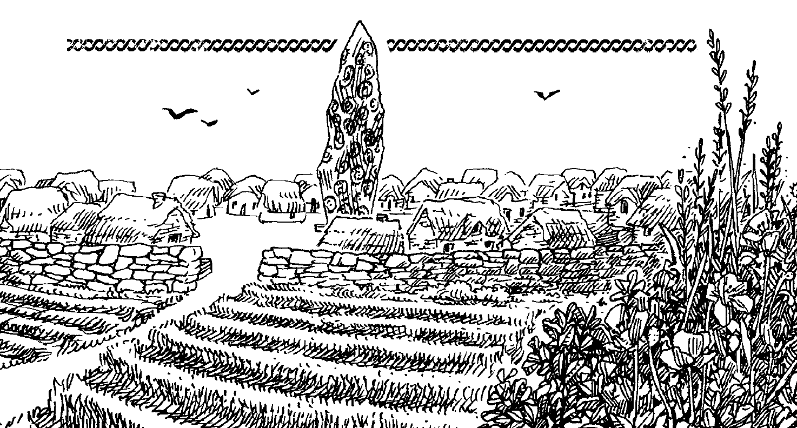
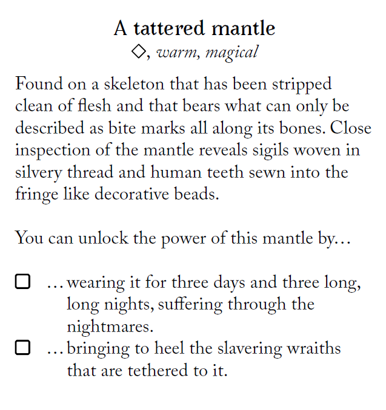
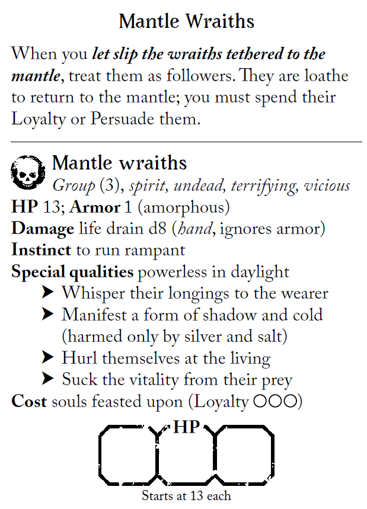
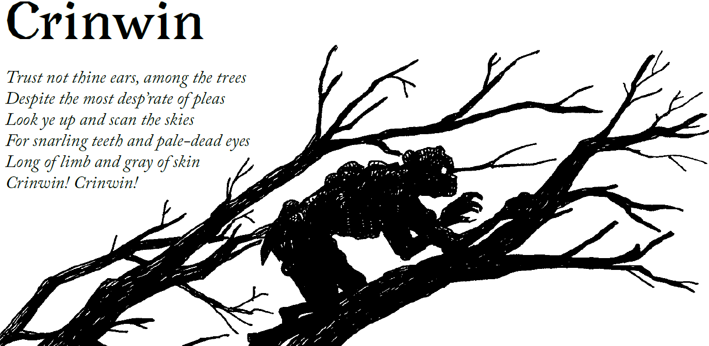
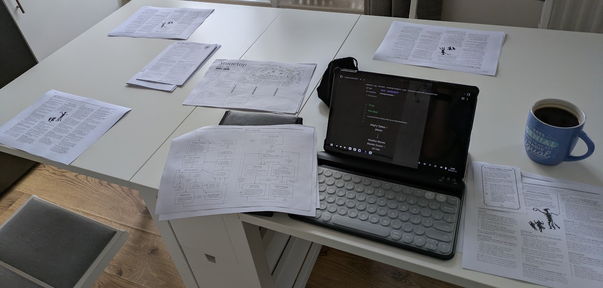

---
tags:
  - rpg
  - rpg/gming
  - rpg/stonetop
played-on: Home
title: Stonetop - Session 1 - Gŵyl y Tatws
description: Taliesyn, Cuno and Wen have an eventful potato festival and head out of Stonetop tracing a threat to the village.
heroImage: ./stonetop-banner.png
pubDate: 2026-07-17
---
Taliesyn, Cuno and Wen have an eventful potato festival and head out of Stonetop tracing a threat to the village. This continues the world of Stonetop that we defined in [session 0](/stonetop-session-000-report).
## Summary

### _The first buds of Spring_

A crisp cold sun rises over the horizon melting the frost sitting on the barley roofs of the round stone houses. The water drips from them and smoke rises from the hearths in Stonetop. And like small clusters of ants villagers leave their houses and move towards the fields. Winter is over and it is time to retrieve the only thing that Danu allows to grow in winter: potatoes.

The morning is cold and the sun barely warms up but Cuno can feel how the days become a bit brighter. The time of Helior comes, and for this _Gŵyl y Tatws_ he has got something special.

> This is literally potato festival in Welsh and I have established it is the spring coming celebration and an opportunity to introduce some scenes of what life is like in Stonetop and the hook for the adventure.

Taliesyn is also up early, bag of trinkets and measurement utensils in hand, trying to find ways to harvest the potatoes quicker and help with the planting. And his mind is already racing with the idea of building a crane. His voice, though, is hoarse with the condescending undertone of the academic. One of the more experienced farmers, Gerlt, looks on with a frown from a distance and mutters something. It looks like The Seeker's behaviour has been breeding some beef with the farmers over the last few years.

Wen is up early too, heading into the woods with his adoptive father, Rhonwen, looking for whatever small game the winter has left untouched and for some medicinal and aromatic herbs. They venture a little bit beyond what a responsible parent would like but Rhonwen knows better than to try to convince them not to go too far. Besides, Brother and Sister are here to guard Wen and it is also his role now. They venture to a small clearing of the forest, big enough for the sun to get through, protected enough to allow for a big patch of wild rosemary to grow, Wen's spot. _Gŵyl y Tatws_ would not be the same without baked potatoes with butter and rosemary and that is one of the contributions to the village that make them feel proud.

### _The night of Gŵyl y Tatws_

The public house is full to the brim, only the sick, the villagers on watch and a few stragglers are missing. This is a moment of celebration, the official end of winter and a time to look forward to better weather, better food, more sunlight.

In the outskirts of the public house there are some old and stained wooden tables and some rocks that are used as seats. Two figures sweat at the glow of the fire, arms out on the table in a wrestling match.  Blodwen The Wild, arms solid as tree trunks, fights Cuno, the eccentric and itinerant voice of Helior. There is shouting, gasping, and confused looks when the unexpected winner emerges. Cuno smiles and boasts, overflowing with confidence. This is his time, Helior's time, winter be damned. And that is why it is today, the day when Helior is closest, when he has to try and face what hides in Taliesyn's mantle. No more wandering in the darkness without Helior's light for the tinkerer. But before that, Cuno has a little something prepared for the rest of the town.

Andras' loud and authoritative voice reaches outside the open doors of the public house announcing Cuno's performance. He is cloaked and with a mysterious air he walks from the stage in the public house outside.

'Come, follow me!' he shouts as people hesitantly and tentatively trickle behind him.

He walks towards _The Stone_ in the middle of the village, all sorts of runic undecipherable carvings in the uncannily smooth rock, the smell of ozone always stronger here along with the aura of Tor, Slayer of Beasts, God of Rain and Thunder.

_The Stone of Stonetop_

Gasps as Cuno throws liqueur flasks into The Stone with the aid of a wooden thrower trinket, no doubt the work of Taliesyn The Tinkerer. The flasks smash and drip liquid. And then a flame, as the rock lights up with the echo of more gasps.

_Taliesyn's liqueur thrower, probably using wood from the pliers, some strings and leather_

Cuno drops his cloak, revealing his weathered naked body, covered in golden painted tattoos. He picks up his two string fiddle from the floor and starts playing, singing and dancing, warming up the surprised faces of his public.

> Here Cuno rolled a +10 on _Defy Danger_ using _CHA_, the danger being his actions being perceived as a sacrilege. His actions might still cause some unpleasantries and conflict down the line between Helior and Tor, but for now he can enjoy his success, and we agree that degree of success grants him a possible new follower, Tesni, that for now stays vague in details.

As he sings and dances he goes from warming up songs to a proper story he learnt during his travels listening to the stories of merchants travelling between Marshedge and the south. It is the story about the lost city of what today is _Three Coven Lake_, a story of love and tragic loss. Something familiar awakens in Taliesyn as he listens to that story, a faded memory perhaps?

The song ends and the fire goes away and in a flash Cuno is gone, people still adapting their eyes to the night. He is one that likes making grand entrances and disappearances.

A few minutes after Cuno disappears people start to go towards the public house to drink and eat more and that is Taliesyn's chance to make his exit. He is mostly stealthy but not enough for Wen's eyes and nose. Wen or Wyn, an old way to mark hunters in their names, is not just a decorative trait, and all those years in the forest have given Blodwen a trained nose for smelling unnatural trouble. 

At Taliesyn's house, Cuno and The Tinkerer meet in conspiratorial whispers. It is time to unveil the mysteries of the tattered mantle under supervision.

A few nights ago Cuno discovered Taliesyn gasping for air at the edge of dawn, as dark shadows emanating from the now inert mantle clutched to his throat. He was lucky he was around and with Helior's light and dawn on the horizon the wraiths went back to their prison.

_Front part of the minor arcana_

Tonight, the day of the official change of seasons, Helior's power would be stronger, and Cuno feels these things trapped in there have some sort of relationship with the prophetic dreams that guided him to Helior two decades ago. In the shadows, Wen watches.

> Normally you already start with the arcana unlocked as part of The Seeker playbook but the table felt it was more interesting to unlock that in play and that is what we did.

There is a circle of stones prepared with candles, an attempt to bind the wraiths to a confined space to avoid more unsavoury experiences.

This time, when Taliesyn leaves the Mantle Wraiths free, their black shapeless forms bash against an invisible wall in the circle. And there he tries to communicate with them and learn more.

'Give us food, give us souls, my master' says more clearly the whispery voice of one of them.

Around the whispery voice one shadow materialises, face featuring a skull, not quite human but familiar, they have definitely seen that before.

> Here a failure in seek insight is an opportunity to give the players a mystery, which we might resolve a little bit ahead in time.

He also has the chance to understand better what works and what doesn't with these creatures. They seem to be afraid of salt. And ghostly forms are not fond of silver, so Taliesyn thinks it is safe to assume that too (unfortunately silver is hard to come by and he does not have any).

_This is the reverse of Taliesyn's minor arcana card_

Just as he is in deep thought and experimentation the ringing of bells takes the village, the watchtowers have seen danger!

### Something in the woods

> A [wee thematic song](https://www.youtube.com/watch?v=5lUj3IhgMH8&list=RD5lUj3IhgMH8&start_radio=1)...

Cuno and Taliesyn rush back to the village jumping one of the walls. Wen is much faster moving from the apiary directly to the watchtower that faces the switchback path to The Great Wood.

Wen arrives and sees Rhonwen talking with Winifred the distiller. As they get closer and close enough with the help of the moon that shines now in the crisp night they see greyish greenish blood, with a trace of blue too? It definitely appears to be crinwin, but the blue, that is weird.

Rhonwen embraces Wen as they come out of the shadows, glad to see they are fine. A crinwin attack has been repelled and Winifred starts retelling the fight as Cuno and Taliesyn arrive at the scene.

They learn from tall red haired Winifred how these crinwin are big. Crinwin are normally child sized, these ones are the size of a beefy teenager. And not only that, even if there were just five of them, they were organised and looking for something. They only noticed they were trying to sneak in because Winifred has a keen eye and has lived long enough to stay extra vigilant in celebrations where everything seems to be going well.

Cuno and Taliesyn exchange a quick guilty glance. Could anything that they have done with the stone or the mantle have caused this? Wen also flashes, they have definitely felt something dark and similar to the Mantle Wraiths just about the time of the attack. It is fuzzy and not clear but they have learnt to trust their instincts.

Wen is decisive and does not waver. The trail is fresh, Rhonwen and the village might be in danger. They need to go now. Rhonwen's face contorts trying to think of a solution when he sees Wen moving.

'I know you need to protect the village in case they come back in greater numbers. I can take care of myself, Brother and Sister have got my back' says Blodwen.

Rhonwen glances towards Taliesyn and Cuno. The Tinkerer volunteers himself readily while for Cuno a little bit of convincing is needed. He boasted so much on his wrestling match that now surely he can prove he is worthy of the village hunters.

They pack light and fast and descend from the top of the cliff down to The Great Woods. While they walk Wen approaches directly the subject of the mantle:

'You don't know what you are fucking with and you are putting the whole village in danger' they sentence.

Poor justification blurts out of Taliesyn's mouth, and a small reprimand from Cuno for being spied on, but Wen's voice carries the wrath of nature and the forest and deep down both Taliesyn and Cuno know they are working with dangerous forces.

Just at that time The Blessed wolves, Brother and Sister, appear on the horizon and come closer. They lick Wen's face and sniff around The Lightbearer and the Seeker. Blodwen then uses some of the blood from the crinwin to put them on the scent of their prey and they immediately start to follow the scent.

The scent soon leads to The Stream, deeper water than usual with all the melting snow and recent rain. Crossing it is tricky and everybody knows where there is deep water there are evil things. They decide to find a narrower passage rather than following the scent directly and risking entering the water for longer than they can hold their breath.

As they find a narrower passage Wen and Cuno both hold their breath and touch dry soil after, a small ritual that popular knowledge says offers some protection from the evil below. Taliesyn however is sceptical and does not follow with the same enthusiasm.

> This was a great exercise of world building and was taken directly from some of the questions prompted in _Book II_ of _Stonetop_. The players are the ones that come up with the answers while the GM tries to provide context and frame specific questions.

Hours of walking follow, creaking of the trees and sounds of night creatures all around the forest while Blodwen and the wolves follow the scent. And then movement in the top of the trees. Taliesyn and Wen catch this but one of the massive crinwin jumps out of the trees and slashes Cuno in the chest before he can react. The face of the creature...it has the same shape as the skull of the Mantle Wraiths. 

_Crinwin like to jump from the trees, these strange ones seem to be no different_

## Game thoughts

The _End of Session_ move was a good way to close off the session. As a table we agreed that we want to see more of:
- Worldbuilding stuff like coming up with the rituals that are used to cross water
- Mantle Wraiths. This is clearly becoming central to our campaign
- History of the world, maybe some makers
- More of the Forest. Particularly a wish to see good spirits in action, maybe woodlands ones

So far it has been a delight running this. I have been mostly running one shots lately and I enjoy the slower pace of a campaign. Prepping games used to cause me a fair bit of anxiety but Stonetop is helping me a lot to enjoy whatever prep I can do. And the worldbuilding, I am loving it. It feels very close to when I played a coop [Starforged](https://tomkinpress.com/pages/ironsworn-starforged) campaign (if we ever do a session 2 I might write about this here!). 

I have got more GM load than in Starforged but being able to have players that engage in the fiction is great to be surprised and keeps me on my toes to weave their creations into the story. Also I can plan some surprises for the players and see their reactions, which is cool!

_The table where the magic happened_

---

Note that all art from the books is the work of [Lucie Arnoux](https://willoe.carbonmade.com/projects/7231383).