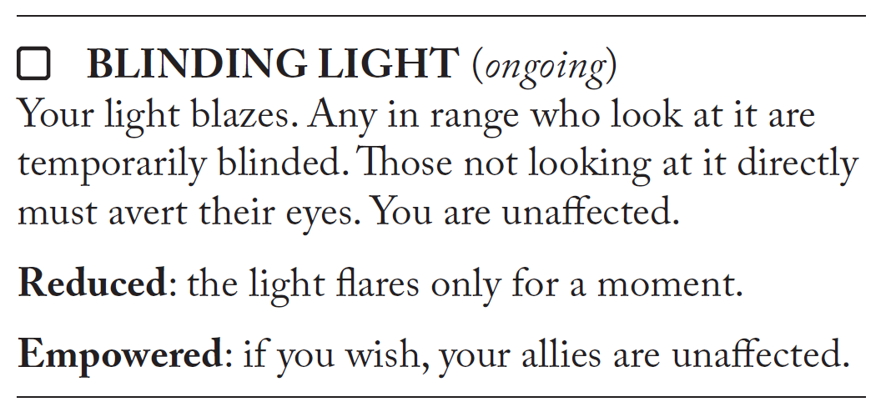
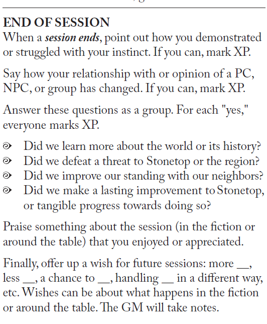
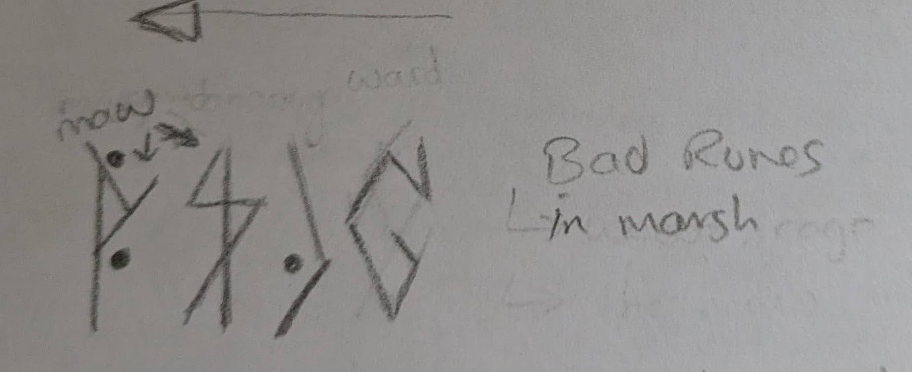
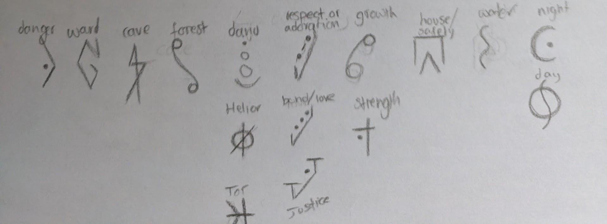
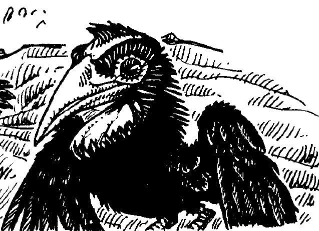

---
tags:
  - rpg
  - rpg/gming
  - rpg/stonetop
played-on: Home
title: Stonetop - Session 2 - The Maw
description: Our heroes move into the depths of the forest while The Mantle whispers cruel words.
heroImage: ./stonetop-banner.png
pubDate: 2026-07-25
---
## Summary

Taliesyn, Cuno and Wen dive deeper into the forest and try to defeat the crinwin that jumped on them during [session 1](/blog/stonetop-session-001-report).
### The ambush

Cuno lies on the forest floor, blood sputtering from his chest, a cry of pain exhaling from his suddenly dry throat. Taliesyn tries to think quick and moves in Cuno's aid at the expense of losing one of the creatures that lurk in the shadows. He wields the staff with as much strength as he can muster and tries to hit the creature with enough momentum to kick it away from Cuno. But the opponent is quick as a fox and their feet drag against The Tinkerer as they dodge, making him fall on his back. A second crinwin jumps from the trees towards Taliesyn.

Wen's eyes are wide, nostrils open, primal wild instincts awakened. They pull the sling from the belt, load a rock and score it in between the eyes of the crinwin on the trees. The creature falls and in the blink of an eye Wen's carved knife blade is tinted with blue blood.

Cuno struggles with the crinwin on top of him but he manages to free his hands for a few seconds, enough to whisper some words of help to Helior, move his hands in a circle, and clasp them. A blinding flash of light takes by surprise both crinwin leaving them startled, revealing barklike skin uncharacteristic of their species.

_The invocation move_

> I wonder if I should have blinded Taliesyn here too. Something to keep in mind next time this Lightbearer invocation comes into play!

The other two crinwin are dispatched in moments by Sister's teeth and a glyph carved femur that Cuno uses as a knife.

> Given that this is an uncharacteristic item as a GM I had multiple options. I don't like saying no to interesting ideas so in the end I settled for that item being mechanically a regular knife but not before asking a few questions that might come up in future games. We established that he won the "knife" from a Gordin's Delve merchant who wants it back, Tox The Tinkerer (yep it looks like we have another tinkerer).

Taliesyn sits panting, cleaning blood, his mind racing. In the fray of the fight he was able to recognise the broken speech of the crinwin and realised it is the same as the whispers of blood and souls coming from the mantle. He is sure now, the wraiths were asking for his blood, and these crinwin were looking to recover the mantle.
### Camp

The group decides to find a spot to rest during the rest of the night. Taliesyn is still in shock and bears some cuts from the crinwin's claws and Cuno's garments have been slashed across the chest. The latter looks worse, with wounds digging deep into the flesh that will take some time to heal, marking him for the years to come.

> Here the players rolled fairly well on `CON` _Defy Danger_. And players are already suspecting there is something afoul with these crinwin.

They find a little defensible clearing in the forest where they can light up a fire. Once the fire is up wounds are bandaged as good as an improvised expedition can do, then they eat. After that is the turn for storytelling, to brighten up the spirits. Taliesyn's encounter has loosened his tongue and he starts recalling memories of mountaineering, as they flow back like a stream enriched by the ice melting in spring. He starts recounting how looking at the sky when it was clear and finding The Bridge would always give him certainty.

> Here, with a few questions the players come up with The Bridge, a constellation tied to the gods, who use it to traverse the sky so they don't fall into the deep water.

As his brain connects the dots he stops his tale and he tries to change the subject of the conversation, those nights were the ones previous to him finding the mantle. He can remember now that it was late autumn, but that is not something Taliesyn wants to reveal to their fellow heroes just now.

Cuno takes the pause in the conversation as an opportunity to bring up the mantle.

'We can't go back to the village with that,'—he points to the old looking mantle—'it is a risk for everybody.'

'I know what I am doing, I would know if I was putting everybody in danger.' says Taliesyn, a pained look on his face but unwilling to admit he is wrong.

> This was a great example of a character struggling with his instinct, and an opportunity for character growth over different sessions. Having flawed character is great for the story! And it rewards the player with xp!
> 
> 
> _End of Session move includes marking `XP` when characters have demonstrated or struggled with an instinct_

The conversation reaches a stalemate after some backs and forwards and Wen intervenes to change direction asking for a song from Cuno's. In the rush of leaving he was not able to carry his two string fiddle but he still has got his voice.

Not quite finished with the previous topic Cuno brings a cautionary tale from his repertoire. The story of a farm boy who stole the endless fire from the gods, but by doing so, burned his whole village down.

### A warning

The party sleeps taking watches and early in the morning Wen leaves camp to scout ahead. The intention is to forage but instead they find a marshy area, a solitary carved tree half sunk and covered in markings. Wen gets knee deep into the marshy area and gets a closer look at the glyphs.

They know they are Forest Folk glyphs. There is also something else, a spirit presence, damaged, almost wailing. Wen has felt something like this before when in the area but, is it worse now?

> A couple of things here:
> 
> 1. Wen's character can perceive spirits but given that this is something important for our table I want to spend some time thinking about what kind of spirit and the options, so rather than presenting the spirit straight away we delay its appearance.
> 
> 2. Thinking after the game one thing that it would probably be good to dig into in next games is how that perception of spirits manifests. I like the idea that it is not clear cut but this is the kind of thing that it is better to work with the table via some questions.

Wen, with the help of Brother and Sister, also knows that the trail for the crinwin passes close to this place. They wake everybody up and bring them here. 

Taliesyn fortunately has some writing utensils so Wen sketches some of the symbols on parchment so their companion does not have to sink into the mud. The Tinkerer studies the drawings, he is _Well Versed_ in the wild world and a _Polyglot_. This is definitely a warding symbol, likely faded, and a warning of not getting close to _The Maw_. 

_Wen's player came up with the glyphs, they are amazing!_

_And some extra glyphs he made!_

### The Maw

The scent of the enemy seems to be beyond the tree, so they ignore the warning and continue. Wen sees a clear path, like a faint animal trail, and Brother and Sister keep them on track. Cuno and Taliesyn just see branches and endless forest, they would be lost if not for Wen. 

Finally they arrive at a clearing to see a group of _butcherbirds_ festering on what looks like part of a stag. They sound like a group of maniacally possessed children and their lust for blood makes the heroes stop for a moment, cold. Such a tiny bird, but always such a gruesome and spine chilling experience.

> I am not a great voice actor so instead I asked the players what sound do these birds do that makes them so unsettling.

_A butcherbird_

Wen sends the wolves to scare them off and they hold them long enough for them to quickly inspect a half rotten animal with a strong, somehow familiar smell. The top half is missing.

They quickly continue as the butcherbirds swoop claiming their bounty again.

A few hours later there is a shift in the air, and it is not only Taliesyn that hears the whispers from The Mantle now, Wen does too, even in plain daylight. In front of them there is a 10m tall cave, no growth except grey lichen, bones scattered, some rotting and half eaten, some clean. Seven of these big crinwin are guarding the entrance of the cave and before they can react one of them shouts something that only Taliesyn understands.

'Aghhhh!—Get the mantle!—' says without closing their mouth and in a guttural jarring sound, or so it seems from the distance.

The party looks for a second paralysed and clearly outnumbered.

'You were right!' Taliesyn says before they all sprint into the forest.

> What determined the situation at the start of The Maw was a roll to _Struggle as One_ (`DEX`) to be able to sneak in without being seen. They failed.
## Game thoughts

I think the game went pretty well and I am enjoying it so far. I am thinking as the campaign goes probably this section will get smaller as I am finding it more useful to have annotations in the summary.

A couple of things we discussed after the game were:
- Keeping an eye on not seeing the party running from combat too many times. I don't think it is a problem at the moment but the table is keen to not make a habit of this
- Digging deeper into what we encounter like for example the butcherbirds. I wonder if I missed asking some more worldbuilding directed questions on this session but the table (including myself!) loves it

One other thing that I think I am still struggling with is being able to use all the mechanical tools that the game offers. Particularly having so many moves sometimes makes things a bit difficult to find. I don't think this is a major problem but something I want to keep an eye on. I've got the feeling that, for my personal preferences, a small number of flexible moves with good examples would have been enough, and probably saved some page flipping/clicking.

---

Note that all art from the books is the work of [Lucie Arnoux](https://willoe.carbonmade.com/projects/7231383).