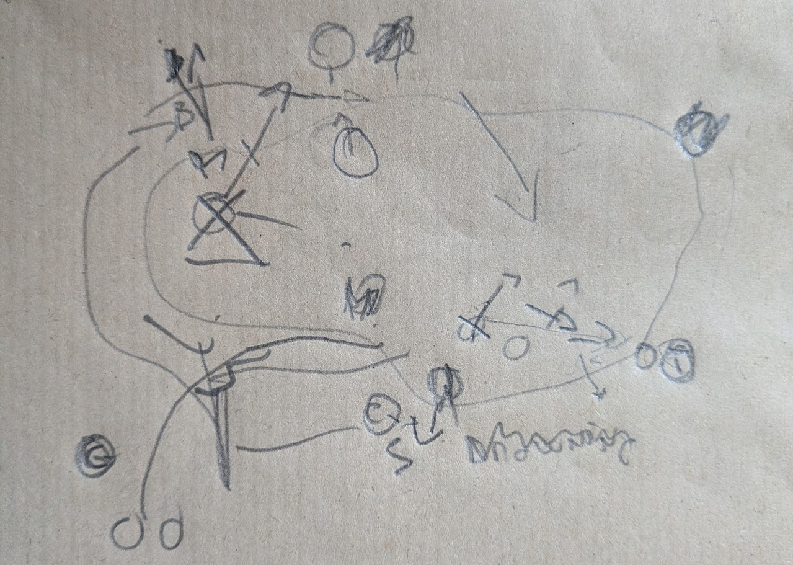
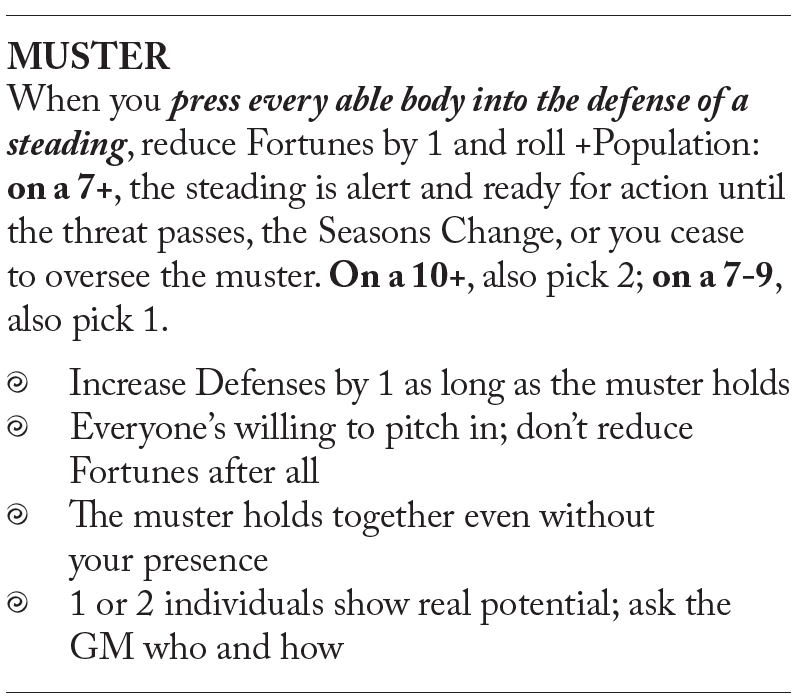

---
tags:
  - rpg
  - rpg/gming
  - rpg/stonetop
title: Stonetop - Session 3 - The Sorcerer
description: Taliesyn, Cuno and Wen run into the forest, decide to ambush the crinwin, and learn about a new threat.
heroImage: ./stonetop-banner.png
pubDate: 2026-08-23
---
Taliesyn, Cuno and Wen run into the forest (read the session 2 recap [here](/blog/stonetop-session-002-report/)), decide to ambush the crinwin, and learn about a new threat.

## Summary

### Mouth of The Forest

They run for what seem hours to Taliesyn. His pride is replaced by humble pragmatism when Wen takes the lead with Brother at the front, Sister watching the back. The pursuing crinwin are no match for _The Blessed_, who moves like a shadow through the foliage. Cuno and Taliesyn struggle to keep pace behind but don't complain.

But that confidence is nothing but a façade. Wen is thinking about what is best for the village, and for now the best is getting away from Stonetop, at least until they have decided what to do with The Mantle. The terrain is unfamiliar, dense thickets populate this area of the forest and the smells are all different. If it wasn't for the pursuit, this would be pleasant and exciting for Wen.

As they walk and it is obvious that nobody is immediately on their tail, conversation starts to trickle. And from a trickle it becomes a stream. They argue about The Mantle, Cuno and Wen outlining how this is a risk to Stonetop.

'But we can't just hand it over to these creatures, we don't know to what ill use they would put it.' Taliesyn argues while avoiding as best he can the thickets' sharp edges.

There is silence after that and Cuno and Wen look at each other. It is a valid point. And just as their minds start to shift, the shape of the forest starts to change to give way to a swath of ash trees. They all agree there is only one way to find out what the crinwin want. They need to capture one alive.

But before they can talk more the swath gives way to a small clearing with something unusual at its centre.

> Here I took the chance to ask some worldbuilding questions:
> - Wen, Taliesyn, what gives away this is a sacred place to a spirit?
> - What is strange, wild and savage about this place?
> 
> I already had some vague details in mind but from these questions we built together some deeper details. Spirit shrines have a circle of mushrooms around them (at least the ones that Wen has seen) and this one in particular had greyed ash trees facing the place of worship.

There is a stone with some faded runes, and what seems to be a bowl with some fruit and eggshells. All the ash trees, the colour of grey rock, seem to be facing towards the stone. One of them has a big claw mark.

Surrounding the stone, mushrooms gather, although without making a perfect circle. There are remains of what might have been healthy mushrooms, withered to dry and crumbling debris.

'This is a spirit shrine. I am going to commune with them, see if they know something that can help us.' Wen walks towards the circle, starts painting ash on their arms and sits.

Their eyes roll back, the irises hidden behind the skull, the body still. Taliesyn observes curiously and notices that for the first time since The Maw the whispers have stopped. Cuno is a bit jealous, this is the god Danu in action through Wen. He can feel the closeness, how the boundaries between nature, Danu and Wen blend. He yearns for that closeness with Helior, which always seems a bit distant.

> How Cuno felt was prompted by trying to shift the spotlight. Both Wen and Taliesyn are well versed in the spirit world and I wanted to include Cuno in this scene so I just asked how Wen's closeness and attuning to nature and Danu was different to his relationship with Helior.

Wen steps into a foggy undetermined part of the forest. They walk and see The Maw again, contorting in pain. It is a mouth of rocky teeth, exhaling a putrid sickly stench. The Maw dissolves in a puff of smoke, revealing a massive grey bear, rock toothed and weak. It vanishes in smoke to reveal a humanoid skull, bigger, older. A dark figure enters The Maw, dark clouds descend and there is that rotten smell again, the smell of these crinwin. The grey bear looks at Wen.

'Do you mean harm to us?' Wen's thought escapes loudly even without leaving their mouth.

'To my enemies, to my prey. I am trapped, cleanse The Maw,' answers the grey bear.

### It's a trap

The three of them ponder going back to The Maw. But they are too few. Better to know more about these crinwin. They scheme and come up with a plan. These creatures seem to be attracted by The Mantle, which makes it the perfect bait.

Taliesyn thinks about the marsh they found on the way to the crinwin's lair: 'I know where we can set up our trap.'

Wen leads the group back towards familiar paths. They were lost, that is now obvious to everybody but going back home is always easier than stepping into the unknown. Wen has grown up in the forest and knows how to navigate it. Soon the group is on track, as a fine mist permeates the forest, darkening the day. It is late afternoon by the time they get to the place and they start working immediately on their trap. Wen hasn't made any effort to hide their tracks and Taliesyn can hear The Mantle's whispers again.

> Here what I did was make the players [_Struggle as One_](https://splatbook.app/stonetop/reference/03-playing-the-game--struggle-as-one) on `DEX` to see how they fared on their walk to the marsh and determine the starting situation for the encounter. It didn't make any sense for them to get lost and the danger here was that they might be attacked before their trap was ready.
> 
> We ended up with Cuno in a spot and Taliesyn and Wen in a controlled position.

Cuno livens the spirits with some singing and tests the edge of the marsh while Wen and Taliesyn labour trying to set a rope snare that will tighten as soon as a crinwin steps in. Taliesyn is wearing The Mantle and Wen notices how it is embroidered with teeth. Are those milk teeth from children?

> This was great worldbuilding driven directly by the players. I observed, delighted, and noted down that new detail about the Mantle!

_I reused some leftover map paper from the [Mothership game that I ran recently](/blog/mothership-galactica-journey-to-paradise-001/)._ 

Wen snaps out of it when Cuno's singing abruptly stops. Four bulky crinwin lock eyes on _The Lightbearer_ and _The Mantle_, which whispers pleading for souls.

The skirmish is messy but effective. Cuno ends up battered and covered in mud after almost drowning, but they trap a crinwin and kill the rest. They tie the creature to a knotty willow and begin the interrogation with the last breath of daylight.

The Lightbearer draws on the strength of the hiding sun, cups his hands around a flaming candle and chants soothing words to the creature. The crinwin spits at Cuno's face, then looks down as the blood flowing from his cuts, with its characteristic sparkle of blue, seems to solidify. He grumbles something that Taliesyn is too far away to understand.

Taliesyn approaches next and Cuno moves a few metres away where Wen, Brother and Sister wait. The crinwin's face twitches when Taliesyn answers his mutterings in the same language.

'How do you know our language?'

'I know many things and have got many powers.'

'Kill me and be done with it or give me The Mantle and let me go. There is no other way,' responds the crinwin with a defeated look on his face.

'Why do you want The Mantle?'

'I do not want it, I do not care for it. But The Sorcerer demands it, so we follow.'

It takes a few attempts breaking through the nihilistic answers but when Taliesyn reveals that he is also a "sorcerer" something changes in the crinwin's eyes. He then asks to be freed from the other sorcerer or protected in exchange for information.

The creature reveals that The Sorcerer turned him into what he is, a bound and enslaved crinwin and that he is using them to acquire magical artifacts. He does not know much about his master, just that he is compelled to do his will when close, and that The Sorcerer comes when he needs them to do something. Taliesyn offers his word to help the crinwin break free of The Sorcerer in the future and not to kill him. The crinwin offers his name, Skallag, and Taliesyn introduces himself as _The Wanderer in Light_.

They decide to camp there for the night and early in the morning they leave. Before doing so they loosen Skallag's bindings enough so he can free himself once he wakes up.

### Back to Stonetop

They are heading back to Stonetop. Wen's and Cuno's concerns about bringing The Mantle back to the village are dwarfed by the possibility of this sorcerer getting his hands on it.

As the terrain becomes more familiar and some of the tension of the pursuit fades into the background they start to think about what they are going to tell the villagers.

'We can't tell them about The Mantle, we can say The Sorcerer is after ancient artifacts. It is obvious that The Stone is one of them so that should get the message across just fine.' Taliesyn breaks the silence.

'We can't just lie to our people, that always ends up badly and they are not going to be happy when they finally discover our little secret.' Wen jumps in, eyes piercing Taliesyn.

'And yet, if we tell the whole story now it might divert the village's efforts from where they should be focused. Some would blame Taliesyn instead of worrying about the wider threat. It wouldn't be lying, just leaving enough for a second story once this blows over.' Cuno raises his hands, palms facing outwards in an appeasing motion. Then his gaze settles on the cliff and the beginning of the ascending path to the village. His brain is already weaving a story to tell.

As they approach the village Rhonwen grabs Wen by both arms and hugs them as they awkwardly accept it. The display of love warms their heart. Funo embraces his brother, old rivalries and resentments parked at the sight of him alive and breathing. Cerys The Healer stays behind but smiles and nods at Taliesyn, her bright green eyes radiating warmth. A small pang of guilt as his hand touches the rucksack where The Mantle is hidden.

> Here I asked the players who was waiting for them so we can reinforce the ties between the characters and the village at the table.

They go to get cleaned and changed and ask the people to gather at The Stone. Word of their arrival spreads like wildfire and half of the village is waiting when they appear. Wen remains in the crowd, never fond of being in the spotlight. Rhonwen's hand rests on their arm: 'You should be there, you deserve it, you know it, right?'

Cuno's melodious voice addresses the crowd. He recounts how they faced the crinwin, how they followed them to The Maw, their exploits capturing one, and how they are commanded by a darker magical force, a sorcerer. Gasps and worried looks as he lets that simmer through a dramatic pause. He explains how this force is gathering strength and hunting for relics, how the very existence of Stonetop is in danger and how the village needs to pull together. Three times they have defeated their minions already, and now that they are alert they will be prepared for whatever is thrown at them.

Doubt and silence. A few roars. Multiple roars, cheers. The village is galvanised.

> Here the party tried to prepare the village for the threat of the sorcerer, so the _[Muster](https://splatbook.app/stonetop/reference/15-homefront--muster)_ Homefront move is what made most sense. They rolled a 7-9 and picked:
> 
> - Increase Defenses by 1 as long as the muster holds
> 
> 
## Game thoughts

I am enjoying running this campaign. There is a lot of worldbuilding and the advice in the books is helping me hone the art of prepping what is important. The summaries are helping to bridge the gaps between sessions (they are happening roughly once a month at the moment) so it is likely that I will continue writing them.

From the _End of Session_ move there are a few things to note that came up at the table:
- We enjoyed:
	- The battle in the mud
	- The dream sequence
	- Worldbuilding
	- The crinwin not being some plain brutish creatures (that was on my list of things I wanted to explore and I am very pleased it came naturally at the table!)
- We want to see more:
	- Learning about the forest cultures
	- Learn about the influence of magic in culture
	- Something beyond the forest, maybe Gordin's Delve