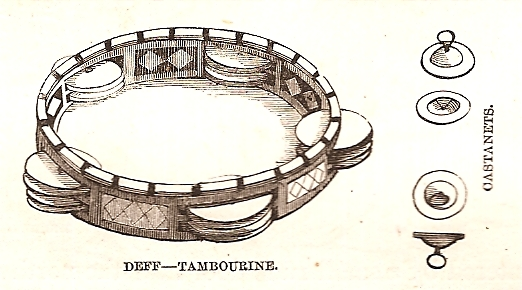
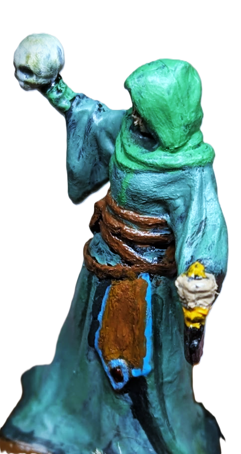

---
tags:
  - rpg
  - rpg/gming
  - rpg/stonetop
title: Stonetop - Session 4 - The Crinwin's Disease
description: Taliesyn, Cuno and Wen spend some time in Stonetop, facing a growing disease and trying to find out more about The Sorcerer.
heroImage: ./stonetop-banner.png
pubDate: 2026-10-02
---
Our three heroes spend some time in Stonetop after days in the Great Wood (recap from previous session [here](/blog/stonetop-session-003-report/)). One night of sleep and rest is all they get before the problems start to creep up and demand their attention.
## Summary

### A new dawn

A knock on the door is followed by barking. Wen has slept through the remainder of the day and through the night. Their makeshift bed is lifted close to the ceiling, and it is made with precious oak and ash shed from the Great Wood. Rhonwen's utilitarian hearth doesn't have much space, but when he adopted Wen he made sure they always had a bed to come back to. He has gone hunting, and has left Wen to lie down. At the door, there is a young friendly face, their friend Bryn.

Yawning, Wen slides it open and prepares some goat's milk and porridge, while Brother and Sister sniff and play with Bryn. They sit to talk and Bryn inquires about their expedition, awe in his eyes as he has never gone beyond The Stream. Then, his expression darkens and he talks about how Winifred hasn't been seen outside of her house for the last couple of days, and how people murmur about it but are tight lipped, as if silence could keep bad things from happening.

Cuno is on Funo's barley roof early in the morning. Basking in the sun, but shivering from the early spring breeze. Even though he just arrived he is pondering leaving again. He won't be able to concentrate while in Stonetop, and Helior's light has always been brighter and clearer outside of the village, in the wilderness and on the paths, that is the way of _The Lightbearer_.

> Here Cuno's player was showing his interest in using his _[Itinerant Mystic](https://www.splatbook.app/stonetop/reference/playbooks-the-lightbearer--background)_ background, which allows him to disappear holding a meta-currency called _Enigma_, and then have some advantages once he comes back.

Tesni's voice interrupts Cuno's thoughts. An eager sixteen year old, dark skinned with an aquiline nose. He looks up to _The Lightbearer_ after what he did at the festival and his brave expedition into the Great Wood.

They walk away from the stone wall towards the Pavilion while Tesni asks with a yearning voice questions about Helior, Cuno's trips and what made him serve the god. _The Lightbearer_ talks about a feeling inside him and how he can perceive it in Tesni. Cuno talks about finding Helior in song and inquires what the apprentice felt when he heard him singing during Gŵyl y Tatws; then he hands a flute to Tesni, and quickly takes it away when the young follower blows it as one would blow dust. He settles on a tambourine as a better instrument for his apprentice, and Tesni is delighted. Tesni asks Cuno if he can go with him the next time he leaves Stonetop, and when _The Lightbearer_ accepts his smile widens. Under the guidance of Cuno he cleans the mossy and dusty Helior shrine.

_[Public Domain Image](https://commons.wikimedia.org/w/index.php?curid=4776396)_

Another knock on a door, this time on Taliesyn's lodgings. This one is quick and strong, urgent. Annoyed and sleepy, _The Seeker_ walks to the door to receive Cerys.

'We need to talk,' she says as she walks in.

Taliesyn's eyes widen and he has to contain a tremor as Cerys explains that Winifred hasn't been able to get out of bed for two days, after she was injured by one of the crinwin. Cerys is afraid Winifred has contracted some sort of affliction, the Crinwin's Disease. And all her healing knowledge is being challenged by it. She wants Taliesyn to have a look, so they go to _The Distiller's_ house.

On the way to Winifred's hearth Cerys checks Taliesyn's scratches and injuries from his encounters with crinwin, and she lets out a sigh of relief when she sees them.

### Crinwin's Disease

Winifred's husband, Jory, and five year old son, Pons, are there when Taliesyn and Cerys arrive. She asks them to go and get some fresh air as they have been taking care of Winifred all night; Jory takes Pons by the hand with a sad, tired and thankful smile. When they are left alone Cerys takes the bandage off from Winifred's thigh. Taliesyn doesn't need to examine the wound in depth, the smell trampling his nostrils is already telling him this is related to what happened to the crinwin they encountered. It is that distressing rotten smell. It is faint, compared to what they have experienced when they had to deal with the creatures or their work, but there is no doubt about it. The bark like skin is another symptom, forming and taking over the scab.

> Taliesyn here rolled _Seek Insight_ with a result of 7-9 and he asked _Who or what is really in control here?_

'This is no simple arcane magic. A fouler game is at play, this disease bears all the markings of the Things Below,' Taliesyn's voice proclaims, ragged breathing in the background.

That takes Cerys aback, and she remains silent, hand on forehead, holding heavy thoughts.

'I will take care of Jory and Pons and host them at my house. You seem to be immune to this disease but we should limit contact with everybody else. Would you take care of Winifred?'

Taliesyn uncomfortably accepts after an awkward moment of silence.

> Here to try and share the spotlight I took the chance to answer some questions about the Things Below, as this was the first time they were more central to our story. We decided that:
> - The waterfall and pool close to the birth of _The Stream_ are considered tainted
> - Stonetop's way to keep the "demons" away is bronze-reflected candles that Cuno makes
> - Children's stories in Stonetop mention how the sky was split when the people sinned, and shards of the sky cut into the land, releasing the Things Below. Some people say the worst happened around the _Ruined Tower_
### The Chronicle

It is a clear evening, the moon shines and the stars twinkle. Cuno, Wen and Tesni move outside of the settlement and towards the old wall, where the abandoned Chronicle is. They are searching for clues about The Sorcerer and how to face them.

Years ago, there was a judge in Stonetop, from an old and ancient order, tasked with preserving the past so the future wouldn't succumb to the tendrils of previous dark times, paved by a road of mistakes. He is dead now and The Chronicle rarely gets visited as the tasks for the survival of the village are many and few know how to read anyway.

> Here I used The Judge playbook and asked the players a few questions to determine what the Chronicle was like

The building is unassuming from the outside but as they get inside they are able to perceive its power. The same power that built the maker roads. Not a speck of dust can be seen in a room that feels bigger on the inside.

_Imagine a static and rooted grey stone Tardis, that is our Stonetop Chronicle. Okay, maybe a little bit bigger than that on the outside - [CC Steve Collis](https://commons.wikimedia.org/wiki/File:Doctor_Who_Experience_%288105520673%29.jpg#Licensing) with some manual edits_

On the walls there are little panels and the light of the candles seems to reflect and grow to illuminate their path. To Cuno it looks like a beehive, hexagons stacked on top of each other. As they walk through the room they can discern the different materials texts are written on, from precious books to parchments, stone and clay.

Cuno starts chanting, asking for guidance from his lord, and Tesni helps with his tambourine. Wen rummages through books, parchments and tablets of stone and clay, awkwardly bearing with the music.

> Unfortunately Cuno here rolled a 6- on _Seek Insight_ so he does not get any useful information from the writings stored in The Chronicle. However, I don't like to not provide anything, so I came up with something that moves the story forward but introduces a complication.

Nothing, only reflections but no light. The chanting reflects off the walls as the flicker of the candles. His wager hasn't paid off and Helior didn't want him to find anything in this cryptic piece of rock. A wager. Cuno looks at his "knife", a carved femur with glyphs. If somebody knows about strange happenings it is Tox. He might still be angry that he had to part with the knife, but nothing that can't be ironed out, right?

They go back to Stonetop while Cuno talks about Gordin's Delve and his "friend" Tox.

### A blink from the past

Taliesyn is also busy at work during the night. He is deep in concentration, holding the _[Azure Hand](https://www.splatbook.app/stonetop/reference/58-appendix-d-major-arcana--azure-hand)_, at the edge of the cliff that looks into the Great Wood. He did the same half an hour ago at Winifred's but there wasn't a strong trace of energy, confirming this is something more than arcane, closer to a disease with the touch of the Things Below. He is here, overlooking the forest in the hope something lights up, thinking. He sees the shapes of mountains to the north, bigger shadows on a silver night. And then, he recalls about the miners in Gordin's Delve. He has read or heard tales (his fragmented memory does not help) of how the miners use a special type of thyme from the mountain to protect themselves from the demons that dwell below the rock. If this is an effective ward, and herbs have healing properties, it might help save Winifred.

Then, suddenly, a flash of memories floods him, transporting him to the past. He is in a cave (why is it always a cave?). Next to him there is a white robed man with Helior's glyph on his cloak, and two individuals wearing the colours of the forest and wooden masks, a shimmering glint of green coming from the eye slits. They are tense and in front of them there is a crumbled body, wearing _The Mantle_ and slowly moving like a serpent. _The Azure Hand_ is also there, not far from the body, resting on the floor less than two metres away.

Tension gives way to chaos as one of the women with wooden masks drops hers, twitches, and immediately stabs the white robed man in the belly, in the heart, in the neck. Shouting follows, and wrestling between the forest folk, and everything gets fuzzy again. Taliesyn feels the touch of the _Azure Hand_ and _The Mantle_, his heart pounding as he escapes the cave, sweating steaming fear.

_The Sorcerer, painted by me. It was cool stepping away from the table, grabbing the mini and just putting it down on the table._

> Taliesyn used the Azure Hand to _Seek Insight_ with a 10+ (He had advantage from the previous move when he examined Winifred) so he gets 3 answers:
> - _What is about to happen?_ The disease is definitely the same as the crinwin and Winifred will end up the same if nothing is done
> - _What here is useful or valuable to me?_ There is a herb that might help with the disease in Gordin's Delve
> - _What here is not what it appears to be?_ Taliesyn has met The Sorcerer before (flashback scene)
>
> One thing to note is that I found it difficult finding answers to the predefined questions. I remember scrambling for an answer and hacking it a bit with some follow up conversation and questions to be able to come up with something. I might end up changing the move to be more flexible with the questions. I also wonder if _Know Things_ would have been a better choice for the move.
### A healing attempt

The sun shines in Stonetop once more and Cuno sits with his back against The Stone, basking in the morning light. Yesterday, when they were heading to The Chronicle, Wen mentioned Winifred's absence from the village's life, and they decided they would go and see her.

They all meet at The Stone and go together to Winifred's place. Taliesyn's tired face answers on the other side of the door and explains what is happening.

_The Lightbearer_ and his acolyte start chanting and preparing to bless Winifred with Helior's touch, while Taliesyn and Wen catch up on the other side of the hearth. The light is shining and Cuno's hands carry its warmth to Winifred's raspy chest, that inflates and deflates like a creaky mechanism about to break. No warmth is able to restore this and it seems this disease is beyond the powers that Helior bestows on their priests.

> Here Cuno tried to use one of their invocations, _[Bath of Healing Light](https://www.splatbook.app/stonetop/reference/playbooks-inserts--bath-of-healing-light)_ but I decided there is nothing that can be done here. I want to move away from power fantasy where you can dispel a curse with a spell. Divine powers in our version of Stonetop are a bit more blurry and it takes more to heal a disease.
>
> However I didn't want to render the power useless so I proposed a roll. On a 10+ the invocation can delay the disease taking complete control over Winifred. As you can read above a 10+ didn't happen and the party will have to work with a rapidly deteriorating Winifred.

Cerys comes into the house to see how Winifred is faring and her face contracts at the sight of Tesni.

'What are you all doing here? I thought I was clear when I mentioned to keep people outside of the house,' she shoots a disappointed look at Taliesyn and her eyes move towards Cuno, piercing like an arrow,' and Cuno what were you thinking bringing Tesni here?'

'He is here with me, helping me tend Winifred with Helior's light,' responds Cuno, calm, softspoken, charming.

That, however, seems to make Cerys boil with anger.

'Well I hope if he gets sick', she points at Winifred, 'you are the one who is going to explain why that happened to his parents'. She shakes her head before moving on with the conversation. If there is any damage caused, there is nothing she can do now to avoid it.
### To Gordin's Delve

Taliesyn, Wen and Cuno study their options. Something needs to be done and by the looks of it, quick. Cerys has heard about Gordin's Delve Thyme before and she confirms there is none in the village, as that is something that is not usually acquired through trade, and in any case there haven't been any merchants coming with goods, spring has just started after all. Cuno mentions he knows a merchant that might be able to help them, so there are no doubts in the group about what to do next. They need to go there, and they need to take Winifred. She won't survive long enough for a round trip, she needs to come with them and be healed at Gordin's Delve.

The three of them don't waste any time and gather in the public house with an informal Stonetop council, composed of the heads of the main trades. Andras from the public house, Gerlt from the farmers, Cerys as a healer, and a few others; Rhonwen from the hunters is absent, he has been out catching some game and gathering wood since early in the morning.

They all agree to lend a cart and one of the two horses Stonetop has ([this is what the village starts with](https://www.splatbook.app/stonetop/reference/15-homefront--assets)). It is a hard conversation. And Andras, fixated on his hate for Taliesyn, takes his chance to make the party look greedy. Gerlt, despite knowing that missing a horse will affect the sowing, accepts that a life is more important than that and vouches for the heroes, even though he's had his doubts about Taliesyn before. He is a pragmatic man and what the heroes propose is reasonable. With a strong clap on the shoulder he tells Andras to stop complaining and that settles it. Our heroes are travelling to Gordin's Delve.

> Instead of using _[Requisition](https://www.splatbook.app/stonetop/reference/10-expeditions--requisition)_ as a move we just roleplayed this. This was an oversight on my side but I think it was better that we didn't roll as the outcome and who was going to oppose was very clear and that didn't need rolling.

## Game thoughts

This session had a few more things I am not completely happy with (reinforced by  feedback the _[End of Session](https://www.splatbook.app/stonetop/reference/06-player-moves--end-of-session)_ move):
- Zoomed out play in the village was missing a bit of flow. This is the first time GMing that I have done a full session focused on downtime. More experience and finding the right balance are something that I hope can help make this type of session more fluid
- Spotlight management was slightly more difficult. Even though we had the collective worldbuilding for the Things Below, sometimes there would be long scenes with a single player. Which is fine, but makes it harder for other players to be engaged. One of the things we have decided to trial is that if the player characters are not in the scene, we can rotate the spotlight by making players take the role of NPCs. And given that we are building a solid network of NPCs that players already know, it means they will have guidance about how they behave and have an easier time roleplaying them. This is something I have seen work really well before in a cooperative campaign we played using [Starforged](https://tomkinpress.com/pages/ironsworn-starforged). It was great being reminded of this possibility by one of the players
- I felt my portrayal of NPCs could have been better. There was no specific player feedback on that but I left the session feeling that all my NPCs were a bit similar. I want to investigate what tools/reminders/practice I can do to make them more varied and distinct in play

Now that I got off my chest the stuff I don't feel good about, let's celebrate what went well:
- The network of NPCs is growing and Stonetop feels like a village. We were able to flesh out existing characters and have a better picture of who is who in the village, and that was great. It makes Stonetop feel alive and real
- The tension between day to day tasks of the village and adventurer stuff was good and I carried that well. Confronting the players with the pressures of daily life and responsibilities in the village was good. I think this was especially interesting with Cuno
- I had to pause a bit more to grab lore from the Things Below and ask the table questions. This is something I sometimes struggle with. Stop and read during the game. And I did it! I wasn't expecting the Things Below would come into play yet so I just paused for a moment, went to find the setup questions, and fired away. I was able to resist the urge to keep going (I don't like to lose momentum). I need to keep reminding myself that stopping the game is not a failure and highlighting it and being able to re-read it might help me in the future