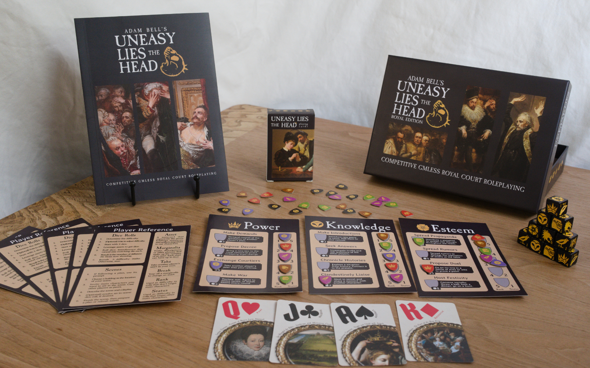
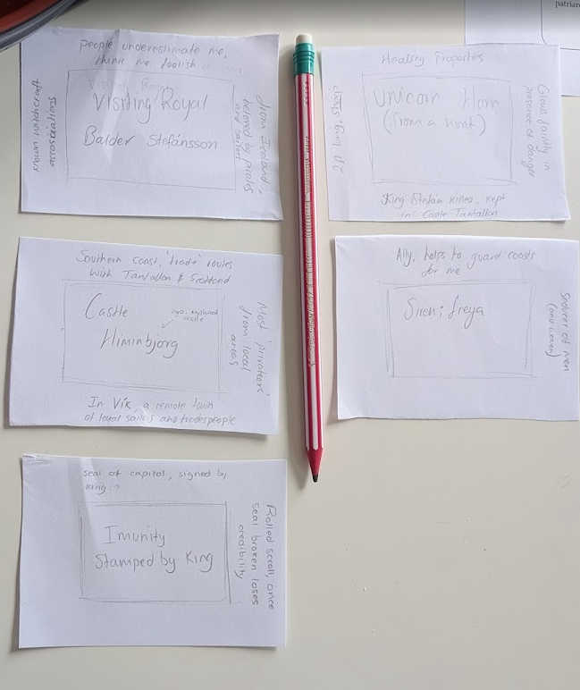
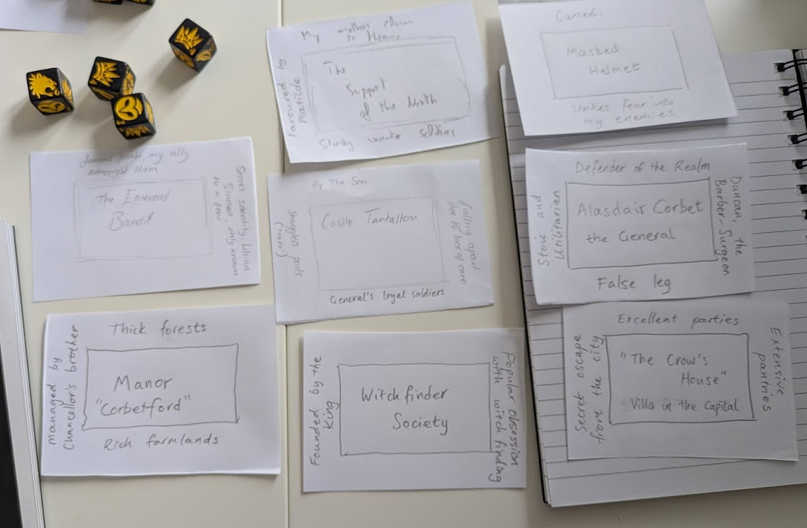
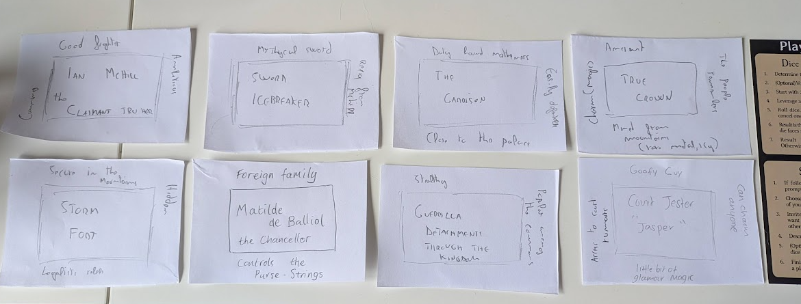
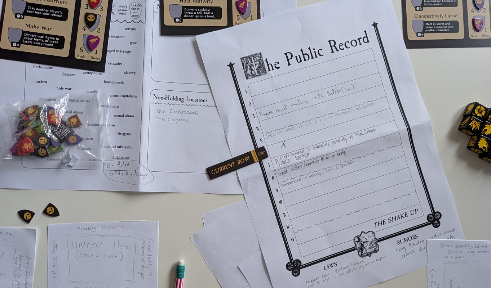

---
tags:
  - rpg/coop
  - rpg/uneasy-lies-the-head
relates-to:
played-at: Home
title: Uneasy Lies the Head - Three Player Game - Part 1
description: My experience of playing Uneasy Lies the Head, a cooperative royal court intrigue TTRPG
pubDate: 2026-05-06
heroImage: ./uneasy-lies-the-head-banner.png
---

Here is a small summary of the first session of a game of [Uneasy Lies the Head](https://adambell.itch.io/uneasy-lies-the-head-2e), a cooperative royal court intrigue TTRPG.

The main characters:
- Alasdair Corbet, _The General_
- Balder Stefansson, _Visiting Royal_ (and foreign ruler)
- Ian McHill, _The Claimant_ and _True Heir_

## The setting

We settled on a fantastical pseudo historical setting (loosely based on medieval Scotland) with weird beasts, convoluted political intrigue, distressing medical practices and some level of magic.

## The prologue

Balder Stefansson is a _Visiting Royal_ at the court coming from an island kingdom (akin to Iceland). He is beloved by pirates and sailors and has control of Tantallon Castle, that is until the kingdom's General decides to intervene and put the monarch soldiers under control of it. Rumours of witchcraft and piracy have gotten to the crown and Alasdair Corbet is the steady hand that holds the realm together. And who knows what he might do if he discovers Balder's friend the _Siren Freya_, or finds out about a powerful _Unicorn Horn_ held by the _Visiting Royal_. This would give compelling evidence to the _Witchfinder Society_ that acts under the orders of _The General_.

His _false leg_ is no impediment to Alasdair being everywhere, one day thwarting the attempts of Balder to take a hold on the realm, the next stealing the _Support of the North_ from Ian McHill, Claimant to the Throne and True Heir for some. But not all is lost for Ian, who meets with _The Garrison_ and his gathering _Guerrillas_ close to the capital, and the monarch's Chancelor, _Matilde de Balliol_, meets with him in secret and swears allegiance to his cause.

Balder Stefansson gets wind of what is happening in the south from his informant in court, _Jasper The Jester_, and as a good enterprising sailor takes _Storm Fort_ from _The Claimant_. But the victory is short lived and Ian McHill's forces take it back before it is too late. In court _Matilde_ manages to enlist _Jasper_ to the rebels' cause, leaving the _Visiting Royal_ in a tight spot.

## The public record (turns 1 to 5)

This is where the action happens. The board is set, the pieces are moving.

Our three main characters, _The General_, _The Visiting Royal and recently ascended ruler of a foreign power_ and _The Claimant_ do not lose any time in the first half of the year.

Balder, under constant vigilance from _Alasdair_, meets with _Freya_ in secret and tries to find out more about how _The General_ has gotten hold of _The Emerald Bandit_, a reputed pir..corsair who has now switched sides. After some investigation he discovers the corsair's real name has been found out and his family is held as leverage. Balder takes care of it and the hold of _The General_ on _The Emerald Bandit_ weakens. In parallel and with the same amount of secrecy, Balder seeks a meeting with Ian McHill. Having failed to secure a second lair from his hands, maybe he could use an ally.

In the meantime Ian McHill meets with _Matilde de Balliol_, planning his move for the crown. The sticking conundrum, aiming for the crown or trying to break the north free from the kingdom, fills the dark room with a pensive mood. The latter having more chances of success according to the rebel chancellor, but the _True Heir_ is not sure if he wants to give up the kingdom yet. A council meeting is due and he will need to make a decision.

Alasdair prepares a big feast sending invitations to every noble and person of power, trying to broker peace between the Monarch and _The Claimant_. Not so publicly, he pressures the Witchfinders to find a way to remove the curse from his _Masked Helmet_ which is responsible for his missing leg. Only by obtaining one of the icy-like spikes of the _True Crown_ this can be done. Maybe he can lure the ambitious _True Heir_ and make sure the crown is the real thing. A missing spike won't be a big deal and who knows, it might weaken certain ambitions.

Things are about to get heated.

## Post game

I got good feelings from the first session and the game feels unique. We spent about 1.5/2h on the prologue and then 1/1.5h on the game. I am happy we didn't cut the prologue short as this helped a lot to set the scene.

A few general thoughts:
- Assets were a bit overwhelming at first
- Table space will likely be a problem for games with more than 3 players. I'm really looking forward to finding a way to play with more limited space as I would love to pitch it at [Ancient Robots](https://www.ancientrobotgames.co.uk/)
- It's hard to place items so everybody sees them on the table, pieces tend to move out of place
- Stealing assets in the prologue is super fun and sets up some good backstories
- Loved the combination of board game and TTRPG, it feels like a bold choice, unique. It leaves me wanting to let more people know about the game, it deserves some love! (and here is a very limited reach post)
- What if...I were to combine a game of _Uneasy Lies the Head_ first, get to know the villains of the story and then afterwards play against them in a campaign of [Gallows Corner](https://www.threesailsstudios.com/gallows-corner)
- It feels like an excellent world building tool compatible with any other system

