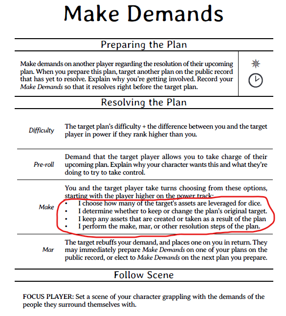
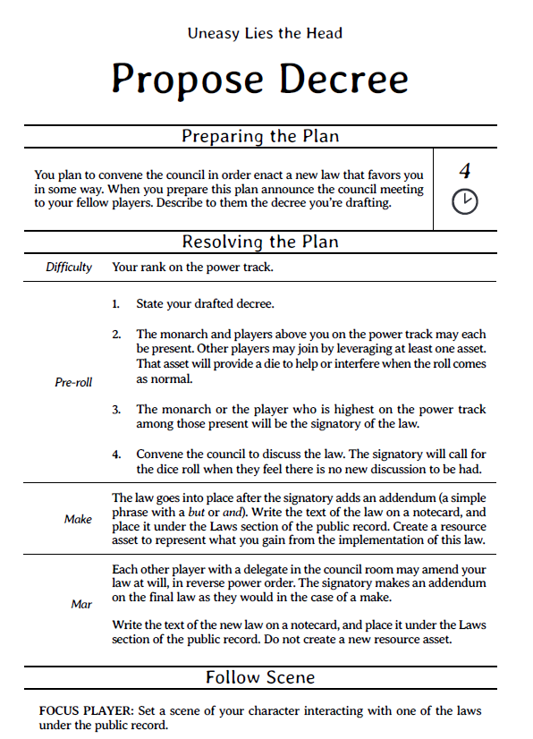
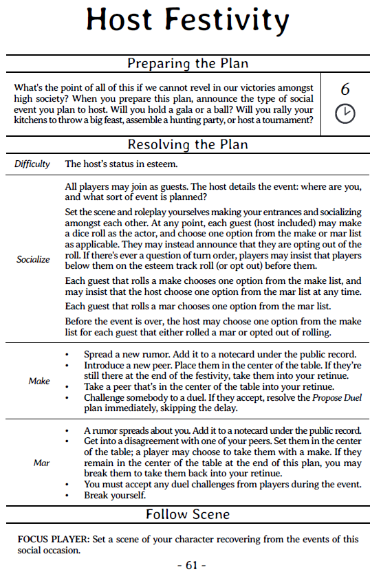
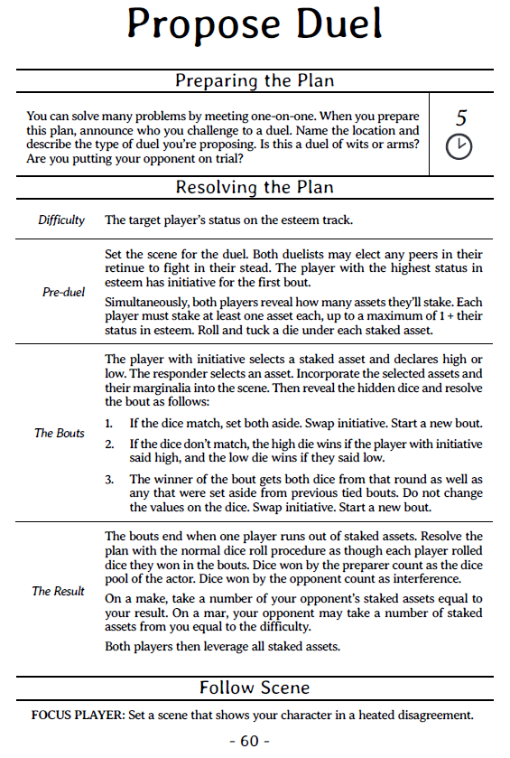
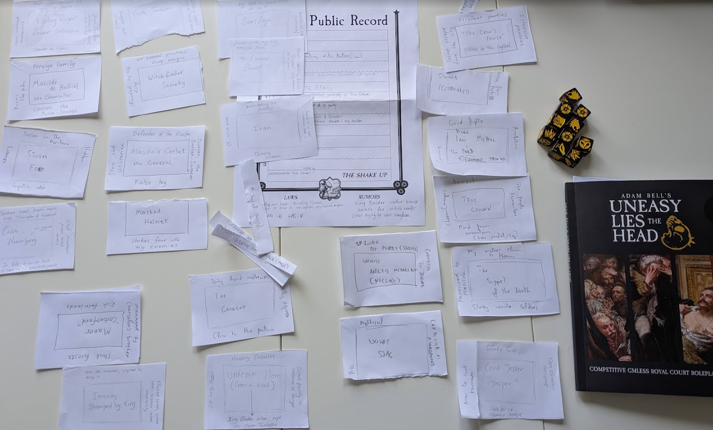

---
tags:
  - rpg/coop
  - rpg/uneasy-lies-the-head
  - rpg
played-at: Home
title: Uneasy Lies the Head - Three Player Game - Part 2
description: Second and final part of this multiplayer game of Uneasy Lies the Head. Follow Balder, Alasdair and Ian in their machinations and read some of my thoughts on the system.
pubDate: 2026-06-01
heroImage: ./uneasy-lies-the-head-banner.png
---
Last time [in part 1](/blog/uneasy-lies-the-head-three-player-game-part-1) we left off on turn 5 of the public record with a high stakes council meeting about to happen, a feast in the making and a clandestine meeting between Balder Stefansson and Ian McHill being prepared. This second part covers the rest of the public record and the shake up and some final thoughts about the system.

## The public record (turns 6 to 13)

### Turn 6

Ian McHill follows tracks under snow and mud, _Storm Fort_ engraved in the unforgiving mountains of the north, white loaded clouds crowning the peaks. He rides with his trusted companions, the Huntmaster and _Pete Horn_, his inconspicuous assistant and ears from Alasdair Corbet in _The Claimant's_ retinue. The goal: find and capture the mythical _White Stag_ and add another feat to his belt that proves and cements his claim as the rightful king. Balder, leveraging all the research that allowed him to get hold of the _Unicorn Horn_, has provided some clues via sealed letter about how to capture a mythical beast.

They lose track of the beast multiple times, _Pete Horn_ always making a noise in the least opportune way or stepping in too quickly. They finally leave him in the camp cooking and guarding supplies while the party tries to do a final attempt for the day. And they manage to corner the stag against the foot of a cliff. Ian, wearing the _True Crown_ dismounts and uses its charm to calm down the creature and attempts to ride it. He is thrown to the mud. He tries again. And again. And again. It is almost night, but when they come back to camp he does it on the _White Stag_.

---

We decided to try an _In-Scene_ roll and create an asset. If Ian was successful he would create the _White Stag_, resource, if he failed the roll, he would break his character, probably the good fighter marginalia, leaving him only with 3 other attributes. There was some help from Balder and some interference from Alasdair giving us some good opportunities to roleplay the scene. In the end, as described above, Ian succeeds and that means the _White Stag_ is created.

---
### Turn 7 

Letters between _Alasdair Corbet_ and _Ian McHill_ are exchanged for months, north to south, south to north. This council meeting to convene a decree is sensible, _The General_ says. He has spoken with _The Monarch_ and he will grant passage for _The Claimant_ to make his proposal. However there are a few requirements. The _True Crown_ is to be held for examination before any law can be implemented by the council, and there won't be any questioning of the position of the current monarch. If the artifact is valid then a conversation about inheritance of the kingdom can be codified into law.

This isn't what _The Claimant_ is after but he sees the opportunity of advancing his agenda. The flurry of letters stops with a last one. He is riding south, with the _True Crown_.

---

We made a small amendment here to the plan. After we rolled and Alasdair won, instead of taking turns to choose from the options, we tried to pick up the ones that made more sense from the fiction we were roleplaying in the scene.

We had to go back and forward for a bit as it felt hard to understand how to plug in the mechanics of transitioning between _Make Demands_ and _Propose Decree_ moves. This is one of the points where I felt a little bit of tension between the mechanics of the game and the fiction. By this I mean the mechanics were slowing down the flow of the fiction rather than helping it move forward in more interesting ways.

---

The council was tense and Ian McHill's demands didn't sit well with _The Monarch_, but _The General's_ skilful navigation of the situation allows him to keep peace in the realm. He gets hold of the _True Crown_ and in exchange _The Claimant_ is now the recognised _Heir to the Kingdom_.

---

Here we had to bend a little bit the mechanics (again). Ian gets a new title but it didn't make much sense to have a resource created. Instead and based on the fiction of the previous move it made more sense that the _True Crown_ went to Alasdair.

---

While this meeting takes place, next to the shores of _Tantallon Castle_, Balder Stefansson rides fast under the cover of the night, evading his all but in name house arrest. He heads north, and a few days later he arrives at _Storm Fort_ seeking refuge. Once he is well fed and rested he requests access to the library. He briefly skimmed through some of the books during his occupation of the fort and he has got a plan, and hopefully an ally, to reclaim his beloved _Tantallon Castle_. He will dig for precedents of what Ian McHill is doing and present and bolster his legal case for the throne as soon as he can have his property back.

### Turn 8

Alasdair Corbet's villa, known as _The Crow's House_, springs with life on a mild summer evening. It is the event of the year. Everybody is there, all the nobles and aristocrats. But also some of the richest merchants of the kingdom with gifts for the host, hoping to ingratiate themselves with him.

Ian McHill, no longer on the run after the last decree, makes his appearance in his massive _White Stag_, followed by his retinue but also _Matilde de Balliol_, her support now visible to all the people attending the party. _The General_ receives his guest who immediately takes the chance to make a snarky remark about the monarch's health highlighting his absence. Alasdair responds with his impassive soldier expression and carries on unaffected. He moves the conversation forward, highlighting how _The Monarch_ had been before but has more urgent businesses to attend. After some eating and drinking he redirects Ian to a friendly archery competition, separating him from _Matilde de Balliol_ and then he makes his move. He brings _Matilde_ to a private room and tries to convince her of how damaging Ian McHill can be to the kingdom and what effects he might cause to the north. Her loyalty to the now official heir is unwavering and _The General's_ efforts backfire. Rumours are spread about him instead.

Balder arrives a while after the party has started with a stocky companion, _Ivan_. He introduces him to the social event as his new guard. _The Visiting Royal_ is quietly rebuilding his crew, and despite his royal blood he is a man of the people. He has been in taverns before, drinking and recruiting for his enterprising adventures. Finding a good and loyal soldier is not a problem for him, even if he tends to draw individuals with a bit of a drinking problem. The aristocracy finds him exotic with his strange manners, his honesty, his stories. It will give some well valued gossip in court and who knows, maybe encourage a new fashion movement that wears black leather.

Balder Stefansson arrives late but he is hard at work since the first minute. He peeks through the guests and finds that _The Emerald Bandit_ is there, trying to mingle. He takes his chance and starts a conversation, but _Alasdair Corbet_ sees the move and immediately steps in. A duel of words follows in a quiet area, both fighting for _The Emerald Bandit's_ loyalty. Under the promises of the hospitality laws granted to _The Visiting Royal_, and the fact that Balder has already taken his family to a safe place in his kingdom, _The General_ receives the second blow of the night and by morning he realises the Bandit has disappeared.

His patience is running thin, he can feel the kingdom slipping and it is all the fault of this narcissistic northerner.  Ian McHill needs to be stopped or it will drown the kingdom with his delusions of grandeur. Only he, _The General_, can take him down.

---

I found _Host Festivity_ one of the most fun plans and I think it is because it encourages the players to play their own game on the party.

Again here rather than rolling and then choosing make/mar we decided to roleplay the scene and then pick up what made more sense from the list. Only going back to it now I realised that we never applied one rule that would have given some good outcomes for Alasdair:

> Before the event is over, the host may choose one option from the make list for each guest that either rolled a mar or opted out of rolling.

---
### Turns 9 and 10

Balder and Ian meet for the first time in _Storm Fort_. _The Heir_ waits patiently in the library until midday when _The Visiting Royal_ joins in. Over lunch they discuss an agreement and a secret alliance. Balder offers his help to build a legal case for the throne in exchange for Tantallon Castle. And Ian agrees with two conditions:
- The Castle goes back to the crown once he dies
- The alliance involves ensuring that the current monarch's life does not overextend

---

Here we decided as a table to set the assassination attempt in the last row. It is interesting that there are no moves supporting this in a royal court intrigue game and this supports some of my feelings that maybe the plans are a bit rigid and block some avenues of play that the fiction might open.

---

Even though his position in the kingdom is stronger than a few months ago Ian's ego and position need to be fed and bolstered so he proceeds with his next part of the plan: creating a legend. And there is no better way to portray a rightful king than in song. With the help of his guerrilla network and Balder the ancient legend of the White Stag and the promised hero is born. The song talks about how the White Stag will provide the rightful king with health and vigour.

### Turn 11

Alasdair sits at his desk finishing up some letters, stamping them with the Corbet's seal. He has made up his mind, levies will be called, the divider of the kingdom will be dealt with. Only war can stop him now. And that traitorous bastard of Balder seems to have run off somewhere, surely to Ian's den with all the conspirators.

### Turn 12

Balder finally finds something that can be used to sustain McHill's claims at the carved into the rock library in _Storm Fort_. He makes sure to send letters and proof to the different corners of the kingdom. But a legal claim won't stop war now.

### Turn 13

Ian McHill hears about Alasdair Corbet's plans and he does not wait for war to come to him. He gathers his levies and rides south to meet _The General_. This battle will decide the destiny of the realm.

The armies meet, standing in front of each other. Both leaders meet to parlay. There is a way to minimise the bloodshed, a duel, Ian McHill proposes. He is confident in his youth and his abilities and knows Alasdair Corbet is too proud to decline the challenge. A duel between the two leaders decides the future of the kingdom.

Ian McHill charges riding the _White Stag_, swords clash and the clinking of metal can be heard over the trot of the mounts. Corbet wears his terrifying _Masked Helmet_, startling the stag for a moment, enough for him to dodge the attack and send Ian to the floor. However his horse is mowed down by one of the creature's antlers.

They are both on the floor now, spitting moist dirt. _The General_ looks behind for a moment and signals to the _True Crown_, brought to the battle as a sign of who is acting on behalf of the kingdom, taunting _The Claimant_ to rush a move. He might be faster but Alasdair has studied Ian's moves when he was at the party.

The northerner gets closer wielding _Icebreaker_ and a fast exchange of blows follows, metallic clanking echoing. _The General's_ false leg gives out and he falls with force, _Masked Helmet_ rolling over. His life is at _The Claimant's_ mercy. Ian walks over to the helmet and stomps on it with unnatural vigour, trampling it until it is unrecognisable. Then he signals his men and the enemy army.

-This is it. The war ends here. Take this prisoner and lead me to my throne. Now!

---

You can end wars by negotiating the peace. We felt a duel on the last turn was the climax so went with it. The hidden dice mechanic for the _Propose Duel_ move sounds great in theory but it ended up being a bit cumbersome on the table and we got a little bit confused by the instructions.

---

In the meantime a small fleet sailed towards the capital led by Balder. Most of the soldiers were supposed to be fighting far away, but always careful, _The General_ left a sizable garrison tasked with reinforcing the palace and holding on. A bloody battle followed at the gates of the palace and _The Visiting Royal_ was revealed as the attacker, defeated and forced into exile. His companion _Ivan_ and many of his followers were either killed or captured. The king lived, although an army led by _The Claimant_ was marching over the city.

### The Shake-Up

Ian McHill sits on a throne decorated with antlers as the new monarch. He is deep in thought, mildly annoyed, burdened by paperwork and hearings, it turns out that _uneasy lies the head that wears a crown_. And there are a lot of problems to sort in the kingdom.

The old monarch still lives and an execution might break the fragile peace of the realm, giving an edge to Alasdair Corbet. He recently escaped from the gaol and now tries to recruit an army in exile to recover the kingdom. There is also the decision of what to do with the capital and the fact that his alliance with Balder Stefansson didn't sit well with everybody in the nobility.

Alasdair Corbet, deprived of his properties and assets in the kingdom now roams the land in search of support, just like _The Claimant_ a few years ago.

Balder Stefansson is no longer a _Visiting Royal_ and he is known as an erudite of magic. He returns to his kingdom to rule, not without recovering Tantallon Castle before leaving, starting the repairs and setting a garrison. With his newly gained power he manages to convince Jasper the Jester to be his ears in McHill's court, just in case he gets ideas of retaking the castle. Will Balder keep his promise of leaving the Castle to Ian McHill after he passes away or will this cause another conflict in an already unstable kingdom?

That is a story for another Chronicler!

## Post game thoughts

The length of the game was close to 4h with only one break. And even with that we had to speed up at the end of it. In retrospect, it might have been better to have this in 3 smaller sessions. I estimate running it with a full table (5 players) would have taken 3-4 sessions.

Now let's move on to the juicy bits.

### What didn't feel right

- It is a short book. Even with that I and the rest of the table struggled with the writing of _The Plans_ and _The Shake-Up_.
- Rules felt unnecessarily complex for what they were trying to do (take assets, break assets, add new element to the fiction). They were missing core aspects of political intrigue like assassination attempts so we ended up going back to the core dice roll mechanics to make it work for us.
- The Shake-Up felt mechanical with many pieces moving which makes it more difficult to roleplay. I think this is due to the following reasons
	- The battle and peak moment already passed so we used it more as an epilogue, which I think is not the intent of it
	- The session had been going for a long time with only one break and we had limited time, so we sped it up
### What felt good

- More roleplaying scenes this time
- Host Festivity move was my favourite one. It gives a lot of opportunities for roleplay and really helps the fiction to move forward
- I liked how we handled the last row with the war, the duel and the assassination attempt. I suppose that was our _Shake-Up_.
- The concept of assets and ripping off parts of characters and NPCs is genius. I plan to steal that for other games I run! It is much better and more high stakes than losing 1HP or gaining a wound
- The public record is an excellent tool to build up arcs. I think it can be easily repurposed for almost any TTRPG with minimal tweaks

### I wonder

- If it would be better having good mechanics for rolls for each attribute  (esteem/power/knowledge). Instead of very rigid plans the system would benefit from giving more creative leeway to the table providing:
	- Good guidance about how to estimate how long plans should take and the stakes
	- A good list of examples in play  (I have been recently reading _[Stonetop](https://plusoneexp.com/collections/stonetop) Book I_ and I have set some expectations for me going forward, although I still need to see it in action when I run it)
- The cards from the box are only used in the prologue. There might be more uses to them as oracles for scenes or even events outside the control of characters.

