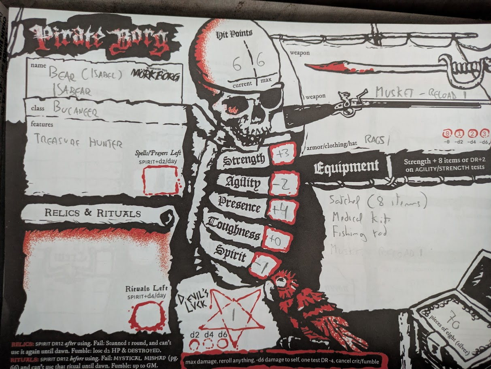
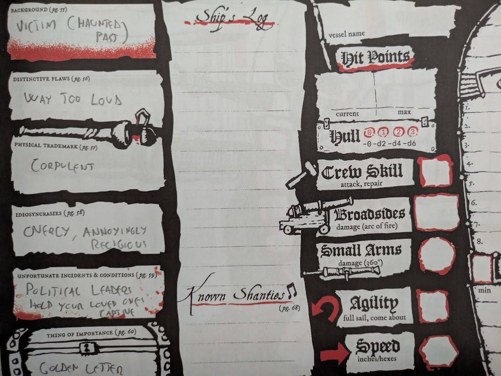

---
tags:
  - writing
  - writing/exercises
  - rpg/pirate-borg
title: 'Steering the Craft: Being Gorgeous (Exercise One) - Isabear The Bucaneer'
description: I am going to be running a Pirate Borg game and I was thinking if I could do some testing of the rules and get some inspiration at the same time as I was writing. This is the result of trying out one of the Exercises from Ursula K. Le Guin Steering the Craft.
pubDate: 2026-09-05
heroImage: ./steering-the-craft-and-pirate-borg.png
---

I am going to be running a Pirate Borg game and I was thinking if I could do some testing of the rules and get some inspiration at the same time as I was writing. In parallel I am also attempting to build a writing routine taking the chance that I am in annual leave; yes, it is one of these projects that might not stick, but one can dream.

So I reserved a little bit of time and started small. Took one of the exercises from [Ursula K. Le Guin _Steering the Craft_](https://www.ursulakleguin.com/steering-the-craft) and gave it a go.

## The prompt

> Write a paragraph to a page of narrative that's meant to be read aloud. Use onomatopoeia, alliteration, repetition, rythmic effects, made-up words or names, dialect — any kind of sound effect you like — but NOT _rhyme_ or meter.

## The paragraph

Bear trots through the jungle, shaking trees and collecting coconut juice. Lately, she has been more Bear than Isabel, although her true nature is Isabear. Bulky, strong-armed, tanned, furry after a month in this island, and a good hugger. Nobody to hug though, only animals and these creatures that must be a hag creation. Human decayed bodies, that animated, try to bite you. But fierce as a trapped boar Isabear jumps on them, trampling, wrestling, hitting with a mouldy oar, and then using her golden letter opener to cut through bone. Then she digs, and put them to rest. She is, after all, a good devotee. Do what the almighty bids and all will be alright.

